# ggplot2_cheatsheet

Xiaorui Zhang

## Some Advanced Techs from ggplot2 

## Dataset

```r
library(ggplot2)
library(dplyr)
## [, 1]	mpg	Miles/(US) gallon
## [, 2]	cyl	Number of cylinders
## [, 3]	disp	Displacement (cu.in.)
## [, 4]	hp	Gross horsepower
## [, 5]	drat	Rear axle ratio
## [, 6]	wt	Weight (1000 lbs)
## [, 7]	qsec	1/4 mile time
## [, 8]	vs	Engine (0 = V-shaped, 1 = straight)
## [, 9]	am	Transmission (0 = automatic, 1 = manual)
## [,10]	gear	Number of forward gears
## [,11]	carb	Number of carburetors
head(mtcars)
```

```
##                    mpg cyl disp  hp drat    wt  qsec vs am gear carb
## Mazda RX4         21.0   6  160 110 3.90 2.620 16.46  0  1    4    4
## Mazda RX4 Wag     21.0   6  160 110 3.90 2.875 17.02  0  1    4    4
## Datsun 710        22.8   4  108  93 3.85 2.320 18.61  1  1    4    1
## Hornet 4 Drive    21.4   6  258 110 3.08 3.215 19.44  1  0    3    1
## Hornet Sportabout 18.7   8  360 175 3.15 3.440 17.02  0  0    3    2
## Valiant           18.1   6  225 105 2.76 3.460 20.22  1  0    3    1
```

## Facet

## Facet layer basics

```r
ggplot(mtcars, aes(wt, mpg)) + 
  geom_point() +
  ## Facet rows by am and columns by cyl
  facet_grid(rows = vars(am),cols = vars(cyl))
```

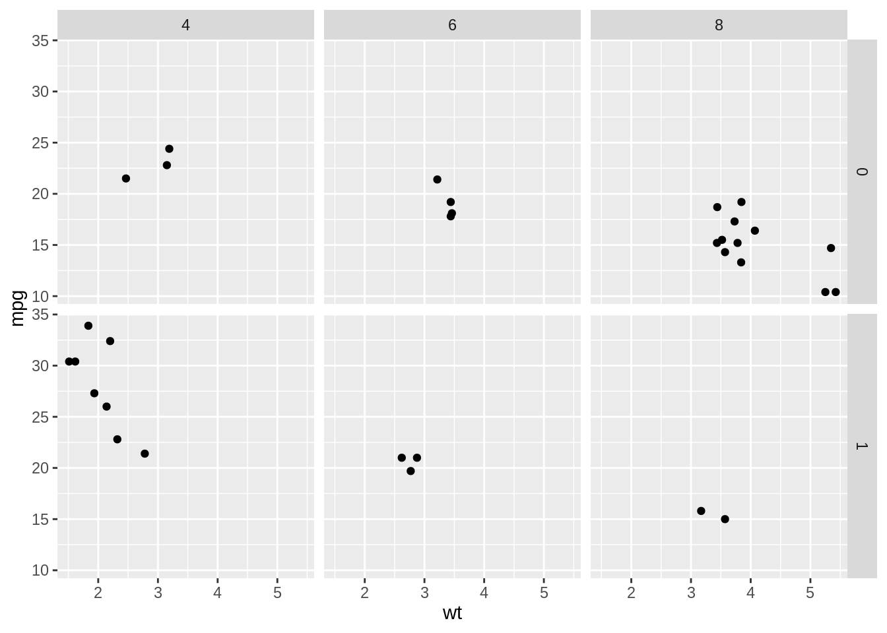


## Many variables

```r
mtcars$fcyl_fam <- interaction(mtcars$cyl,mtcars$am,sep = ":")

## Update the plot
ggplot(mtcars, aes(x = wt, y = mpg, color = fcyl_fam, size = disp)) +
  geom_point() +
  scale_color_brewer(palette = "Paired") +
  ## Grid facet on gear and vs
  facet_grid(rows = vars(gear), cols = vars(vs))
```

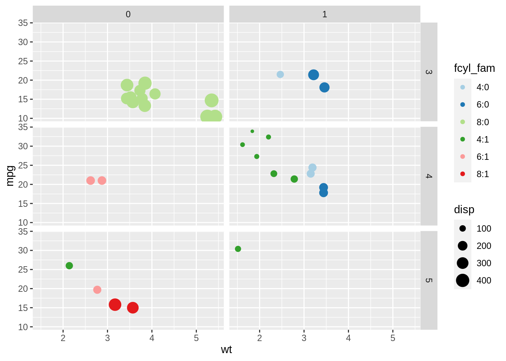


## Formula notation

```r
ggplot(mtcars, aes(wt, mpg)) + 
  geom_point() +
  ## Facet rows by am using formula notation
  facet_grid(am ~ .)
```

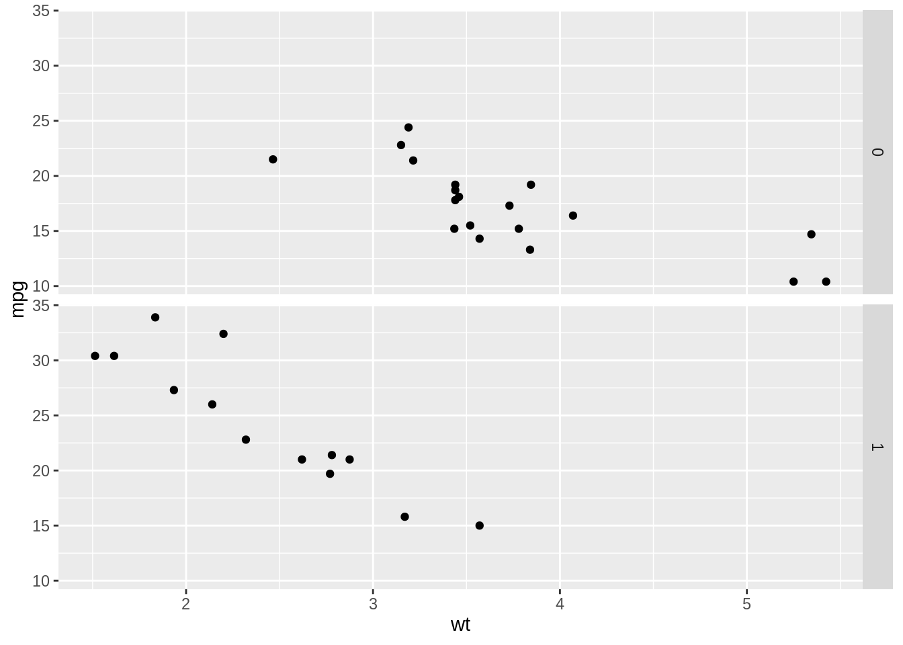

```r
ggplot(mtcars, aes(wt, mpg)) + 
  geom_point() +
  ## Facet columns by cyl using formula notation
  facet_grid(. ~ cyl)
```


```r
ggplot(mtcars, aes(wt, mpg)) + 
  geom_point() +
  ## Facet rows by am and columns by cyl using formula notation
  facet_grid(am ~ cyl)
```


## Labeling facets

```r
## Plot wt by mpg
ggplot(mtcars, aes(wt, mpg)) +
  geom_point() +
  ## Displaying both the values and the variables
  facet_grid(cols = vars(cyl), labeller = label_both)
```

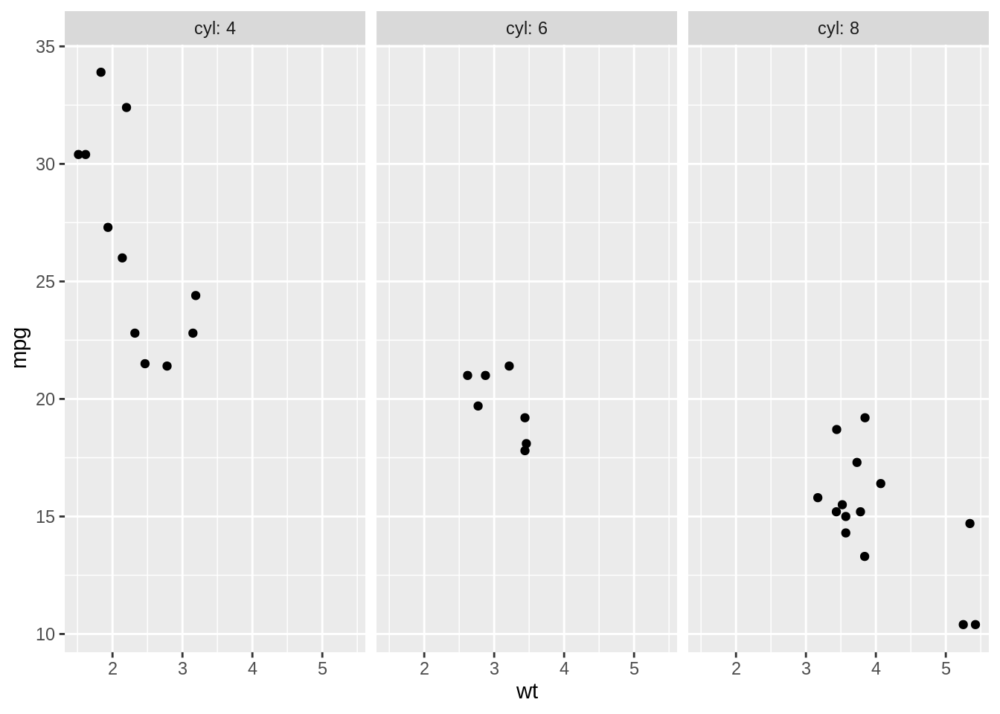

```r
## Plot wt by mpg
ggplot(mtcars, aes(wt, mpg)) +
  geom_point() +
  ## Label context
  facet_grid(cols = vars(cyl), labeller = label_context)
```

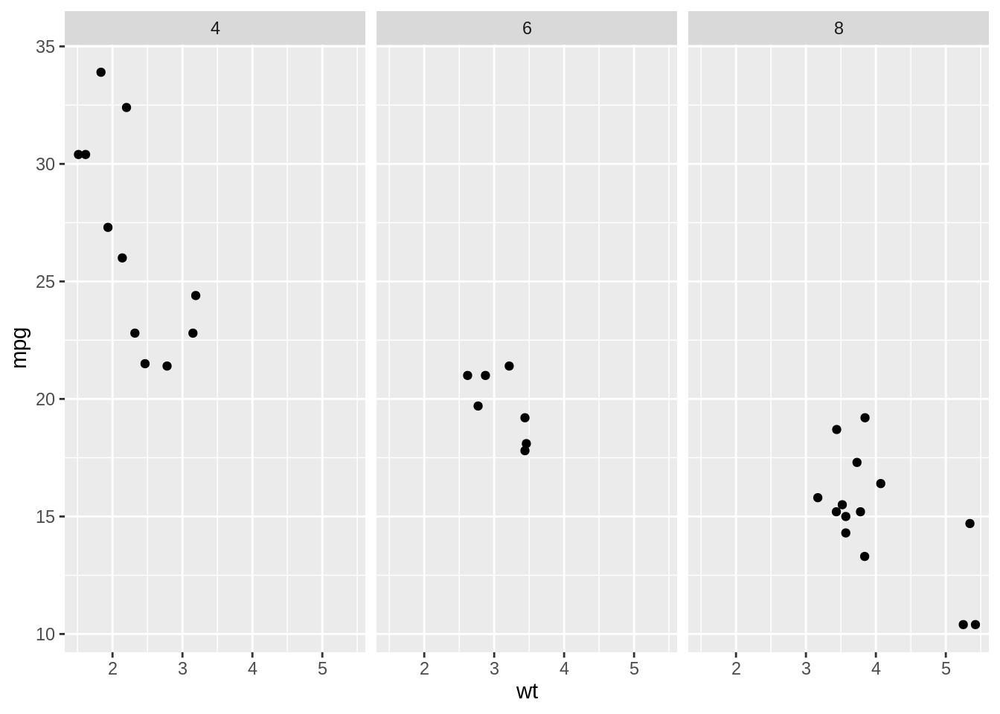

## Coordinates


## Expand and clip

```r
## Expand sets a buffer margin around the plot, so data and axes don't overlap. 
## Setting expand to 0 draws the axes to the limits of the data.
## Clip decides whether plot elements that would lie outside the plot panel 
## are displayed or ignored ("clipped").

ggplot(mtcars, aes(wt, mpg)) +
  geom_point(size = 2) +
  ## Add Cartesian coordinates with zero expansion
  coord_cartesian(expand = 0) +
  theme_classic()
```

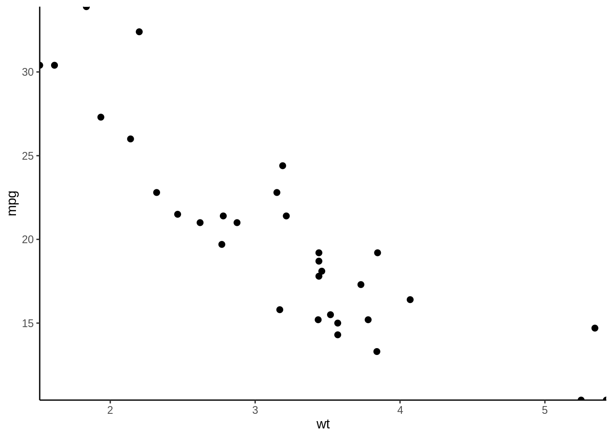

```r
ggplot(mtcars, aes(wt, mpg)) +
  geom_point(size = 2) +
  ## Turn clipping off
  coord_cartesian(expand = 0, clip = "off") +
  theme_classic() +
  ## Remove axis lines
  theme(axis.line = element_blank())
```

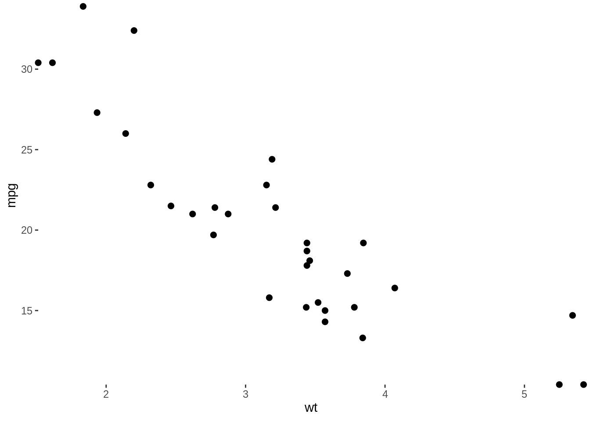


## Flipping axes 

```r
## Plot fcyl bars, filled by fam
ggplot(mtcars, aes(as.factor(cyl), fill = as.factor(am))) +
  ## Place bars side by side
  geom_bar(position = "dodge")
```

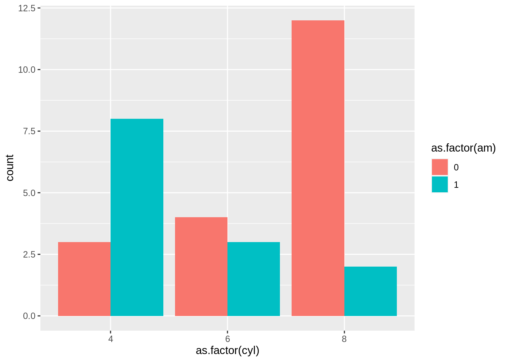

```r
ggplot(mtcars, aes(as.factor(cyl), fill = as.factor(am))) +
  geom_bar(position = "dodge") +
  ## Flip the x and y coordinates
  coord_flip()
```

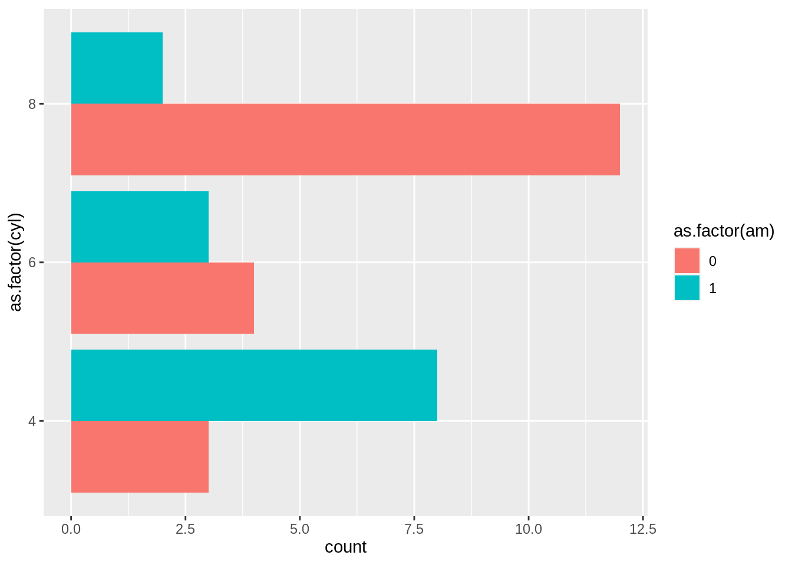

```r
ggplot(mtcars, aes(as.factor(cyl), fill = as.factor(am))) +
  ## Set a dodge width of 0.5 for partially overlapping bars
  geom_bar(position = position_dodge(width = 0.5)) +
  coord_flip()
```

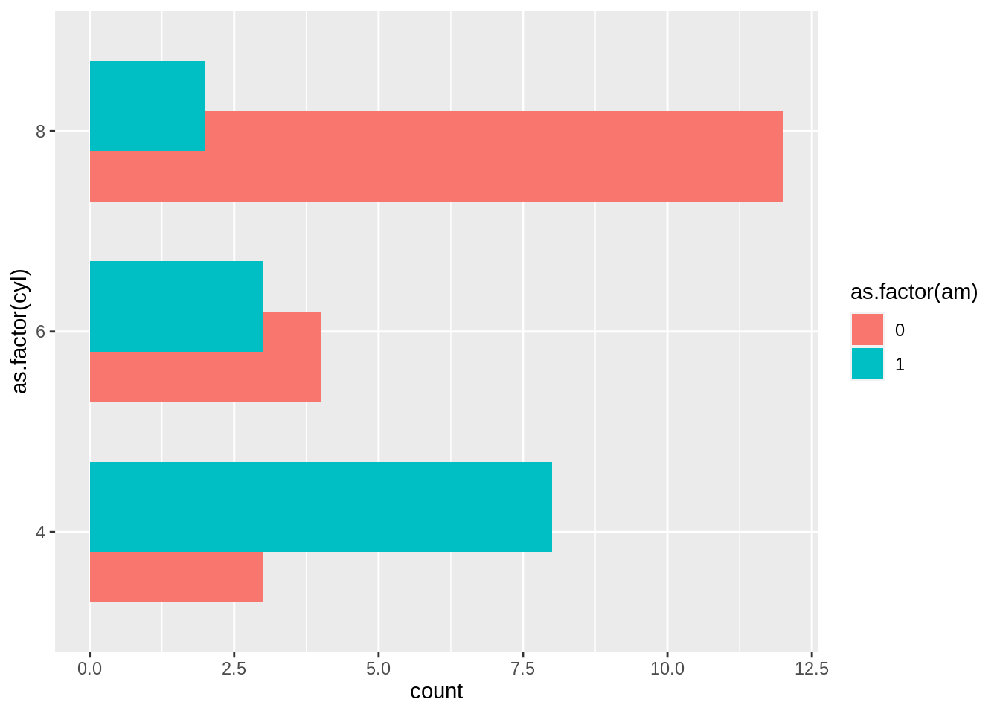


## Pie charts

```r
## Run the code, view the plot, then update it
ggplot(mtcars, aes(x = 1, fill = as.factor(cyl))) +
  geom_bar()+
  ## Add a polar coordinate system
  coord_polar(theta = "y")
```

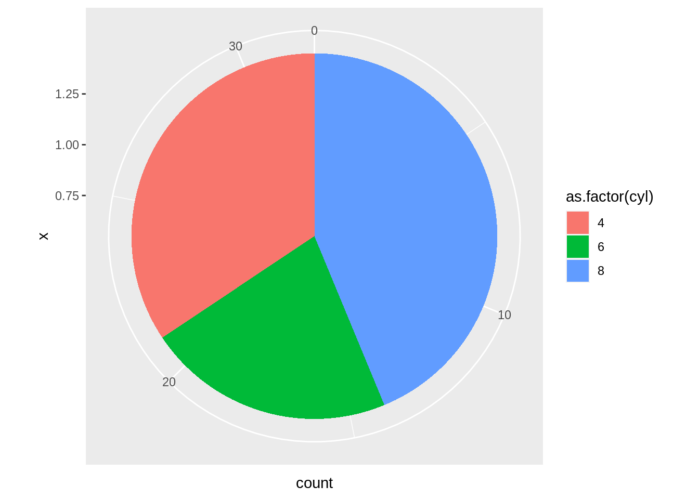

```r
ggplot(mtcars, aes(x = 1, fill = as.factor(cyl))) +
  ## Reduce the bar width to 0.1
  geom_bar(width = 0.1) +
  coord_polar(theta = "y") +
  ## Add a continuous x scale from 0.5 to 1.5
  scale_x_continuous(limits = c(0.5,1.5))
```

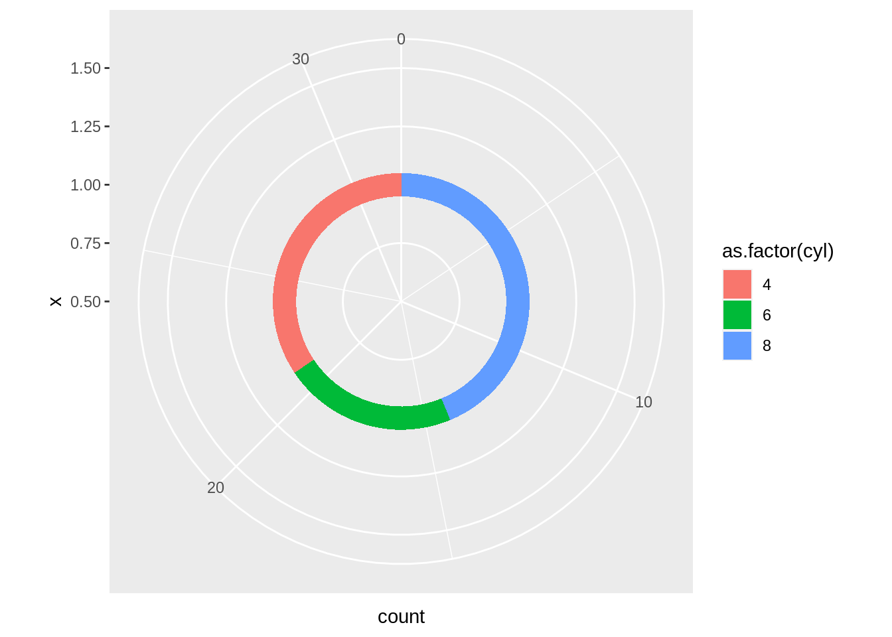

## Conclusion
This is only a little part of ggplot2, and then in my additional resources, compared with ggplot2, everyone can learn the visualization tools from Python if needed. 


