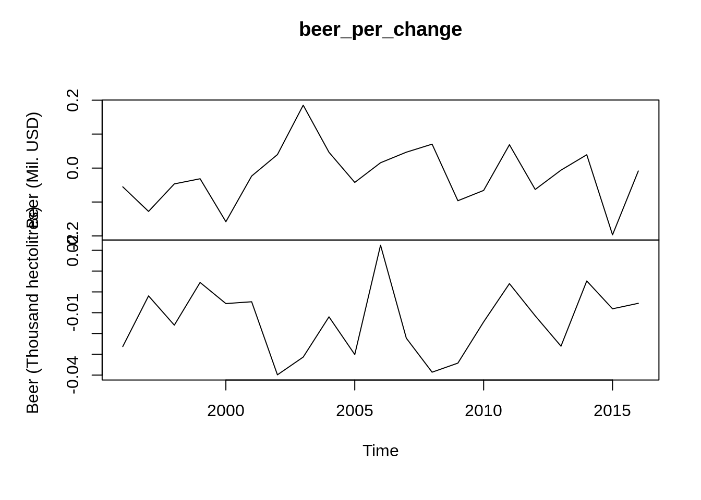

# Introduction to Quandl()

Aiqi Zhou (az2638)


Quandl::Quandl() 

## INTRODUCTION 

Quandl is a source of financial, economic and alternative data. It is acquired by Nasdaq in 2018 and has 20+ million data sets available. Users can acquire free data, purchase data or sell data at Quandl.

You can find data on a large variety of types of data from company data to the demographics data of a country. 
More can be explored on Quandl's website. https://www.quandl.com/search

The data is readily available in json, csv, xml formats and can be loaded in MatLab, R, Python, etc. 

All the data can be loaded in R through the package Quandl.


### Installation :

- install.packages("Quandl")

### Load Package 
- library(Quandl)


```r
library(Quandl)
```

### Set API key 

Quandl allows 50 calls a day for anonymous users.
Sign up for a free account to make unlimited calls every day.

Set up your own account and copy your api_key into the following function 

Quandl.api_key('your_key')


### Loading Data 

All available data can be found and viewed on https://www.quandl.com/search.
This package includes many free datasets, however, some datasets requires an account or is for paid use only.

To call on a data set in R. You must find the Quandl code of the data set. The codes can be found in the documentation page of the data set.

#### For example 

The follow dataset is called the "Federal Reserve Economic Data", which has the code FRED. 
This dataset has 335,000+ time-series data.

To call on certain aspect like the GDP of this data set, the Quandl code is "FRED/GDP".


```r
mydata = Quandl("FRED/GDP")
head(mydata)
```

```
##         Date    Value
## 1 2021-04-01 22740.96
## 2 2021-01-01 22038.23
## 3 2020-10-01 21477.60
## 4 2020-07-01 21138.57
## 5 2020-04-01 19477.44
## 6 2020-01-01 21481.37
```
To call on another aspect like disposable personal income, the Quandl code is "FRED/DSPI"


```r
mydata= Quandl("FRED/DSPI")
head(mydata)
```

```
##         Date   Value
## 1 2021-08-01 18123.9
## 2 2021-07-01 18105.0
## 3 2021-06-01 17903.0
## 4 2021-05-01 17898.5
## 5 2021-04-01 18379.5
## 6 2021-03-01 21698.9
```

### Type

The data can be called in different formats.
The default of the data is data frame, which can have an argument type = "raw"

- "raw"
- "ts"
- "zoo"
- "xts"
- "timeSeries"


```r
mydata = Quandl("FRED/GDP", type="xts")
head(mydata)
```

```
##            [,1]
## 1947 Q1 243.164
## 1947 Q2 245.968
## 1947 Q3 249.585
## 1947 Q4 259.745
## 1948 Q1 265.742
## 1948 Q2 272.567
```

```r
mydata = Quandl("FRED/GDP", type="ts")
head(mydata)
```

```
## [1] 243.164 245.968 249.585 259.745 265.742 272.567
```


```r
mydata = Quandl("FRED/GDP", type="zoo")
head(mydata)
```

```
## 1947 Q1 1947 Q2 1947 Q3 1947 Q4 1948 Q1 1948 Q2 
## 243.164 245.968 249.585 259.745 265.742 272.567
```

### Transform 

There are some preprocessing can be done when loading the data. By adding a transform argument in Quandl(), the data can have the following types of transformations.

- "" = Default original data
- "diff" = row on row change in value
- "rdiff" = row on row percentage change
- "normalize" = scale to start at 100
- "cumul" = cumulative sum
- "rdiff_from" = latest value as % increment 

#### For example the percentage change of GDP by year


```r
mydata = Quandl("FRED/GDP",transform = "rdiff" )
head(mydata)
```

```
##         Date       Value
## 1 2021-04-01  0.03188700
## 2 2021-01-01  0.02610297
## 3 2020-10-01  0.01603812
## 4 2020-07-01  0.08528480
## 5 2020-04-01 -0.09328657
## 6 2020-01-01 -0.00982237
```

### Order 

The data can be ordered by date upon it is loaded.
Default is descending order by date.
- "desc"
- "asc"


```r
mydata = Quandl("FRED/GDP", order = "asc")
head(mydata)
```

```
##         Date   Value
## 1 1947-01-01 243.164
## 2 1947-04-01 245.968
## 3 1947-07-01 249.585
## 4 1947-10-01 259.745
## 5 1948-01-01 265.742
## 6 1948-04-01 272.567
```
### collapse

Since all data have a time associated. Quandl allows you to preprocess the data by specifying the frequency of the data.

- ''
- 'daily'
- 'weekly'
- 'monthly'
- 'quarterly'
- 'annual'


```r
mydata = Quandl("FRED/GDP", collapse = "quarterly")
head(mydata)
```

```
##         Date    Value
## 1 2021-06-30 22740.96
## 2 2021-03-31 22038.23
## 3 2020-12-31 21477.60
## 4 2020-09-30 21138.57
## 5 2020-06-30 19477.44
## 6 2020-03-31 21481.37
```


### Slicing data 

#### Rows
Because the data we are using is time series data, we can specify the range of row of the data set, using the start and end date arguments.


```r
mydata = Quandl("FRED/GDP", start_date="2001-12-31", end_date="2005-12-31")
head(mydata)
```

```
##         Date    Value
## 1 2005-10-01 13324.20
## 2 2005-07-01 13142.64
## 3 2005-04-01 12922.66
## 4 2005-01-01 12767.29
## 5 2004-10-01 12527.21
## 6 2004-07-01 12305.31
```

#### Columns
To get multiple columns of data from Quandl, the data can be called in the format: Quandl(c("col_1", "col_2"))


```r
mydata = Quandl(c("FRED/GDP", "FRED/DSPI"),start_date="2001-12-31", end_date="2005-12-31")
head(mydata)
```

```
##         Date FRED.GDP - Value FRED.DSPI - Value
## 1 2002-01-01         10783.50            7940.7
## 2 2002-02-01               NA            7965.7
## 3 2002-03-01               NA            7992.7
## 4 2002-04-01         10887.46            8053.4
## 5 2002-05-01               NA            8091.4
## 6 2002-06-01               NA            8126.2
```


### Finding a dataset in Quandl 

You can look for certain data sets within R using Quandl.search()

Format: 

Quandl.search(query = "search keyword", 
              page = # , 
              source = "source to search from if known", 
              silent = TRUE/FALSE)
              
- query: mandatory argument that you want to search for
- page: which page of search result you want. Default page = 1.
- source: specific source you want to search from.
- silent: print the results when FALSE. Nothing prints when true.

#### Example search for Japan 

```r
Quandl.search(query = "Japan", 
              page = 1 , 
              silent = FALSE)
```

```
## Japanese Intervention: Japanese Bank purchases of USD against JPY
## Code: FRED/JPINTDUSDJPY
## Desc: 100 Million Yen Not Seasonally Adjusted, (+) numbers mean purchases of the USD (sell Yen), (-) numbers mean sales of USD (buy Yen). Unpublished data. 
## Freq: daily
## Cols: DATE | VALUE
## 
## Nasdaq Japan Energy JPY Index (NQJP60JPY)
## Code: NASDAQOMX/NQJP60JPY
## Desc: For detailed information, see <a href=https://indexes.nasdaqomx.com/Index/Overview/NQJP60JPY>https://indexes.nasdaqomx.com/Index/Overview/NQJP60JPY</a>
## Freq: daily
## Cols: Trade Date | Index Value | High | Low | Total Market Value | Dividend Market Value
## 
## Nasdaq Japan Banks JPY Index (NQJP3010JPY)
## Code: NASDAQOMX/NQJP3010JPY
## Desc: For detailed information, see <a href=https://indexes.nasdaqomx.com/Index/Overview/NQJP3010JPY>https://indexes.nasdaqomx.com/Index/Overview/NQJP3010JPY</a>
## Freq: daily
## Cols: Trade Date | Index Value | High | Low | Total Market Value | Dividend Market Value
## 
## Nasdaq Japan Chemicals JPY Index (NQJP5520JPY)
## Code: NASDAQOMX/NQJP5520JPY
## Desc: For detailed information, see <a href=https://indexes.nasdaqomx.com/Index/Overview/NQJP5520JPY>https://indexes.nasdaqomx.com/Index/Overview/NQJP5520JPY</a>
## Freq: daily
## Cols: Trade Date | Index Value | High | Low | Total Market Value | Dividend Market Value
## 
## Nasdaq Japan Industrials JPY Index (NQJP50JPY)
## Code: NASDAQOMX/NQJP50JPY
## Desc: For detailed information, see <a href=https://indexes.nasdaqomx.com/Index/Overview/NQJP50JPY>https://indexes.nasdaqomx.com/Index/Overview/NQJP50JPY</a>
## Freq: daily
## Cols: Trade Date | Index Value | High | Low | Total Market Value | Dividend Market Value
## 
## NASDAQ Japan Telecom JPY Index (NQJP6000JPY)
## Code: NASDAQOMX/NQJP6000JPY
## Desc: For detailed information, see <a href=https://indexes.nasdaqomx.com/Index/Overview/NQJP6000JPY>https://indexes.nasdaqomx.com/Index/Overview/NQJP6000JPY</a>
## Freq: daily
## Cols: Trade Date | Index Value | High | Low | Total Market Value | Dividend Market Value
## 
## NASDAQ Japan Utilities JPY Index (NQJP7000JPY)
## Code: NASDAQOMX/NQJP7000JPY
## Desc: For detailed information, see <a href=https://indexes.nasdaqomx.com/Index/Overview/NQJP7000JPY>https://indexes.nasdaqomx.com/Index/Overview/NQJP7000JPY</a>
## Freq: daily
## Cols: Trade Date | Index Value | High | Low | Total Market Value | Dividend Market Value
## 
## NASDAQ Japan Banks JPY Index (NQJP8300JPY)
## Code: NASDAQOMX/NQJP8300JPY
## Desc: For detailed information, see <a href=https://indexes.nasdaqomx.com/Index/Overview/NQJP8300JPY>https://indexes.nasdaqomx.com/Index/Overview/NQJP8300JPY</a>
## Freq: daily
## Cols: Trade Date | Index Value | High | Low | Total Market Value | Dividend Market Value
## 
## NASDAQ Japan Chemicals JPY Index (NQJP1300JPY)
## Code: NASDAQOMX/NQJP1300JPY
## Desc: For detailed information, see <a href=https://indexes.nasdaqomx.com/Index/Overview/NQJP1300JPY>https://indexes.nasdaqomx.com/Index/Overview/NQJP1300JPY</a>
## Freq: daily
## Cols: Trade Date | Index Value | High | Low | Total Market Value | Dividend Market Value
## 
## NASDAQ Japan Ins JPY Index (NQJP8500JPY)
## Code: NASDAQOMX/NQJP8500JPY
## Desc: For detailed information, see <a href=https://indexes.nasdaqomx.com/Index/Overview/NQJP8500JPY>https://indexes.nasdaqomx.com/Index/Overview/NQJP8500JPY</a>
## Freq: daily
## Cols: Trade Date | Index Value | High | Low | Total Market Value | Dividend Market Value
```
You can pick which data set to use from the search result.

### Example 

The following is a quick example of getting data from the data set United Nations Industrial Commodities. 
From the documentation of this data set, we can learn what we are interested in. https://www.quandl.com/data/UINC-United-Nations-Industrial-Commodities

Here I want to plot the time series data of Beer production of Germany. The code for this information is "UINC/BEER_DEU".
I want to plot the time series, then the data need to be in the form of "ts"


```r
beer = Quandl("UINC/BEER_DEU",type = "ts")
head(beer)
```

```
##      Beer (Mil. USD) Beer (Thousand hectolitres)
## [1,]       10021.504                    111875.4
## [2,]        9468.029                    108937.5
## [3,]        8258.888                    108729.5
## [4,]        7873.553                    106993.0
## [5,]        7625.868                    107479.3
## [6,]        6420.827                    106877.4
```


```r
beer = Quandl("UINC/BEER_DEU",type = "ts")
plot.ts(beer)
```


If I want to see the yearly percentage change of the data, we need to add a transform argument "rdiff"

```r
beer_per_change = Quandl("UINC/BEER_DEU",type = "ts",transform = 'rdiff')
plot.ts(beer_per_change)
```




