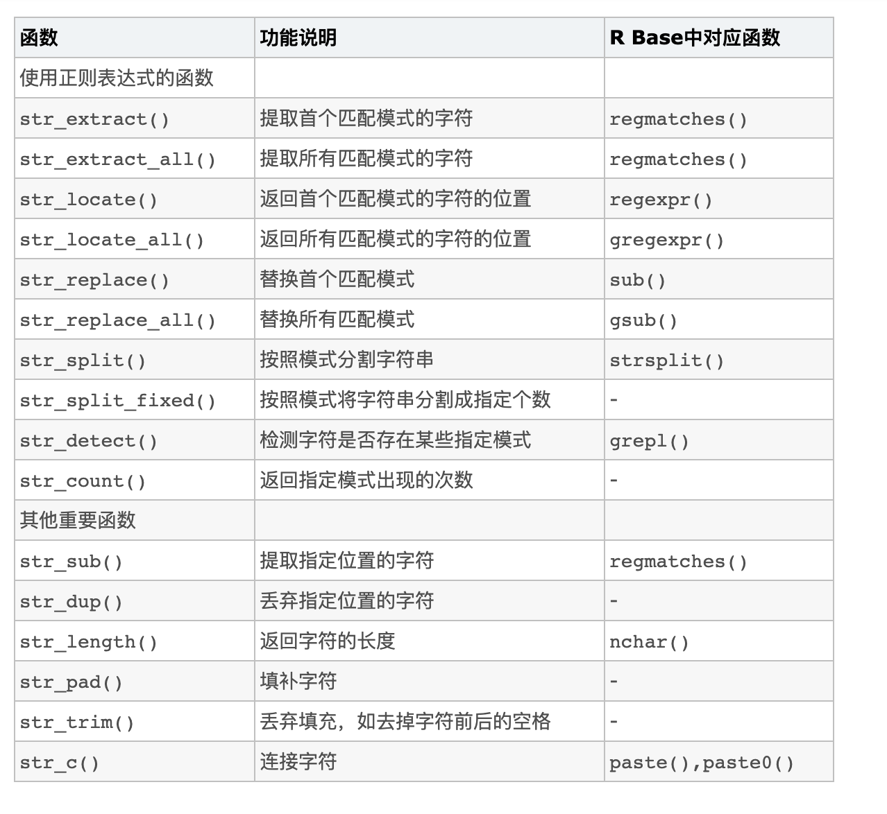

# Chinese translation of stringr package

Siwen Xie

```{r}
library(stringr)
```


**入门介绍：stringr package**

资源链接：https://cran.r-project.org/web/packages/stringr/vignettes/stringr.html

字符串不是R的迷人组成部分，但在许多数据清理和准备任务中确实发挥了重要作用。stringr提供了一组有凝聚力的功能，旨在使字符串的工作尽可能轻松。如果您不熟悉字符串，那么最好的起点是R for Data Science中有关字符串的章节。

stringr建立在stringi之上，stringi使用ICU C库提供常见字符串操作的快速，正确实现。 stringr专注于最重要且最常用的字符串操作函数，而stringi提供了涵盖几乎所有你可以想象的内容的全面集合。如果发现stringr缺少所需的功能，请尝试查找stringi。这两个软件包都具有相似的约定，因此，一旦掌握了stringr，就应该发现stringi同样易于使用。


stringr有四个主要的函数族：

1.	字符操作：这些函数允许您操作字符向量中字符串中的单个字符。

2.	用于添加、删除和操作空格的空格工具。

3.	对区域设置敏感的操作，其操作因区域设置而异。

4.	模式匹配功能。它们识别模式描述的四个引擎。最常见的是正则表达式，但还有三种其他工具。

**获取和设置单个字符：**

你用str_length()可以得到字符向量的长度
```{r}
library("stringr")
str_length("abc")
```

这个函数和R的基础函数nchar() 是一样的。之前，我们需要解决nchar() 的一些问题，比如nchar(NA)会返回2。这个问题已经在3.3.0 版本的R 得到解决所以这个问题不是那么重要了。

你使用str_sub()可以得到单个字符。它需要三个参数：字符向量、起始位置和结束位置。任何一个位置都可以是从左开始计数的正整数，也可以是从右开始计数的负整数。这些位置包括在内，并且如果长于字符串，则将被自动截断。
```{r}
x <- c("abcdef", "ghifjk")

# The 3rd letter
str_sub(x, 3, 3)


# The 2nd to 2nd-to-last character
str_sub(x, 2, -2)

```
你也可以使用str_sub()来修改字符串：
```{r}
str_sub(x, 3, 3) <- "X"
x

```

要复制单个字符串，可以使用str_dup():
```{r}
str_dup(x, c(2, 3))

```

**空格**
三个函数可添加，删除或修改空格：

1.	str_pad()通过在左侧，右侧或两侧添加额外的空格来将字符串填充到固定长度。
```{r}
x <- c("abc", "defghi")
str_pad(x, 10) # default pads on left

str_pad(x, 10, "both")

```

（你可以使用pad参数填充其他字符。）

str_pad()绝不会使字符串更短:
```{r}
str_pad(x, 4)

```

因此，如果要确保所有字符串的长度相同（通常对打印方法有用），请结合使用str_pad()和str_trunc():
```{r}
x <- c("Short", "This is a long string")

x %>% 
  str_trunc(10) %>% 
  str_pad(10, "right")

```


2.	str_trim():是str_pad()的相反，它删除了前导和尾随空格：
```{r}
x <- c("  a   ", "b   ",  "   c")
str_trim(x)

str_trim(x, "left")

```
3.	你可以使用str_wrap()修改现有的空格，以换行一段文本，以使每行的长度尽可能相似。
```{r}
jabberwocky <- str_c(
  "`Twas brillig, and the slithy toves ",
  "did gyre and gimble in the wabe: ",
  "All mimsy were the borogoves, ",
  "and the mome raths outgrabe. "
)
cat(str_wrap(jabberwocky, width = 40))

```


**对区域的敏感性**

少数几个字符串函数对语言环境敏感：它们在世界不同地区的执行方式会有所不同。
这些功能是大小写转换功能：
```{r}
x <- "I like horses."
str_to_upper(x)

str_to_title(x)


str_to_lower(x)

str_to_lower(x, "tr")


```

字符串排序：
```{r}
x <- c("y", "i", "k")
str_order(x)


str_sort(x)

# In Lithuanian, y comes between i and k
str_sort(x, locale = "lt")

```

区域设置始终默认为英语，以确保默认行为在系统之间相同。语言环境始终包含两个字母的ISO-639-1语言代码（如英语为“ en”或中文为“ zh”），以及可选的ISO-3166国家/地区代码（如“ en_UK”与“ en_US”）。您可以通过运行stringi::stri_locale_list()
来查看可用语言环境的完整列表。

**模式匹配**

绝大多数的字符串函数都与模式一起使用。这些参数由它们执行的任务和它们匹配的模式类型进行参数化。

任务：
每个模式匹配函数都具有相同的前两个参数，要处理的字符串的字符向量和要匹配的单个模式。 stringr提供模式匹配功能，以检测，定位，提取，匹配，替换和拆分字符串。我将说明它们如何与一些字符串和正则表达式配合使用以匹配（美国）电话号码：

```{r}
strings <- c(
  "apple", 
  "219 733 8965", 
  "329-293-8753", 
  "Work: 579-499-7527; Home: 543.355.3679"
)
phone <- "([2-9][0-9]{2})[- .]([0-9]{3})[- .]([0-9]{4})"
```

+	str_detect() 检测模式的存在或不存在，并返回逻辑向量（类似于grepl()）。 str_subset() 返回与正则表达式匹配的字符向量的元素（类似于 grep()，其值为TRUE）。
```{r}
# Which strings contain phone numbers?
str_detect(strings, phone)

str_subset(strings, phone)

```
+ str_count()计算匹配的数量
```{r}
# How many phone numbers in each string?
str_count(strings, phone)

```
+ str_locate() 定位模式的第一个位置，并返回带有列开始和结束的数字矩阵。 str_locate_all()查找所有匹配项，并返回数字矩阵列表。与regexpr()和gregexpr()类似。
```{r}
# Where in the string is the phone number located?
(loc <- str_locate(strings, phone))

str_locate_all(strings, phone)

```
+ str_extract()提取与第一个匹配项对应的文本，并返回一个字符向量。 str_extract_all() 提取所有匹配项并返回字符向量列表。
```{r}
# What are the phone numbers?
str_extract(strings, phone)

str_extract_all(strings, phone)

str_extract_all(strings, phone, simplify = TRUE)

```
+	str_match()从第一个匹配中提取由（）形成的捕获组。它返回一个字符矩阵，其中一列用于完全匹配，一列用于每个组。str_match_all()从所有匹配项中提取捕获组，并返回字符矩阵列表。与regmatches()类似。
```{r}
# Pull out the three components of the match
str_match(strings, phone)

str_match_all(strings, phone)

```
+ str_replace()替换第一个匹配的模式并返回一个字符向量。str_replace_all()替换所有匹配项。类似于sub() 和 gsub()。
```{r}
str_replace(strings, phone, "XXX-XXX-XXXX")

str_replace_all(strings, phone, "XXX-XXX-XXXX")


```
+	str_split_fixed() 根据模式将字符串分成固定数量的段，并返回一个字符矩阵。str_split() 将字符串分成可变数量的段，并返回字符向量列表。
```{r}
str_split("a-b-c", "-")

str_split_fixed("a-b-c", "-", n = 2)

```
**引擎**

stringr可以使用四个主要引擎来描述模式：

+	正则表达式是默认值，如上所示，并在vignette("regular-expressions")中进行了描述。
+	使用fixed()进行固定的按字节匹配。
+	区分语言环境的字符匹配，使用coll()
+	使用boundary()进行文本边界分析。

固定匹配
fixed(x) 仅匹配x指定的确切字节序列。这是一个非常有限的“模式”，但是该限制可以使匹配更快。当心对非英语数据使用fixed() 。这是有问题的，因为通常有多种方式表示同一角色。例如，有两种定义“á”的方法：作为单个字符或作为“a”加重音符号：

```{r}
a1 <- "\u00e1"
a2 <- "a\u0301"
c(a1, a2)
a1 == a2

```
它们的渲染方式相同，但是由于定义不同，fixed() 找不到匹配项。相反，您可以使用下面解释的coll()来遵守人类字符比较规则：
```{r}
str_detect(a1, fixed(a2))

str_detect(a1, coll(a2))

```
归类搜索

coll(x)使用人工语言的排序规则来寻找与x的匹配项，如果您要进行不区分大小写的匹配，则它尤其重要。排序规则在世界各地都不同，因此您还需要提供一个语言环境参数。
```{r}
i <- c("I", "İ", "i", "ı")
i


str_subset(i, coll("i", ignore_case = TRUE))

str_subset(i, coll("i", ignore_case = TRUE, locale = "tr"))


```
coll()的缺点是速度慢。由于识别哪些字符相同的规则很复杂，因此与regex()
和fixed()相比，coll()相对较慢。注意，当fixed()和regex()都具有ignore_case参数时，它们执行的比较比coll()简单得多。

**边界分析**

boundary()匹配字符，行，句子或单词之间的边界。它对str_split()最为有用，但可以与所有模式匹配功能一起使用：
```{r}
x <- "This is a sentence."
str_split(x, boundary("word"))

str_count(x, boundary("word"))

str_extract_all(x, boundary("word"))

```

按照惯例，“ ”被视为boundary(character)界限区分符：
```{r}
str_split(x, "")

str_count(x, "")

```


**函数总结**




