# Chinese translation of using ARIMA models in R

Kehao Guo

Source: [link](https://a-little-book-of-r-for-time-series.readthedocs.io/en/latest/src/timeseries.html#arima-models)

## ARIMA模型

指数平滑方法对于预测很有用，并且不对时间序列中的相邻数据作假设。但是，如果你想用指数平滑方法作预测区间，预测区间会需要不相关的、正态分布的、零均值化的且水平方差的预测误差。

虽然指数平滑方法不对时间序列中的相邻数据作假设，在某些情况下你可以通过考虑数据间的相关性来做出更好的预测模型。差分整合移动平均自回归模型（ARIMA）包含了一个允许异常成分中非零自相关性的统计模型。

### 差异化一组时间序列

ARIMA模型是为平稳时间序列定义的。所以如果需要处理一组非平稳时间序列，你首先需要‘差异化’时间序列直至获得一组平稳时间序列。如果你需要差异化d次来获得平稳时间序列，那你就会用ARIMA(p,d,q)模型，d代表差异次数。

你可以在R中使用‘diff()’函数来差异化时间序列。比如，1866年至1911年女士裙子的直径均值上下浮动且不平稳：

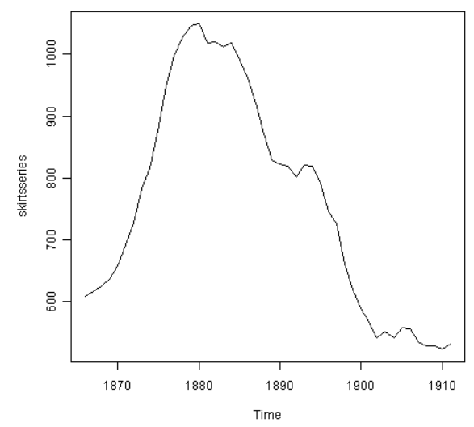

我们可以输入以下指令来差异化一次时间序列并且对差异化后的系列作图：

```{r, eval=FALSE, echo=TRUE}
skirtsseriesdiff1 <- diff(skirtsseries, differences=1)
plot.ts(skirtsseriesdiff1)
```

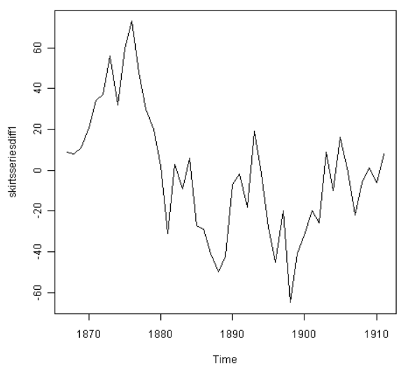

以上的一次差异化时间序列不像是有稳定均值的。所以，我们可以作两次差异化以检测结果是否是稳定时间序列：

```{r, eval=FALSE, echo=TRUE}
skirtsseriesdiff2 <- diff(skirtsseries, differences=2)
plot.ts(skirtsseriesdiff2)
```

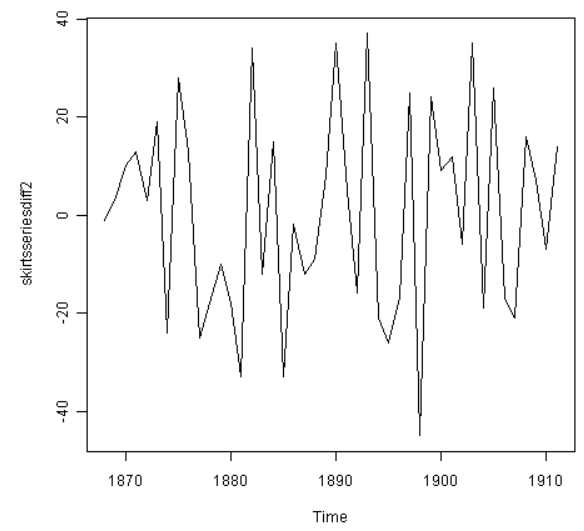

以上的二次差异化时间序列看上去是有稳定均值和方差的，因为序列的水平大致保持一致。所以，我们需要作二次差异化以得到裙子直径的稳定平稳时间序列。

如果你需要对原数据作d次差异化来得到平稳时间序列，那你可以使用ARIMA(p,d,q)模型，d代表差异化次数。在女裙直径的时间序列的例子中，我们可以使用ARIMA(p,2,q)模型，因为差异化次数应为2。下一步我们需要求得p与q的值。

另一例子是英格兰国王死亡岁数的时间序列：

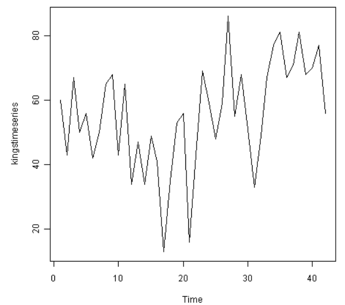

从以上图表可以看出，该时间序列没有平稳均值。我们输入以下代码以计算一次差异化的时间序列并作图：

```{r, eval=FALSE, echo=TRUE}
kingtimeseriesdiff1 <- diff(kingstimeseries, differences=1)
plot.ts(kingtimeseriesdiff1)
```

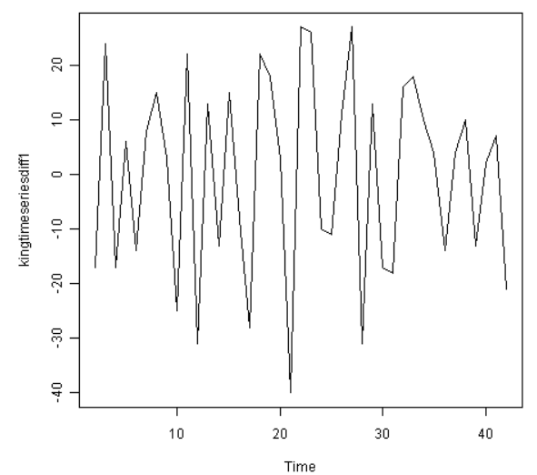

一次差异化的该时间序列像是有平稳均值和方差的，所以ARIMA(p,1,q)应是一个合适的模型。一次差异化祛除了英格兰国王死亡岁数的时间序列的趋势成分，只留下了不规则成分。我们现在可以检查相邻的不规则成分间是否存在相关性；如果有，这会帮助我们找出一个预测国王死亡岁数的模型。

### 选择ARIMA候选模型

如果时间序列是平稳的，或通过差异化d次得到一个平稳的时间序列，那下一步则为选择一个合适的ARIMA模型，也就是找出合适的p和q的值。为此还需要检验平稳时间序列的相关图和部分相关图。

我们需要R中的“acf()”和"pacf()"函数来分别作出相关图和部分相关图。为了得到自相关和偏自相关的实际值，我们设“acf()”和"pacf()"函数中“plot=FALSE"。

#### 例：英格兰国王死亡岁数

比如，要对一次差异化的英格兰国王死亡岁数的时间序列的1-20滞后作相关图，并得到自相关的值，我们输入：

```{r, eval=FALSE, echo=TRUE}
acf(kingtimeseriesdiff1, lag.max=20)             # plot a correlogram
acf(kingtimeseriesdiff1, lag.max=20, plot=FALSE) # get the autocorrelation values
Autocorrelations of series 'kingtimeseriesdiff1', by lag
0      1      2      3      4      5      6      7      8      9     10
1.000 -0.360 -0.162 -0.050  0.227 -0.042 -0.181  0.095  0.064 -0.116 -0.071
   11     12     13     14     15     16     17     18     19     20
0.206 -0.017 -0.212  0.130  0.114 -0.009 -0.192  0.072  0.113 -0.093

```

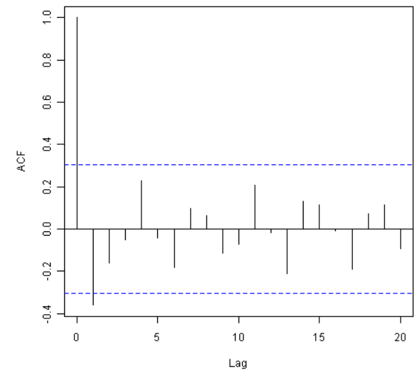

我们从相关图中看到滞后1的自相关（-0.360）超过了显著性界限，但其他滞后的自相关都没有超过显著性界限。

要对一次差异化的英格兰国王死亡岁数的时间序列的1-20滞后作部分相关图，并得到偏自相关的值，我们使用“pacf()”函数并输入：

```{r, eval=FALSE, echo=TRUE}
pacf(kingtimeseriesdiff1, lag.max=20)             # plot a partial correlogram
pacf(kingtimeseriesdiff1, lag.max=20, plot=FALSE) # get the partial autocorrelation values
Partial autocorrelations of series 'kingtimeseriesdiff1', by lag
  1      2      3      4      5      6      7      8      9     10     11
 -0.360 -0.335 -0.321  0.005  0.025 -0.144 -0.022 -0.007 -0.143 -0.167  0.065
  12     13     14     15     16     17     18     19     20
 0.034 -0.161  0.036  0.066  0.081 -0.005 -0.027 -0.006 -0.037

```

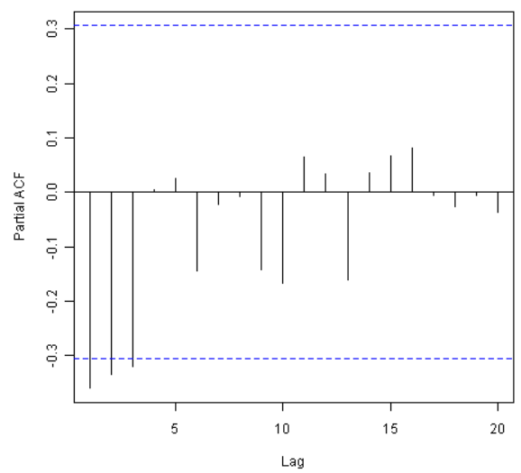

该部分相关图显示偏自相关值在1、2和3滞后时超过了显著性界限，是负的，并且随着滞后增加而大小缓慢减少。在滞后3后偏自相关值减少至0。

由此，以下为对一次差异化时间序列而言可能的ARMA(自回归滑动平均)模型：

* ARMA(3,0)模型：一个p=3的自回归模型，因为部分相关途中pacf在滞后3后为零，且自相关图中减少至0。
* ARMA(0,1)模型：一个q=1的滑动平均模型，因为自回归图在滞后1后为零，且偏自回归图减少至0。
* ARMA(p,q)模型：一个p和q的值大于0的混合模型，应为自回归图和偏自回归图减少至0。

我们用简约原则来决定哪一个是最好的模型：我们假设参数最少的模型是最好的。以上模型分别有3个，1个和至少2个参数。所以，ARMA(0,1)被认定为最佳模型。

ARMA(0,1)模型，即MA(1)模型，是一阶的滑动平均模型。该模型可被写作X_t - mu = Z_t - (theta * Z_t-1),X_t为平稳时间序列（英格兰国王死亡岁数的一次差异化序列），mu为时间序列的均值，Z_t是零均值和方差不变的白噪音，theta是可被预测的参数。

滑动平均模型通常被用来对相邻观测值间有短期依赖的时间序列建模。直观上，MA模型可以被用作对英格兰国王死亡岁数的时间序列中的不规则成分建模，因为我们可以说一个国王死亡岁数可能和他后面一两个继任者的死亡岁数有关联，但和他更后面的继任者的死亡岁数可能就没什么关系了。

因为ARMA(0,1)模型（p=0, q=1）被认定为该一次差异化时间序列的最佳模型候选，所以原时间序列可以适用于ARIMA(0,1,1)模型（p=0, d=1, q=1）。

### 使用ARIMA模型进行预测

一旦你选择了最佳ARIMA(p,d,q)模型候选，你就可以预测该模型的参数，并且为时间序列的未来值进行预测。

在R中你可以用“arima()”函数来估计一个ARIMA(p,d,q)模型的参数。

#### 例：英格兰国王死亡岁数

如上，ARIMA(0,1,1)模型对该时间序列来说似乎是一个可行的模型。你可以用“arima()”函数的“order”选项明确ARIMA模型的p,d和q的值。要对一组时间序列拟合一个ARIMA(p,d,q)模型，我们输入：

```{r, eval=FALSE, echo=TRUE}
kingstimeseriesarima <- arima(kingstimeseries, order=c(0,1,1)) # fit an ARIMA(0,1,1) model
kingstimeseriesarima
ARIMA(0,1,1)
Coefficients:
        ma1
      -0.7218
s.e.   0.1208
sigma^2 estimated as 230.4:  log likelihood = -170.06
AIC = 344.13   AICc = 344.44   BIC = 347.56
```

如上所说，如果我们对时间序列拟合一个ARIMA(0,1,1)模型，我们其实也是对一次差异化的时间序列拟合一个ARMA(0,1)模型。ARMA(0,1)模型可被写作X_t - mu = Z_t - (theta * Z_t-1)，theta是要被估计的参数。从以上的R的“arima()”函数的输出来看，theta的估值（R输出中的‘ma1’）为-0.7218。

然后我们可以用R的“forecast”包中的“forcast.Arima()”函数对时间序列的未来值进行预测。比如，要对接下来5个英格兰国王的死亡岁数进行预测，我们输入：

```{r, eval=FALSE, echo=TRUE}
library("forecast") # load the "forecast" R library
kingstimeseriesforecasts <- forecast.Arima(kingstimeseriesarima, h=5)
kingstimeseriesforecasts
     Point Forecast    Lo 80    Hi 80    Lo 95     Hi 95
  43       67.75063 48.29647 87.20479 37.99806  97.50319
  44       67.75063 47.55748 87.94377 36.86788  98.63338
  45       67.75063 46.84460 88.65665 35.77762  99.72363
  46       67.75063 46.15524 89.34601 34.72333 100.77792
  47       67.75063 45.48722 90.01404 33.70168 101.79958
```

原时间序列包括了42位英格兰国王的死亡岁数。forcast.Arima()给出了接下来5位(第43到第48位国王)的死亡岁数，以及相应的80%和95%预测区间。第42位国王的死亡岁数为56岁，而ARIMA模型预测下五位国王的死亡岁数为67.8岁。

我们可以将前42位国王的实际死亡岁数和用ARIMA(0,1,1)模型预测的后5位国王的死亡岁数作图，输入：

```{r, eval=FALSE, echo=TRUE}
plot.forecast(kingstimeseriesforecasts)
```

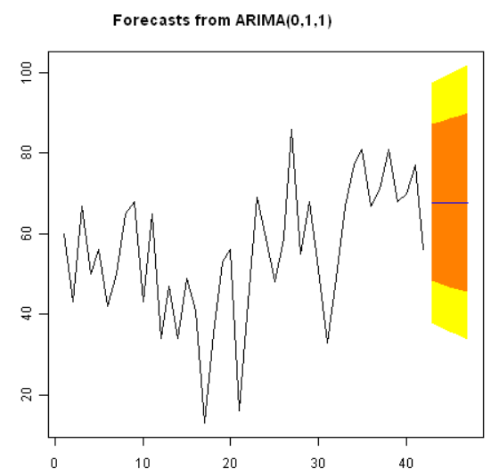

如果是指数平滑模型，那最好能调查ARIMA模型的预测误差是否是正态分布的、零均值化的且水平方差的，且是否存在相邻预测误差间的相关。

比如，我们可以对ARIMA(0,1,1)模型对英格兰国王死亡岁数的预测误差作相关图，并且对1-20滞后作LB检验，输入：

```{r, eval=FALSE, echo=TRUE}
acf(kingstimeseriesforecasts$residuals, lag.max=20)
Box.test(kingstimeseriesforecasts$residuals, lag=20, type="Ljung-Box")
Box-Ljung test
data:  kingstimeseriesforecasts$residuals
X-squared = 13.5844, df = 20, p-value = 0.851
```

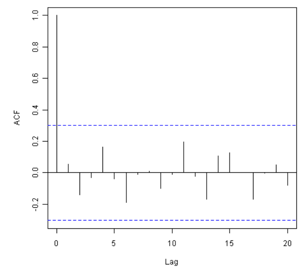

由于相关图中没有1-20滞后的样本自相关值超过显著性界限，且LB测试的p值为0.9，我们可以得出有极少证据支持1-20滞后的非零自相关的结论。

要调查预测误差是否是正态分布的，零均值的，且水平方差的，我们可以作一张预测误差的时间图和(覆盖正态曲线的)柱状图：

```{r, eval=FALSE, echo=TRUE}
plot.ts(kingstimeseriesforecasts$residuals)            # make time plot of forecast errors
plotForecastErrors(kingstimeseriesforecasts$residuals) # make a histogram
```

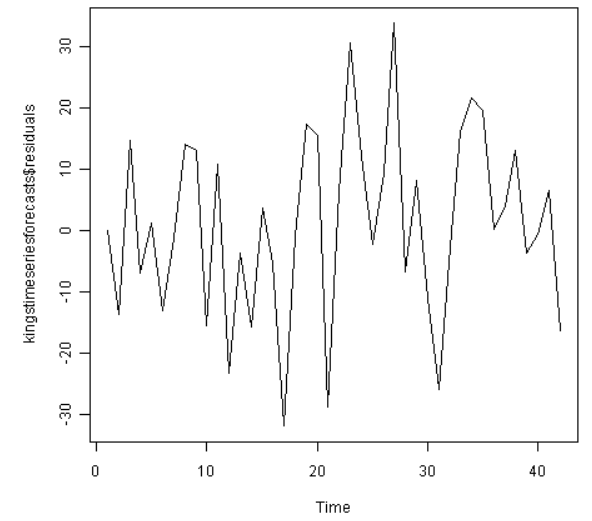
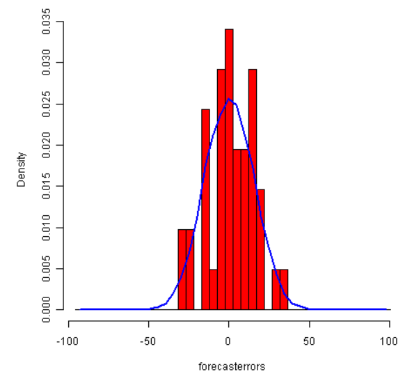

样本预测误差的时间图显示了预测误差的方差大约保持一致。柱状图显示了预测误差大约是正态分布的且均值约等于0。所以，可以说预测误差是正态分布的，零均值的，且水平方差的。

因为相邻的预测误差不像是相关的，且预测误差是正态分布的，零均值的，且水平方差的，ARIMA(0,1,1)模型的确提供了一个合适的预测英格兰国王死亡岁数的模型。
