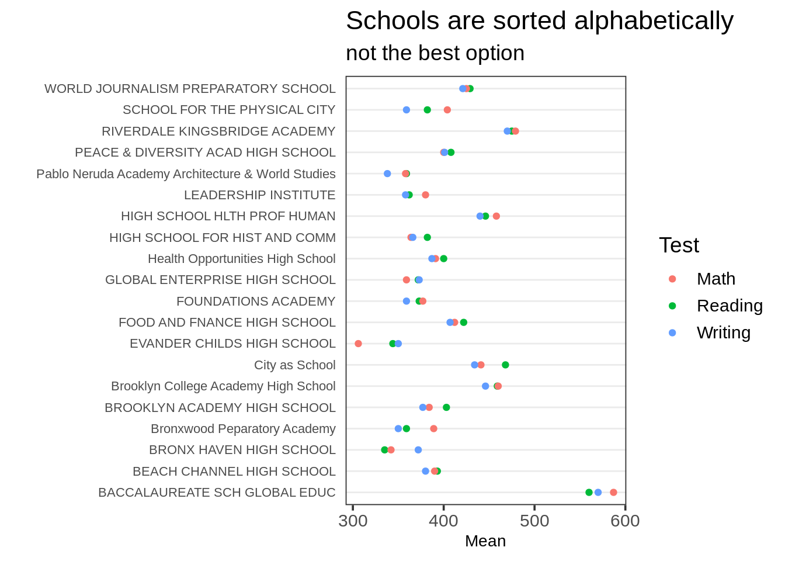
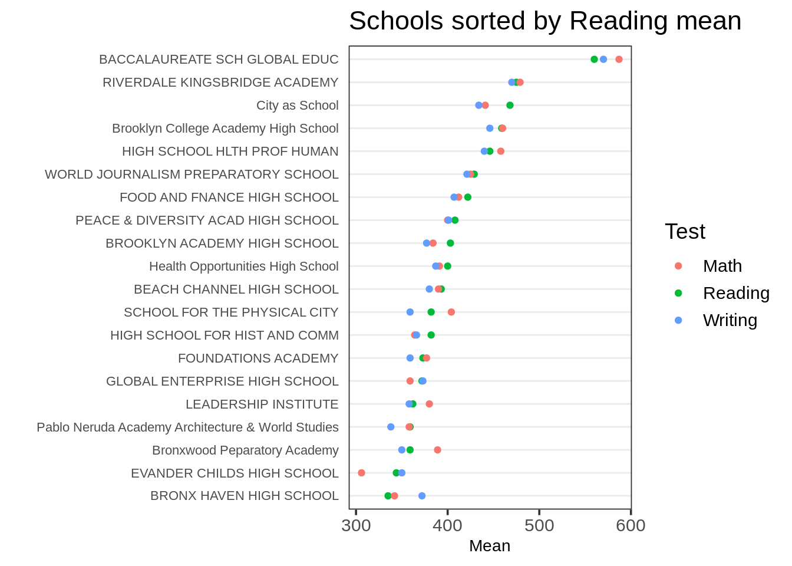
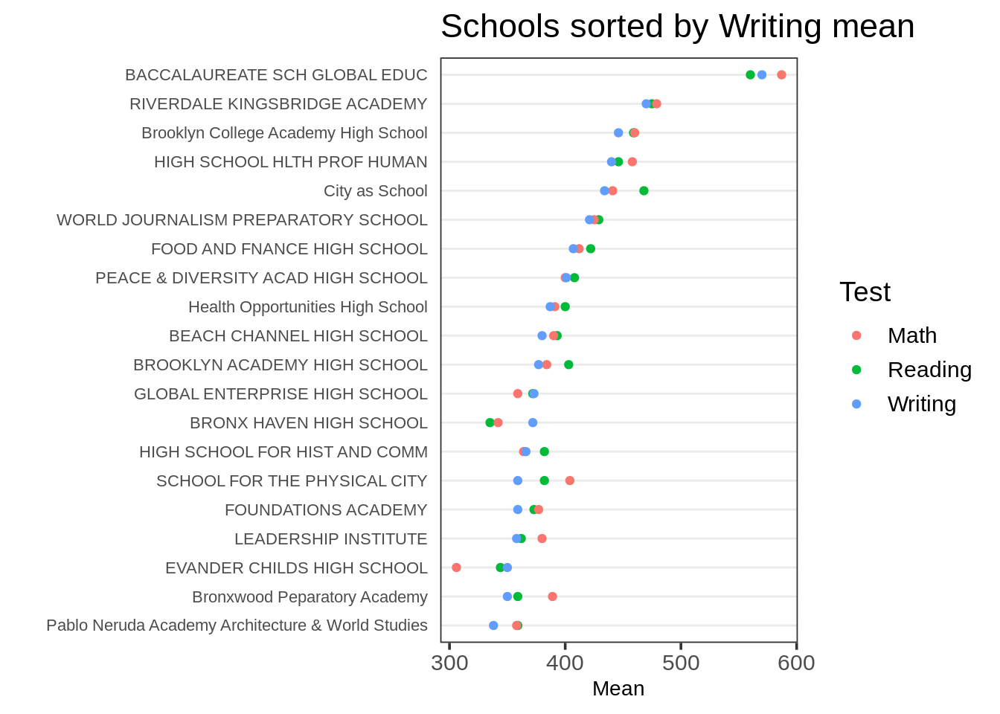
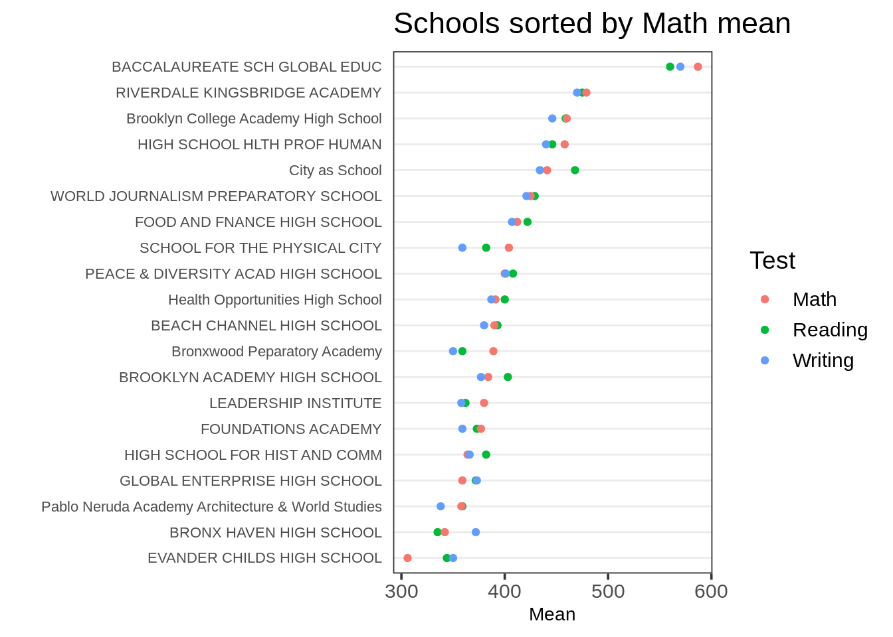

# Chinese Translation of Bar Chart and Cleveland Dot Plot 

Changhao He

Source: https://edav.info/bar.html<br/>
        https://edav.info/cleveland.html

## 图表：条形图


### 综述

  这一章节包含了如何制作条形图。

### 太长不看

我想要一个漂亮的例子。不是明天，不是在早饭之后，而是现在！<br />
这里就是一个显示了皇家游轮泰坦尼克号乘客生还率的条形图：


接下来是代码：


```r
library(datasets) # 数据
library(ggplot2) # 绘图工具
library(dplyr) # 数据处理

# 结合儿童和成年人的数据
ship_grouped <- as.data.frame(Titanic) %>%
  group_by(Class, Sex, Survived) %>%
  summarise(Total = sum(Freq))

ggplot(ship_grouped, aes(x = Survived, y = Total, fill = Sex)) +
  geom_bar(position = "dodge", stat = "identity") +
  geom_text(aes(label = Total), position = position_dodge(width = 0.9), 
            vjust = -0.4, color = "grey68") +
  facet_wrap(~Class) +
  # 排版
  ylim(0, 750) +
  ggtitle("Don't Be A Crew Member On The Titanic",
          subtitle = "Survival Rates of Titanic Passengers by Class and Gender") +
  scale_fill_manual(values = c("#b2df8a", "#a6cee3")) +
  labs(y = "Passenger Count", caption = "Source: titanic::titanic_train") +
  theme(plot.title = element_text(face = "bold")) +
  theme(plot.subtitle = element_text(face = "bold", color = "grey35")) +
  theme(plot.caption = element_text(color = "grey68"))
```

想要知道关于这个数据的更多信息，在控制台输入`?datasets::Titanic`。

### 简单的例子

我的眼睛比我的胃还大，请更加简单一点！<br />

让我们来用`HairEyeColor`这个数据。刚开始，让我们来看女性发色的不同分类。


```r
colors <- as.data.frame(HairEyeColor)

# 通过dplyr只获取女性发色
colors_female_hair <- colors %>%
  filter(Sex == "Female") %>%
  group_by(Hair) %>%
  summarise(Total = sum(Freq))

# 浏览数据
head(colors_female_hair)
```

```
## # A tibble: 4 × 2
##   Hair  Total
##   <fct> <dbl>
## 1 Black    52
## 2 Brown   143
## 3 Red      37
## 4 Blond    81
```

让我们根据这个数据来做一些图形。

#### 用base R做条形图


```r
barplot(colors_female_hair[["Total"]], 
        names.arg = colors_female_hair[["Hair"]],
        main = "Bar Graph Using Base R")
```


我们建议用Base R来做那些只是为了你自己的简单条形图。和其他所有的Base R一样，它设置起来很简单。注意：Base R需要一个矢量或者矩阵,因此在条形图调用时需要用双中括号（获取每一列作为列表）。


#### 用ggplot2做条形图


```r
library(ggplot2) # 绘图工具

ggplot(colors_female_hair, aes(x = Hair, y = Total)) +
  geom_bar(stat = "identity") +
  ggtitle("Bar Graph Using ggplot2")
```


`ggplot2`中的条形图非常简单。你输出一个数据框，让它知道你想要哪一部分映射到不同的轴上。注意：在这个例子里，我们有一个含有数值的表，并想要通过独立的柱的高度来画出这些数值。因此，我们规定y轴为`Total`这一列，但我们也需要规定`stat = "identity`在`geom_bar()`里，从而让它知道怎么正确的绘图。通常你会有每一行都是一个观测值的数据集，同时你想要把这些观测值通过柱来分组。在这种情况下，y轴和`stat = "identity`不需要特别规定。


### 理论

想要知道绘制分类数据的更多信息，阅读教科书第四章。

### 何时使用


条形图最好用在分类数据。通常你会有一个你想要把它分成不同组的因子数据的集合。


### 注意事项


#### 不要用于连续数据


如果你发现你的条形图看起来不太对，请确保你的数据是分类的而不是连续的。如果你想通过柱来绘制连续数据，那是直方图的功能。

### 修改

这些修改假设你在使用`ggplot2`。

#### 旋转条形图

为了旋转方向，添加`coord_flip()`就可以了：

```r
ggplot(colors_female_hair, aes(x = Hair, y = Total)) +
  geom_bar(stat = "identity") +
  ggtitle("Bar Graph Using ggplot2") +
  coord_flip()
```


#### 对柱子重新排序

在base R和ggplot2里对于字符型数据柱是通过首字母顺序排列的，对于因子型数据柱是通过层次来排列的。但是，因为因子型数据的层次的默认顺序是首字母顺序，所以在两种情况下柱都会通过首字母顺序排列。请看这个[教程](https://github.com/jtr13/codehelp/blob/master/R/reorder.md)来获得关于条形图里的柱应该怎么排序细致的解释，和如何通过forcats程序包来帮助你完成重新排序。

#### 封装型分面

你可以通过`facet_wrap()`把图表分成几个小图。（别忘记了腭化符号，~）：

```r
ggplot(colors, aes(x = Sex, y = Freq)) +
  geom_bar(stat = "identity") +
  facet_wrap(~Hair)
```


### 外部资源

- [Cookbook for R](http://www.cookbook-r.com/Manipulating_data/Changing_the_order_of_levels_of_a_factor/): 讨论了关于因子层次的重新排序。<br/>
- [DataCamp Exercise](https://campus.datacamp.com/courses/data-visualization-with-ggplot2-2/chapter-4-best-practices?ex=4#skiponboarding):一些用`ggplot2`做条形图的一些简单练习。<br/>
- [ggplot2 cheatsheet](https://rstudio.com/wp-content/uploads/2015/03/ggplot2-cheatsheet.pdf):在你身边总是好的。<br/> <br/>

## 图表：克利夫兰点图


这个页面是一项正在进行的工作，我们感谢任何你可能有的贡献。如果你想帮助改进这个页面，请考虑对[我们的版本库做出贡献](https://edav.info/contribute.html)。

### 综述

这一章节包含了如何做克利夫兰点图。克利夫兰点图是简单条形图的一个很好的替代品，特别是如果你有不止一些的项的时候。不需要太多的项就会让条形图看起来很凌乱。在相同的空间里，更多的数值可以被包含在一个点图里面，而且点图也更容易阅读。R 有一个内置的基本函数，`dotchart()`，但是因为它是一个画起来很简单的图形，在ggplot2或者base里面“从零开始”让我们有更多的定制选项。


代码：


```r
# 创造一个能被再使用的点图主题。
theme_dotplot <- theme_bw(14) +
    theme(axis.text.y = element_text(size = rel(.75)),
        axis.ticks.y = element_blank(),
        axis.title.x = element_text(size = rel(.75)),
        panel.grid.major.x = element_blank(),
        panel.grid.major.y = element_line(size = 0.5),
        panel.grid.minor.x = element_blank())
        
# 把行的名字变成数据框的一列。      
df <-  swiss %>% tibble::rownames_to_column("Province")

# 创造一个图表。
ggplot(df, aes(x = Fertility, y = reorder(Province, Fertility))) +
    geom_point(color = "blue") +
    scale_x_continuous(limits = c(35, 95),
        breaks = seq(40, 90, 10)) +
    theme_dotplot +
    xlab("\nannual live births per 1,000 women aged 15-44") +
    ylab("French-speaking provinces\n") +
    ggtitle("Standardized Fertility Measure\nSwitzerland, 1888")
```

### 多点图

在这个例子里面我们将用2010年纽约城公立学校的一个样本的SAT平均分数的数据：


```r
df <- read_csv("data/SAT2010.csv", na = "s")

set.seed(5293)
tidydf <- df %>%
  filter(!is.na(`Critical Reading Mean`)) %>%
  sample_n(20) %>%
  rename(Reading = "Critical Reading Mean", Math = "Mathematics Mean",
         Writing = "Writing Mean") %>%
  gather(key = "Test", value = "Mean", "Reading", "Math", "Writing")

ggplot(tidydf, aes(Mean, `School Name`, color = Test)) +
  geom_point() +
  ggtitle("Schools are sorted alphabetically", sub = "not the best option") + ylab("") +
  theme_dotplot
```


注意`School Name`是按照因子层次排序的，默认是首字母顺序。一个更好的选择是通过一个`Test`中的层次集来排序。通常最好是尝试通过不同的层次集来排序，然后观察出现的模式。 <br/> <br/>
为了执行双重排序，就是先通过`Test`然后再通过`Mean`来排列`School Name`，我们会使用`forcats::fct_reorder2()`。这个函数会通过对两个矢量的排序来对`.f`(一个因子或者字符矢量)进行排序。对于这种图形，`.x`是彩色的点所表示的变量，`.y`是投射到y轴的连续变量。<br/> <br/>
假设我们希望通过阅读的平均分来对学校进行排序。我们可以在我们对`Mean`进行排序时，通过限制`Test`变量到“阅读”来完成该排序：

```r
ggplot(tidydf, 
       aes(Mean, fct_reorder2(`School Name`, Test=="Reading", Mean, .desc = FALSE),
           color = Test)) +
  geom_point() + ggtitle("Schools sorted by Reading mean") + ylab("") +
  theme_dotplot 
```

<br/> <br/>
（非常感谢Zeyu Qiu对于直接在因子层次上对`.x`进行设置的小建议，这是一个更好的方式相较于我们下面讨论的，顺应`fct_reorder2()`的默认对因子层次进行重新排列。）<br/> <br/>
虽然这是首选方法，但有些情况下直接指明你希望通过对于第一个变量（`Test`）的第一个因子层次或者最后一个因子层次排序,而不用把它拼写出来会更加简单。<br/> <br/>
如果没有特别指明一个变量，`fct_reorder2()`默认会通过对`.x`的最后一个因子层组进行排序，这种情况下“写作”是`Test`的最后一个因子层次。

```r
ggplot(tidydf, 
       aes(Mean, fct_reorder2(`School Name`, Test, Mean, .desc = FALSE),
           color = Test)) +
  geom_point() + ggtitle("Schools sorted by Writing mean") + ylab("") +
  theme_dotplot
```

<br/> <br/>
如果你想要通过对`.x`的第一个因子层次进行排序，在这里是“数学”，你需要forcats的开发版本，你可以通过：`devtools::install_github("tidyverse/forcats")`来安装。<br/>
把默认排序函数`last2()`改为`first2()`：

```r
ggplot(tidydf, 
       aes(Mean, fct_reorder2(`School Name`, Test, Mean, .fun = first2, .desc = FALSE),
           color = Test)) +
  geom_point() + ggtitle("Schools sorted by Math mean") + ylab("") +
  theme_dotplot
```

