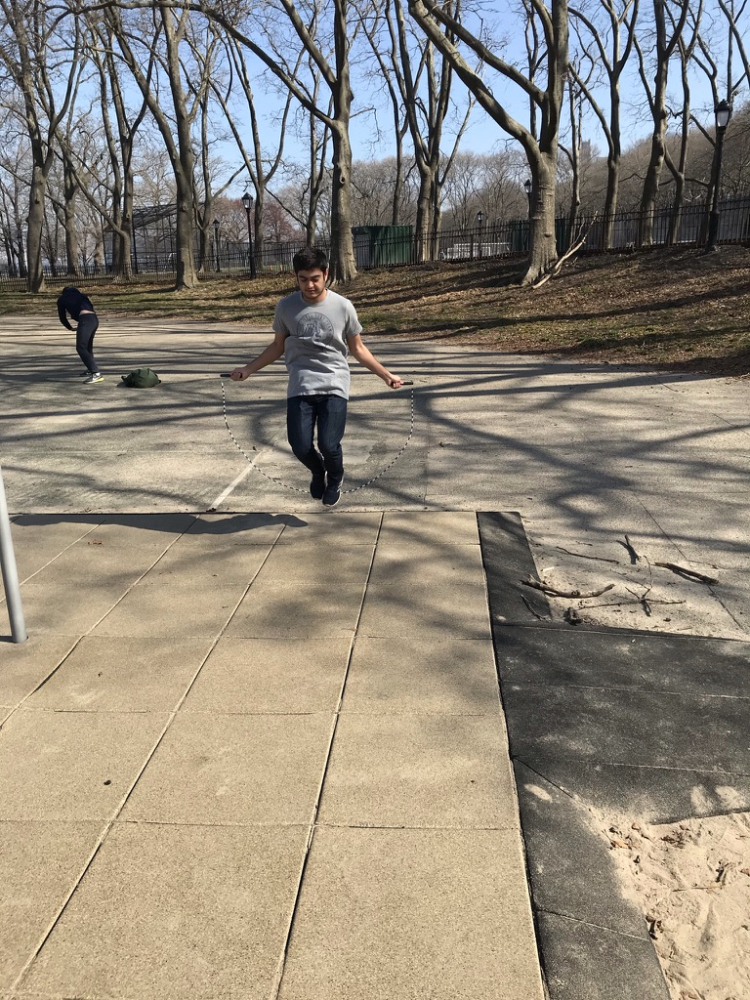
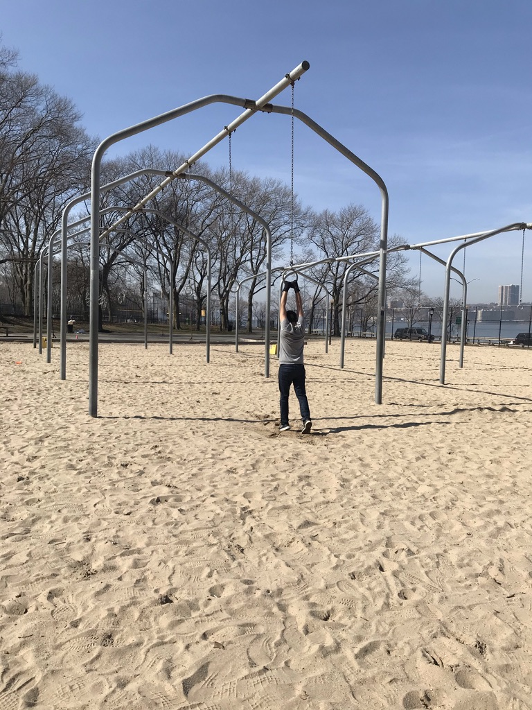
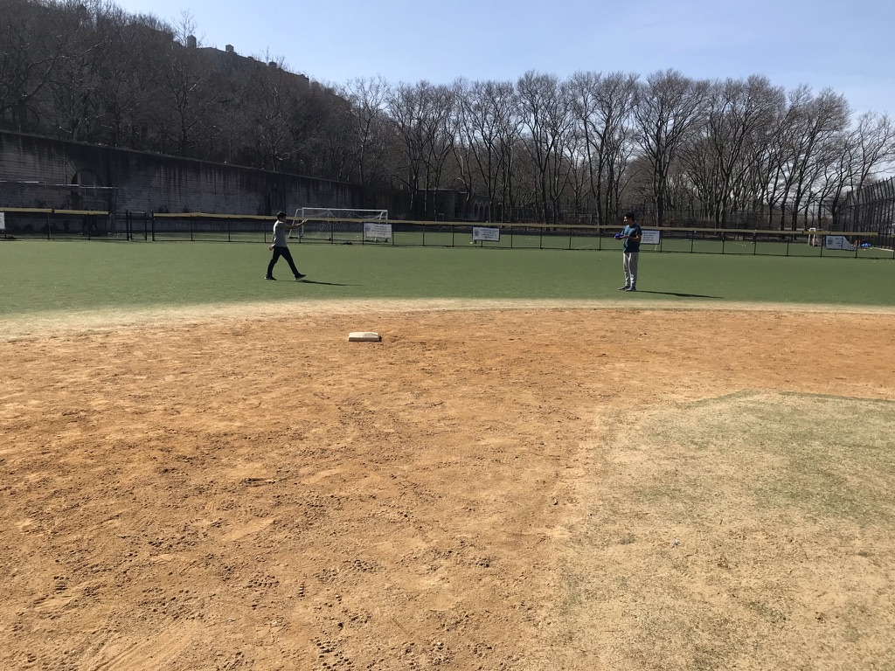

# In-Person Fitness Hour

Aditya Koduri and Archit Matta

## Piazza Announcement

In an effort to provide some real interaction amidst these virtual times, we organized an In-Person Fitness Hour.

**Events:**
 1. Yoga (Bring your own mats)
 2. Jump Rope (Available with Organizers)
 3. Frisbee (Available with Organizers)
 4. Running

**Location:** Riverside Park (Meeting Point - Hudson Beach)
  **Timing:** Tuesday, 23rd March 2021 - 10:00 AM

**Safety Guidelines:**
 1. Masks are compulsory and organizers would provide additional masks at the venue
 2. Maintaining Social Distancing is necessary,and the activities have been planned keeping that in mind
 3. Please bring your own sanitizers and the organizers would bring additional sanitizers to the venue
 4. The organizers would ensure all equipment being offered is sanitized before use
 5. Please refrain from attending if you show symptoms or have been in a high-risk zone
 6. In addition, please also follow the latest guidance from the U.S. Centers for Disease Control and Prevention (CDC)

## Final Event

### Jump Rope

### Monkey Bars

### Frisbee

