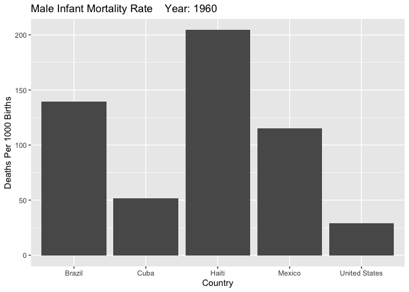
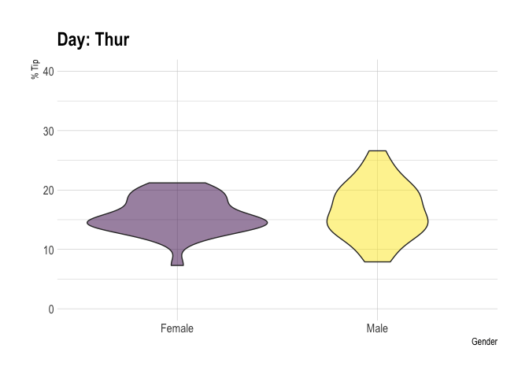
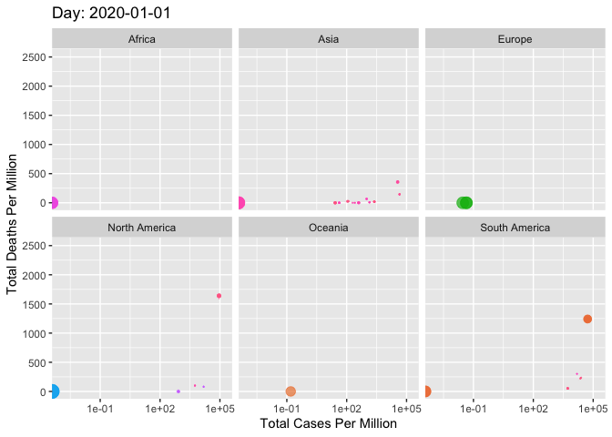
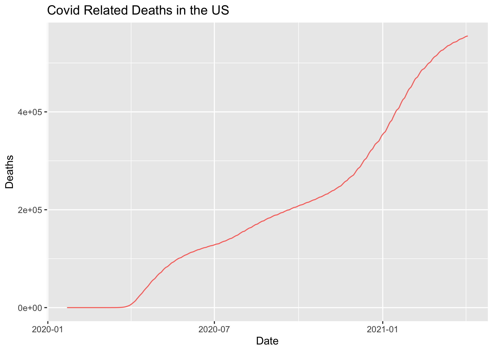
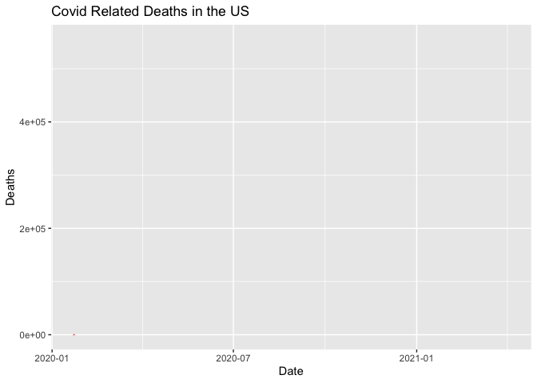
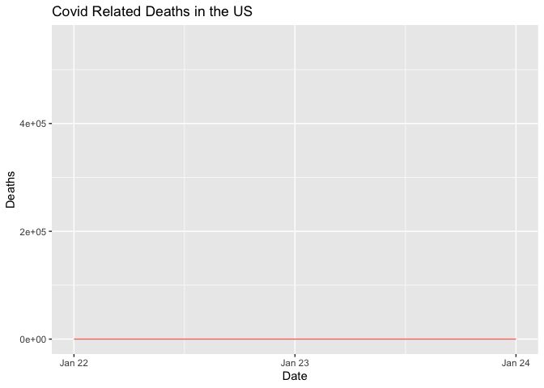

# gganimate Tutorial

Chris Petty

<p>&nbsp;</p>

This is an attempt to provide more instruction to new users of the gganimate tool, since https://gganimate.com/ is light on the details.

<p>&nbsp;</p>

The most important functions that can be added to the end of your ggplot in order to animate it are the `transition_*` functions:

`transition_states(states, transition_length = 1, state_length = 1, wrap = TRUE)`

Where 'states' is the variable the animation transitions over. 'transition_length' is the relative length of the transition, 'state_length' is the relative length of the pause at the states, and 'wrap' decides if the animation loops back to the beginning, meaning the last state transitions into the first. 

`transition_time(time, range = NULL)`

This transition is used for data whose states are represented by points in time. The 'time' variable is the column containing the time data, whether that be years, dates, minutes, ect. And 'range' is used if you only want a subset of your time series to be animated.


`transition_reveal(along, range = NULL, keep_last = TRUE)`

The animation created by this function is of the data being revealed, like a line graph being drawn in front of you.


There are other functions, like `transition_layers()` which animates layers being added to a plot, or `transition_components()` which allows different components of the animation to operate independently from one another... but the uses for these are much more niche.


<p>&nbsp;</p>
<p>&nbsp;</p>

The last functions I'll mention before getting into the examples is `animate(plot, renderer)` which does the actual animating and `anim_save("name", the_animation)` which is used to save the animation (in our case as a gif, using the gifski package).

<p>&nbsp;</p>
<p>&nbsp;</p>

The following are the packages needed to follow along with this tutorial.


```{r message=FALSE, eval=FALSE}

library(tidyverse)
library(ggplot2)
library(gganimate) #Must be installed from cran
library(gifski) #Must be installed from cran
library(readxl) #Must be installed from cran
library(dplyr)
library(janitor) #Must be installed from cran
library(forcats) #Must be installed from cran
library(hrbrthemes) #Must be installed from cran
library(viridis) #Must be installed from cran

```

```{r message=FALSE}

library(knitr)

```

<p>&nbsp;</p>

### Example 1

Here is a [link](https://data.worldbank.org/indicator/SP.DYN.IMRT.IN) to the data used in the first graph. Follow along below to format the data correctly. The displayed data is the format needed for the time series animation to work.

```{r, eval=FALSE}

data <- read_xls('mortality_rate_male.xls', col_names = FALSE)
data <- data %>% select(1, 5:65)
data <- data[-c(1:3), ]
data <- data %>%
  row_to_names(row_number = 1)

new_data <- data[c(28, 49, 99, 153, 250), ]
new_data[,2:62] <- sapply(new_data[,2:62],as.numeric)
new_data <- new_data %>% mutate_if(is.numeric, round, digits=3)

data_final <- new_data %>%
  pivot_longer(!'Country Name', names_to = "years", values_to = "infant mortality rate")
data_final[,2] <- sapply(data_final[,2],as.integer)

head(data_final, 10)

```


Here's a very basic example of Male Infant Mortality Rate by Year, featuring arbitrarily picked nations. Notice **'{frame_time}'** in labs, this updates the time in the title as the animation progresses.

```{r warning=FALSE, eval=FALSE}

anim <- ggplot(data=data_final, aes(x=`Country Name`, y=`infant mortality rate`)) +
  geom_bar(stat="identity") + 
  # The gganimate code is below
  labs(title = 'Male Infant Mortality Rate    Year: {frame_time}', x = 'Country', 
       y = 'Deaths Per 1000 Births') +
  transition_time(years) +
  ease_aes('linear')

mortality_ani <- animate(anim, renderer=gifski_renderer())

mortality_ani

```

```{r echo=FALSE, out.width = '100%'}



```

There's an additional function in the gganimate block above that I haven't mentioned yet, `ease_aes()`, this handles the pace between transition values. Here I use 'linear', but there are others such as 'cubic-in' and 'elastic-in'

*Note: If you're wondering about the spike Haiti had in 2010, there was an earthquake. Read more about it [here](https://www.npr.org/sections/pictureshow/2020/01/12/794939899/haiti-in-ruins-a-look-back-at-the-2010-earthquake).*


<p>&nbsp;</p>
<p>&nbsp;</p>

### Example 2

Here's an example of **transition_states**, this time we're animating the violin plots using the example given [here](https://www.r-graph-gallery.com/violin_grouped_ggplot2.html).

Technically this is also time data, but instead of treating it like that, we're using Thursday, Friday, Saturday, and Sunday as the states.

```{r warning=FALSE, eval=FALSE}

# Load dataset from github
data <- read.table("https://raw.githubusercontent.com/holtzy/data_to_viz/master/Example_dataset/10_OneNumSevCatSubgroupsSevObs.csv", header=T, sep=",") %>%
  mutate(tip = round(tip/total_bill*100, 1))
  
```

```{r warning=FALSE, eval=FALSE}
# Grouped
vio_plot <- data %>%
  mutate(day = fct_reorder(day, tip)) %>%
  mutate(day = factor(day, levels=c("Thur", "Fri", "Sat", "Sun"))) %>%
  ggplot(aes(fill=sex, x=sex, y=tip)) + 
    geom_violin(position="dodge", alpha=0.5, outlier.colour="transparent", show.legend = FALSE) +
    scale_fill_viridis(discrete=T, name="") +
    theme_ipsum() +
    ylim(0,40) +
  # Here are our additions
  transition_states(day) + 
      labs(title = 'Day: {previous_state}', x = 'Gender', y = '% Tip')
  

vio_ani <- animate(vio_plot, renderer=gifski_renderer())

vio_ani

```

```{r echo=FALSE, out.width = '100%'}



```

<p>&nbsp;</p>

### Example 3

Next, another example using time series data, this time featuring our own graph of Covid Deaths and Cases for every nation. Here's a [link](https://ourworldindata.org/coronavirus-source-data) to the data to follow along. I'm particularly fond of this one because, while it isn't perfect, it's a great example of how much information you can display in a way that remains understandable.

Below is how the data is formatted and how it looks.

```{r warning=FALSE, eval=FALSE}

df2 <- read_csv('owid-covid-data.csv')
df2[, c(5, 8, 11, 14)] <- replace(df2[, c(5, 8, 11, 14)], is.na(df2[, c(5, 8, 11, 14)]), 0)
df2 <- df2 %>% drop_na(continent, location)
df2 <- df2[, c(2, 3, 4, 5, 8, 11, 14, 45)]

head(df2, 10)

```

<p>&nbsp;</p>

And below is the code to animate. One of the functions being added to the animation is `shadow_wake()`. This briefly marks where the previous data was, almost like the wake of a boat. Personally I don't think it adds much, but it's interesting to look at. `shadow_mark()` also exists, which permanently marks each data point.


```{r warning=FALSE, eval=FALSE}

anim2 <- ggplot(df2, aes(total_cases_per_million, total_deaths_per_million, size = population, colour = location)) +
  geom_point(alpha = 0.7, show.legend = FALSE) +
  scale_size(range = c(2, 12)) +
  scale_x_log10() +
  facet_wrap(~continent) +
  # The gganimate bits
  labs(title = 'Day: {frame_time}', x = 'Total Cases Per Million', y = 'Total Deaths Per Million') +
  transition_time(date) +
  # The new function
  shadow_wake(wake_length = 0.1, alpha = FALSE) +
  ease_aes('linear')

coivd_countries_ani <- animate(anim2, nframes = 100, fps = 10, renderer = gifski_renderer())

covid_countries_ani

```

```{r echo=FALSE, out.width = '100%'}



```

You'll also notice two new variables in the animate function, **nframes** and **fps**. The defaults to these are 100 and 10 respectively, which I've kept, but you can set them to whatever you like to control the duration of the animation (run_time = nframes/fps). More frames can add a significant amount of time to the rendering. There is also 'duration', but this doesn't adjust the number of frames and can come out choppy.

More variables not used in this tutorial are **end_pause** in which you can set the number of frames the animation pauses before looping. And **height** and **width**, which allow you to control the size of the output.

<p>&nbsp;</p>

Below is code to save the animation to our directory. Since we used 'gifski_renderer()' as our renderer, the animation will be saved as a gif.

```{r eval=FALSE}

anim_save("covid.gif", the_animation)

```


<p>&nbsp;</p>
<p>&nbsp;</p>

### Example 4

**Another group of functions** that can be used to animate the data is `view_*()`, which animates the axes.

`view_follow(fixed_x=TRUE/FALSE/Range, fixed_x=TRUE/FALSE/Range)`

`view_step(pause_length, step_length, nstep)`

Here's a simple line graph using the US data from the covid dataset above. You can see how **transition_reveal** and **view_follow** each add to the graph. Here you can also see how animate() gets called under the hood in cases where it isn't included.

```{r eval=FALSE}

df3 <- df2[df2$location == 'United States', ]

p <- ggplot(df3,
  aes(x=date, y=total_deaths, colour='red')) +
  geom_line(show.legend = FALSE) +
  labs(title = "Covid Related Deaths in the US", x = "Date", y = "Deaths")

p

```

```{r echo=FALSE, out.width = '100%'}



```

```{r eval=FALSE}

p2 <- p + transition_reveal(date) 

p2

```

```{r echo=FALSE, out.width = '100%'}



```

```{r eval=FALSE}

p3 <- p + transition_reveal(date) + view_follow(fixed_y = TRUE)

p3

```

```{r echo=FALSE, out.width = '100%'}



```


<p>&nbsp;</p>


## More Information

- The larger the dataset the longer the animation will take to render. In some cases this can take hours. That should not be the case for this tutorial.

- More Documentation [here](https://cran.r-project.org/web/packages/gganimate/gganimate.pdf)


- A list of all the functions used/mentioned in this tutorial:

**Main animation functions**

`transition_states(states, transition_length = 1, state_length = 1, wrap = TRUE)`

`transition_time(time, range = NULL)`

`transition_reveal(along, range = NULL, keep_last = TRUE)`

`view_follow(fixed_x=TRUE/FALSE/Range, fixed_x=TRUE/FALSE/Range)`

`view_step(pause_length, step_length, nstep)`

**Animating and parameters**

`animate(plot, n_frames, fps, end_pause, height, width, renderer)`

`anim_save("name", the_animation)`
 
**Additional parameters**

`shadow_wake()` / `shadow_mark()`

`ease_aes(['linear', 'cubic-in', 'elastic-in'])`

`labs(title, x, y)`


