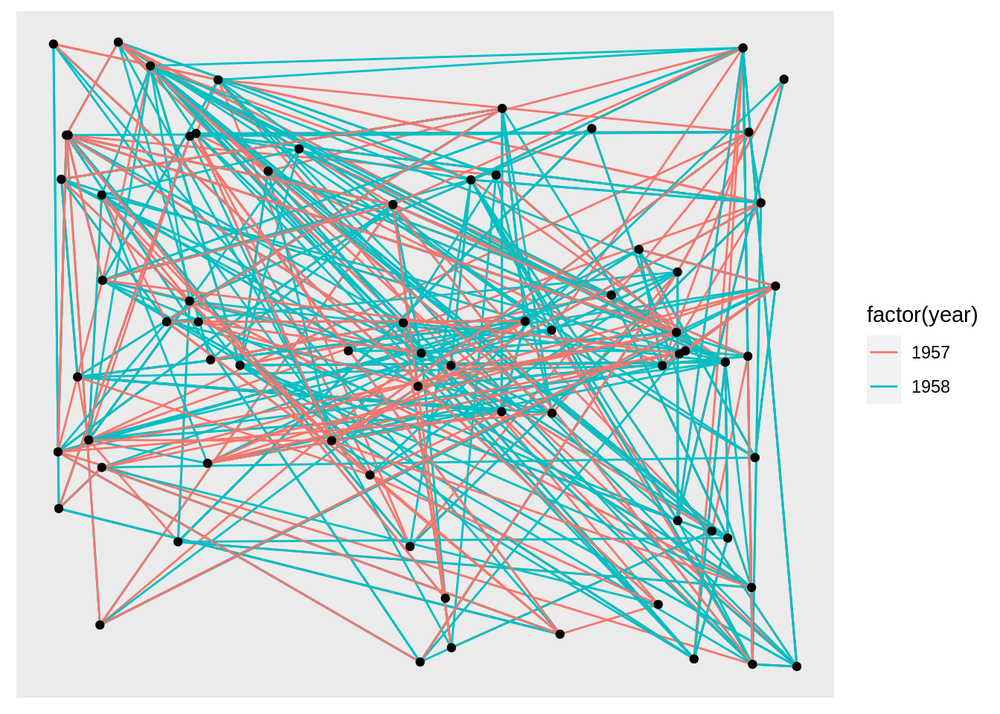
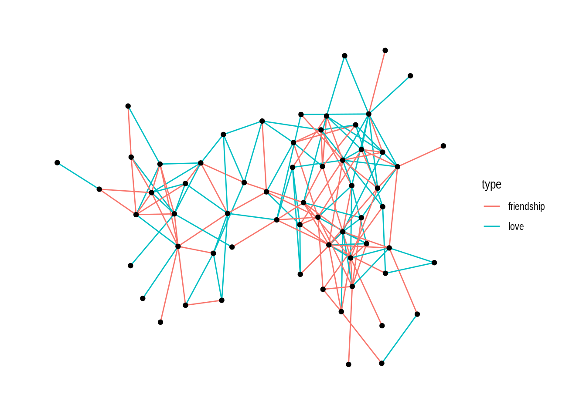
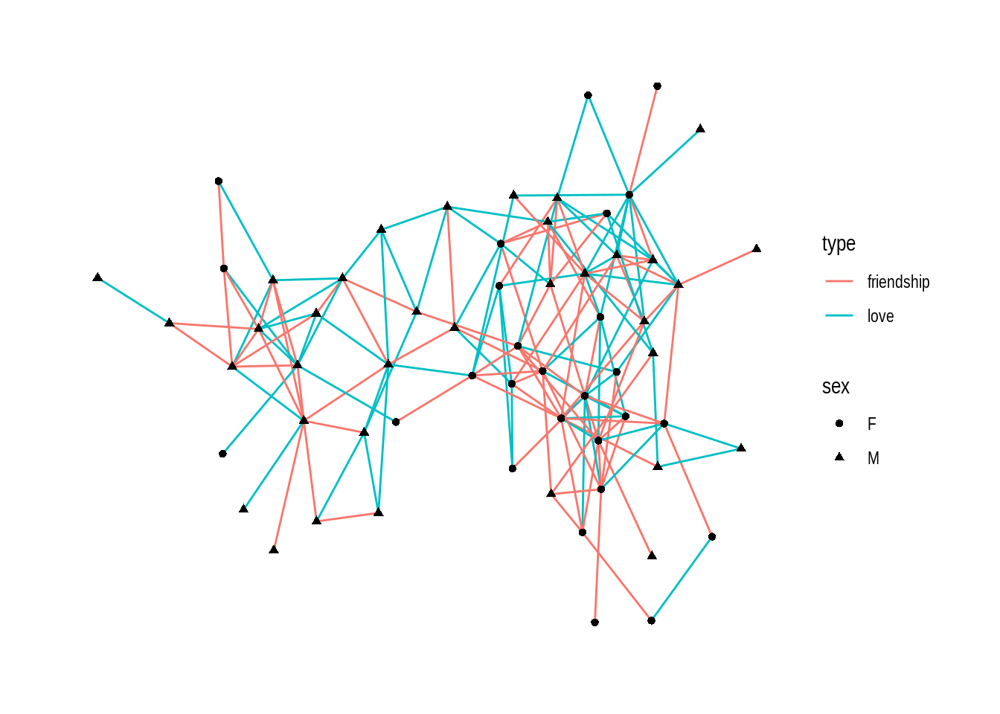
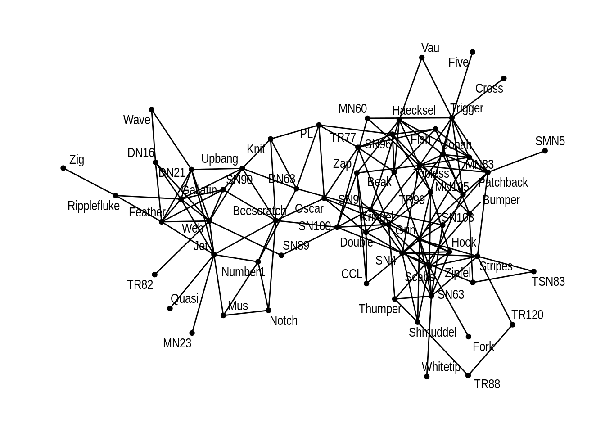

# A brief introduction to ggraph

Ying Bi and Gaoge Liu


## Overview
ggraph is an extension of the ggplot2 API. Because of reliance on tabular data input, ggplot2 is not a good choice for graph and network visualizations. ggpraph helps solve this problem and provides the same flexible approach to building up plots layer by layer.

In this tutorial, we will cover the installation, core concepts and give examples on how to use ggraph.

## Installation
ggraph is available through CRAN and can be installed with install.packages('ggraph'). The package is under active development though and the latest set of features can be obtained by installing from this repository using devtools:

```r
#devtools::install_github('thomasp85/ggraph')
```

## Core Concept 1: Layout
A layout is the vertical and horizontal placement of nodes when plotting a particular graph structure. Conversely, a layout algorithm is an algorithm that takes in a graph structure (and potentially some additional parameters) and return the vertical and horizontal position of the nodes.

ggraph has access to all layout functions available in igraph and furthermore provides a large selection of its own, such as hive plots, treemaps, and circle packing.

When using ggraph, the layout should be defined outside of calls to geoms or stats. If we do not specify a layout, ggraph will automatically pick one.

```r
graph <- graph_from_data_frame(highschool)
ggraph(graph) + 
  geom_edge_link(aes(colour = factor(year))) + 
  geom_node_point()
```


Also, we can specify the layout:

```r
ggraph(graph, layout = 'randomly') + 
    geom_edge_link(aes(colour = factor(year))) + 
    geom_node_point()
```



We can use create_layout() to create a layout_ggraph object and use it as an argument.

```r
layout <- create_layout(graph, layout = 'star')
ggraph(layout) + 
    geom_edge_link(aes(colour = factor(year))) + 
    geom_node_point()
```


The return of create_layout() is a data.frame of node positions and (possible) attributes. The original graph object along with other relevant information is passed along as attributes:

```r
head(layout)
```

```
##           x          y name .ggraph.orig_index circular .ggraph.index
## 1 0.0000000 0.00000000    1                  1    FALSE             1
## 2 1.0000000 0.00000000    2                  2    FALSE             2
## 3 0.9958568 0.09093486    3                  3    FALSE             3
## 4 0.9834617 0.18111621    4                  4    FALSE             4
## 5 0.9629173 0.26979677    5                  5    FALSE             5
## 6 0.9343938 0.35624171    6                  6    FALSE             6
```

```r
attributes(layout)
```

```
## $names
## [1] "x"                  "y"                  "name"              
## [4] ".ggraph.orig_index" "circular"           ".ggraph.index"     
## 
## $row.names
##  [1]  1  2  3  4  5  6  7  8  9 10 11 12 13 14 15 16 17 18 19 20 21 22 23 24 25
## [26] 26 27 28 29 30 31 32 33 34 35 36 37 38 39 40 41 42 43 44 45 46 47 48 49 50
## [51] 51 52 53 54 55 56 57 58 59 60 61 62 63 64 65 66 67 68 69 70
## 
## $graph
## # A tbl_graph: 70 nodes and 506 edges
## #
## # A directed multigraph with 1 component
## #
## # Edge Data: 506 x 4 (active)
##    from    to  year direction
##   <int> <int> <dbl> <fct>    
## 1     1    13  1957 left     
## 2     1    14  1957 left     
## 3     1    20  1957 right    
## 4     1    52  1957 right    
## 5     1    53  1957 right    
## 6     2    20  1957 right    
## # … with 500 more rows
## #
## # Node Data: 70 x 2
##   name  .ggraph.orig_index
##   <chr>              <int>
## 1 1                      1
## 2 2                      2
## 3 3                      3
## # … with 67 more rows
## 
## $class
## [1] "layout_tbl_graph" "layout_ggraph"    "data.frame"      
## 
## $circular
## [1] FALSE
```


## Core Concept 2: Nodes
The Nodes are the connected entities in the relational structure. The first concept, layout, is the physical placement of nodes, while the node geoms is the visual manifestation of the entities. As mentioned in 3, layout returns a dataframe, so we can diretly use geom_point() in ggplot2 to polt nodes.

However, ggraph comes with its own set of node geoms. Its first advantage over geom_point() is to provide clearer code, while the second one is that it saves typing.

```r
gr <- graph_from_data_frame(highschool)

ggraph(gr, layout = 'stress') + 
    geom_node_point()
```


The third advantage is for the added functionality. All ggraph_geoms gets a filter aesthetic that allows you to quickly filter the input data. The use of this can be illustrated when plotting a tree:

```r
gr <- graph_from_data_frame(flare$edges, vertices = flare$vertices)
ggraph(gr, layout = 'dendrogram', circular = TRUE) + 
    geom_edge_diagonal() + 
    geom_node_point(aes(filter = leaf)) + 
    coord_fixed()
```


## Core Concept 3: Edges
The Edges are the connections between the entities in the relational structure.A straight line is simply just one of many ways this relationship can be visualised. As we saw when discussing nodes sometimes it is not drawn at all but impied using containment or position (treemap, circle packing, and partition layouts), but more often it is shown using a line of some sort. This use-case is handled by the large family of edge geoms provided in ggraph. Some of the edges are general while others are dedicated to specific layouts.

geom_edge_link()is the simplest one with only straight lines:

```r
hairball <- graph_from_data_frame(highschool)

# Classify nodes based on popularity gain
pop1957 <- degree(delete_edges(hairball, which(E(hairball)$year == 1957)), 
                  mode = 'in')
pop1958 <- degree(delete_edges(hairball, which(E(hairball)$year == 1958)), 
                  mode = 'in')
V(hairball)$pop_devel <- ifelse(pop1957 < pop1958, 'increased',
                                ifelse(pop1957 > pop1958, 'decreased', 
                                       'unchanged'))
V(hairball)$popularity <- pmax(pop1957, pop1958)
E(hairball)$year <- as.character(E(hairball)$year)
ggraph(hairball, layout = 'kk') + 
    geom_edge_link(aes(colour = year))
```


By using the geom_edge_*() family of geoms that contain a lot of different edge types for different scenarios, we can use other specific type of edges. For example, when there exists multiple edges between the same nodes, we can use geom_edge_fan instead. It will spread parallel edges out as arcs with different curvature. Parallel edges will be sorted by directionality prior to plotting so edges flowing in the same direction will be plottet together:


```r
ggraph(hairball, layout = 'kk') + 
    geom_edge_fan(aes(colour = year))
```


## Example: Network Analysis with ggraph

In this part we show network analysis with ggraph on a dolphin network.  
This dolphin network includes:  
1. a set of nodes representing dolphins [dolphin_nodes.csv](http://users.dimi.uniud.it/~massimo.franceschet/ns/plugandplay/ggraph/dolphin_nodes.csv)  
2. a set of edges representing ties among dolphins [dolphin_edges.csv](http://users.dimi.uniud.it/~massimo.franceschet/ns/plugandplay/ggraph/dolphin_edges.csv)  
We preprocess the data using package tidygraph:


```r
#add edge type
nodes <- read.csv("http://users.dimi.uniud.it/~massimo.franceschet/ns/plugandplay/ggraph/dolphin_nodes.csv")
edges <- read.csv("http://users.dimi.uniud.it/~massimo.franceschet/ns/plugandplay/ggraph/dolphin_edges.csv")
edges = 
  edges %>% 
  mutate(type = sample(c("love", "friendship"), 
                       nrow(edges), 
                       replace = TRUE) )

# make a tidy graph
dolphin <- tbl_graph(nodes = nodes, edges = edges, directed = FALSE)
dolphin
```

```
## # A tbl_graph: 62 nodes and 159 edges
## #
## # An undirected simple graph with 1 component
## #
## # Node Data: 62 x 2 (active)
##   name       sex  
##   <chr>      <chr>
## 1 Beak       M    
## 2 Beescratch M    
## 3 Bumper     M    
## 4 CCL        F    
## 5 Cross      M    
## 6 DN16       F    
## # … with 56 more rows
## #
## # Edge Data: 159 x 3
##    from    to type      
##   <int> <int> <chr>     
## 1     4     9 friendship
## 2     6    10 love      
## 3     7    10 love      
## # … with 156 more rows
```

Firstly we plot the dolphin network with ggraph:

```r
# setting theme_graph 
set_graph_style()

# basic plot
ggraph(dolphin) + 
  geom_edge_link() + 
  geom_node_point()
```


Secondly we show dolphin network with respect to edge type and node sex:

```r
# setting theme_graph 
set_graph_style()

# plot edge type
ggraph(dolphin) + 
  geom_edge_link(aes(color = type)) + 
  geom_node_point()
```



For node sex:

```r
# setting theme_graph 
set_graph_style()

# plot node sex
ggraph(dolphin) + 
  geom_edge_link(aes(color = type)) + 
  geom_node_point(aes(shape = sex))
```



Thirdly we show dolphin network with every dolphin's name:

```r
# plot node name
ggraph(dolphin) + 
  geom_edge_link() + 
  geom_node_point() + 
  geom_node_text(aes(label = name), repel=TRUE)
```



Now we can do many tasks combining packages tidygraph and ggraph. For example, they can be pipelined to perform centrality pagerank and visualization tasks in one go:

```r
# setting theme_graph 
set_graph_style()


dolphin %>% 
  activate(nodes) %>%
  mutate(pagerank = centrality_pagerank()) %>%
  activate(edges) %>%
  mutate(betweenness = centrality_edge_betweenness()) %>%
  ggraph() +
  geom_edge_link(aes(alpha = betweenness)) +
  geom_node_point(aes(size = pagerank, colour = pagerank)) + 
  # discrete colour legend
  scale_color_gradient(guide = 'legend')
```


For our final example, we do community detection task and visualize it with ggraph:

```r
# setting theme_graph 
set_graph_style()


# visualize communities of nodes
dolphin %>% 
  activate(nodes) %>%
  mutate(community = as.factor(group_louvain())) %>% 
  ggraph() + 
  geom_edge_link() + 
  geom_node_point(aes(colour = community), size = 5)
```


## External Resource
1. [ggraph](https://github.com/thomasp85/ggraph) package;   
2. [tidygraph and ggraph: tidy network analysis and visualization](http://users.dimi.uniud.it/~massimo.franceschet/ns/plugandplay/ggraph/ggraph.html#15).
