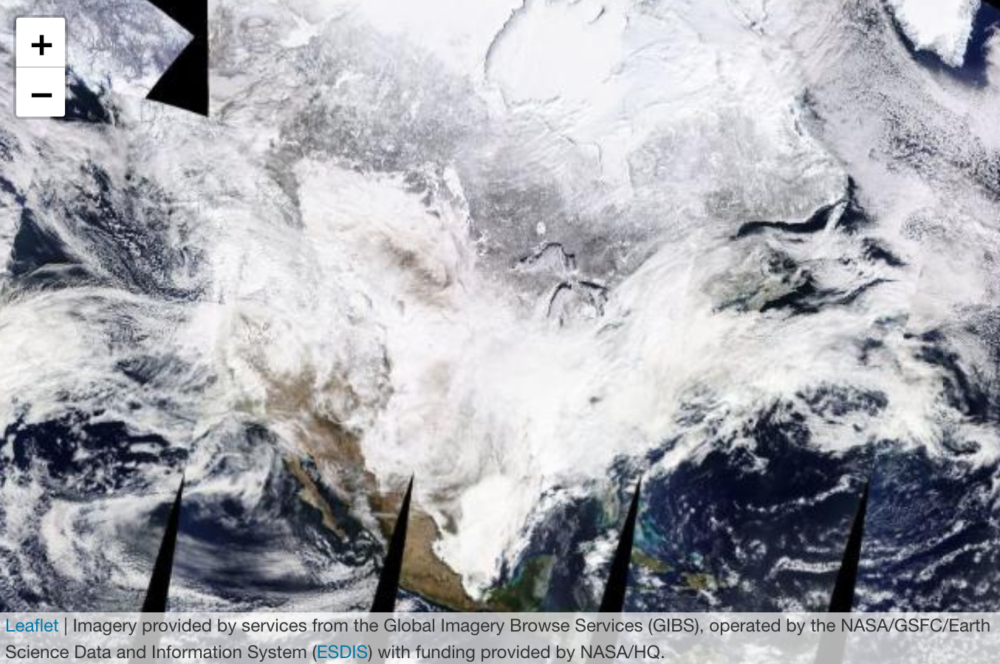

# Up and Running (Quickly) with Leaflet

Kenny Lee


```{r, include=FALSE}
SOLUTIONS <- TRUE
knitr::opts_chunk$set(warning = FALSE, message = FALSE, echo = SOLUTIONS, 
                      eval = SOLUTIONS, cache = FALSE)
library(tidyverse)
```


Last updated: 2021-03-20

## What is leaflet?

According to [Wikipedia](https://en.wikipedia.org/wiki/Leaflet_(software)):

> Leaflet is an open source JavaScript library used to build web mapping applications. First released in 2011, it supports most mobile and desktop platforms, supporting HTML5 and CSS3. Among its users are FourSquare, Pinterest and Flickr. Leaflet allows developers without a GIS background to very easily display tiled web maps hosted on a public server, with optional tiled overlays. It can load feature data from GeoJSON files, style it and create interactive layers, such as markers with popups when clicked. It is developed by Vladimir Agafonkin, who joined Mapbox in 2013.


## Why should we use leaflet on R?
The `leaflet` package is regularly maintained and is an easy way to create `leaflet` maps in R. See [Leaflet for R](https://rstudio.github.io/leaflet/). Mapping tools for R had been around prior to the introduction of this package. For example, `ggplot2` supports mapping with the help of other packages such as `maptools`. However, there are clear advantages over these tools that `leaflet` can offer. See below.

### Reason why you should use leaflet
- It is light and easy to use.
- It supports interactivity on the web, without worrying about JavaScript.
- It can be easily embedded into [R Markdown](http://rmarkdown.rstudio.com/) documents and [Shiny](http://shiny.rstudio.com/) apps.
- There are many visually appealing templates created by third parties.

That said, `leaflet` is not perfect. One drawback is a lack of total freedom. Consider D3 for total control of form and interactivity.

## Why another how-to post on Leaflet?
- The `leaflet` package is relatively well [documented](https://rstudio.github.io/leaflet/), with numerous pages of technical details on everything one can do with it, but all this information can feel daunting., especially for those who lack experience in working with geospatial data.
- In this note, I focus on helping others produce their first map quickly without perusing all the pages in the documentation.
- Follow the steps below to get up and running with leaflet.


## First: Creating a base map

`leaflet` uses tiles to create maps. One just needs a few lines of code to get started. The function `leaflet()` returns a `leaflet` map widget. After that, `addTiles()` loads a base map. Here's our first map with Leaflet.

```{r}
library(leaflet)
mymap <- leaflet() %>% addTiles()
# Default tiles are from OpenStreetMap
mymap
```

Let us zoom into New York City. `setView()` will set the focal point for a map. `lng` and `lat` indicate longitude and lattitude of the center of the map. `zoom` defines the zoom level.


```{r}
mymap %>% addTiles() %>% setView(lng = -73.9, lat = 40.7, zoom = 10)
```

It is easy add tiles from third parties. The following shows a satellite image of the US on in Feb 15 2021, in the midst of severe winter storms that impacted most of the country. The image is provide by NASA's [Global Imagery Browse Services (GIBS)](https://earthdata.nasa.gov/eosdis/science-system-description/eosdis-components/gibs).

```{r eval=FALSE}
leaflet() %>% setView(-93.65, 42.0285, zoom = 3) %>%
    addProviderTiles("NASAGIBS.ModisTerraTrueColorCR",
                    options = providerTileOptions(time = "2021-02-15"))

```
Currently, third-party tiles cannot be supported on bookdown. This issue is discussed [here:](https://github.com/rstudio/bookdown/issues/15#issuecomment-573776659)




## Second: Loading feature data

### What does geospatial data look like?

Geospatial data are often represented in vectors (points, lines and polygons). A shapefile that contains this information usually holds a single type of these vector data. Most common formats for geospatial data are GeoJSON, TopoJSON and .shp shapefiles. 

`leaflet` makes it easy to take spatial features to maps. The data often come in the form of

- `SpatialLines`, `SpatialLinesDataFrame`, `Lines`, and `Line objects` (from the sp package),
- `SpatialPolygons`, `SpatialPolygonsDataFrame`, `Polygons`, and `Polygon` objects (from the `sp` package), 
- and many others.

Here's a real example using `Lines`.

First, these packages are required.
```{r}
library(rgdal)        # for readOGR and others
library(sp)           # for spatial objects
library(leaflet)      # for interactive maps
library(tidyverse)    # for working with data frames and ggplot2
library(jsonlite)     # for downloading and interacting with Geo JSON file later
library(RCurl)        # same as above
library(httr)         # to deal with https problems when getting data from Github
library(zip)          # to unpack downloaded compressed data
```

In this example, I plot all roads in Manhattan from the US Census Bureau's [TIGER database](https://www.census.gov/geographies/mapping-files/time-series/geo/tiger-geodatabase-file.html). Read on below to find out more about the TIGER database. `addPolylines()` function from `leaflet` can interpret `SpatialLinesDataFrame` and plot lines on a map. 
```{r}
# Load the shape file 
base_url <- "https://www2.census.gov/geo/tiger/TIGER2020/ROADS/tl_2020_36061_roads.zip"
download.file(URLencode(base_url), "tl_2020_36061_roads.zip", quiet=TRUE)
unzip("tl_2020_36061_roads.zip")

# "dsn" is the path of the data and the "layer" is the name of the shapefile without any extension
road_shape_ny <- readOGR(dsn = ".", layer = "tl_2020_36061_roads", verbose = FALSE)
leaflet() %>%
    addTiles() %>%
    setView(lng = -73.98928, lat = 40.75042, zoom = 12) %>% 
    addPolylines(data = road_shape_ny, weight = 1)
```

Next, I present an example on plotting `SpatialPolygonsDataFrame`. A polygon is made of 3 or more points connected by vertices. Polygons are often used to delineate an area such as lakes, states or nations.

A great source of geographical data is the US Census Bureau. It provides high-quality data on economic and demographic information across all regions in the nation. This information is based on American Community Survey (ACS), which is a nationwide survey designed to provide communities with reliable and timely social, economic, housing, and demographic data every year. To support ACS and of course the Decennial Census, the Census Bureau developed the Topologically Integrated Geographic Encoding and Referencing (TIGER) database. The TIGER files provide geospatial and map data down to geographical regions as small as census tracts (subdivisions of counties with hundreds to thousands of residents). 

Below, I use the function `addPolygons()` to plot `Polygons` objects that represent census tracts in New York City. Instead of using TIGER files directly, I am showing a modified version by the city authorities as the boundaries of some tracts go over the body of water surrounding the city. The GeoJSON file can be found [here](https://www1.nyc.gov/site/planning/data-maps/open-data/districts-download-metadata.page). `readOGR()` function from the `rgdal` package is used to read the spatial data. 
```{r}
# Geo JSON
base_url <- "https://services5.arcgis.com/GfwWNkhOj9bNBqoJ/arcgis/rest/services/NYC_Census_Tracts_for_2010_US_Census/FeatureServer/0/query?where=1=1&outFields=*&outSR=4326&f=pgeojson"
geo_data <- getURL(URLencode(base_url))
NYCtract <- readOGR(geo_data, 'OGRGeoJSON', verbose = F)
NYCtract %>% leaflet() %>% 
    addTiles() %>%
    setView(lng = -73.98928, lat = 40.75042, zoom = 10) %>%
    addPolygons(weight = 1)

```

In the example above, default inputs for parameters were enough to display the census tracts on the map. Only `weight` parameter was given to set the width of the boundaries. Next, we can make this map more meaningful by combining it with a new dimension. 

The COVID-19 pandemic has shed light on growing economic and health disparity in our society. The latest ACS data can show economic disparity within our own city. From the latest 2019 vintage of ACS 5-year estimates, I pulled data on the share of population below the poverty line as defined by the federal government across census tracts. The subject table can be found [here](https://data.census.gov/cedsci/table?q=S1701&tid=ACSST5Y2019.S1701). The codes below pull in those data and create a sub-sample for New York City. Afterwards, we combine the ACS data with the `SpatialPolygonsDataFrame` we created above. 

```{r}
# 2019 ACS 5-year data by census tract (subject table S1701)
base_url <- "https://raw.githubusercontent.com/kennylee15/leaflet_for_r_101/main/s1701.csv"
data <- read.csv(base_url, stringsAsFactors = FALSE)

# Subset tracts belonging to NYC
data <- data[grep("US36005|US36047|US36061|US36081|US36085", data$geoid),]

# Sub-sample the tracts with population above 150
# Remove the tract for Rendall's Island (the data seem unrealistic)
data <- mutate(data, id = str_sub(geoid,start=10,end=20))
data <- data %>% filter(pop>=150 & id!="36061024000")

# Create a unique key for census tracts by combining with county FIPS codes.
# Census tract ids are only unique within a specific county.
NYCtract@data$CountyCode <- recode(NYCtract@data$BoroCode, 
    "1" = "36061", "2" = "36005", "3"="36047", "4"="36081", "5"="36085")
NYCtract@data <- within(NYCtract@data, 
                        CT2010Unique <- paste(CountyCode, CT2010, sep=""))

mapdata <- NYCtract
mapdata@data <- left_join(NYCtract@data, data, by=c("CT2010Unique"="id"))

```

Finally, we create a `leaflet` object and plot the data. The `SpatialPolygonsDataFrame`, which was combined with the ACS data is loaded with the `addPolygons()` function from `leaflet`. This function will automatically interpret polygons and add a new layer to the map. 

```{r}
# This is for a data pop-up that will appear upon click
popup <- paste0("Area Name (NTA): ", mapdata$NTAName, "<br>", mapdata$name, "<br>", "Percent of Population under Poverty: ", mapdata$pvty)

# Function for color palette
pal <- colorNumeric(
    palette = "YlGnBu",
    domain = mapdata$pvty
)

map_leaflet <- leaflet() %>%
    addTiles() %>%
    setView(lng = -73.9, lat = 40.7, zoom = 10) %>% 
    addPolygons(data = mapdata, 
                fillColor = ~pal(pvty), 
                color = "#444444", # use hex colors
                fillOpacity = 0.6, 
                weight = 0.5, 
                smoothFactor = 0.2,
                popup = popup,
                highlight = highlightOptions(weight = 4,
                             color = "blue",
                             bringToFront = TRUE)) %>%
    addLegend(pal = pal, 
              values = mapdata$pvty, 
              position = "bottomright", 
              title = "Percent of Population<br>under Poverty",
              labFormat = labelFormat(suffix = "%")) 

map_leaflet 
```

Among parameters for aesthetics, the ones used most often are:

- weight: the thickness of the boundary lines in pixels,
- fillColor: the color of the polygons,
- highlight: options to highlight a polygon on hover.

## Last: Saving the map

The whole point of making an interactive map is to share it on a webpage. A leaflet map can be saved in an html form using the `htmlwidgets` package. The saveWidget() function can produce a file that we can store on a server.

```{r, eval = FALSE}
library(htmlwidgets)
saveWidget(map_leaflet, file="map_leaflet.html", selfcontained=FALSE)
```
