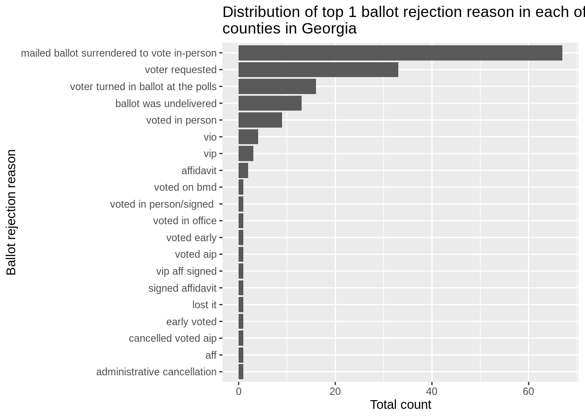
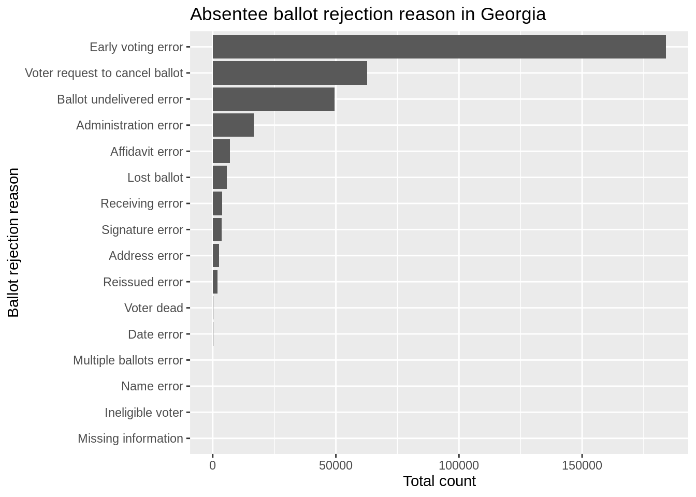
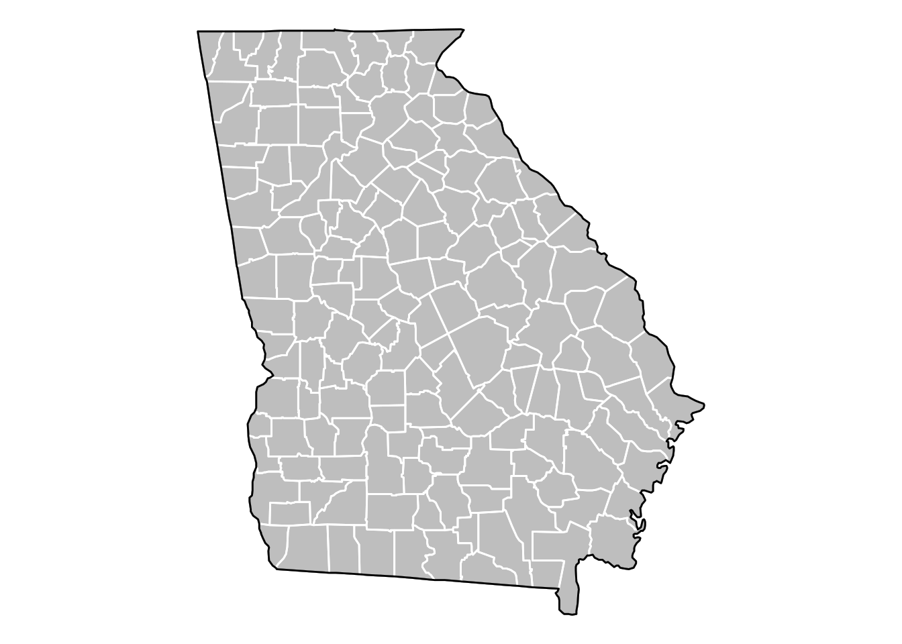
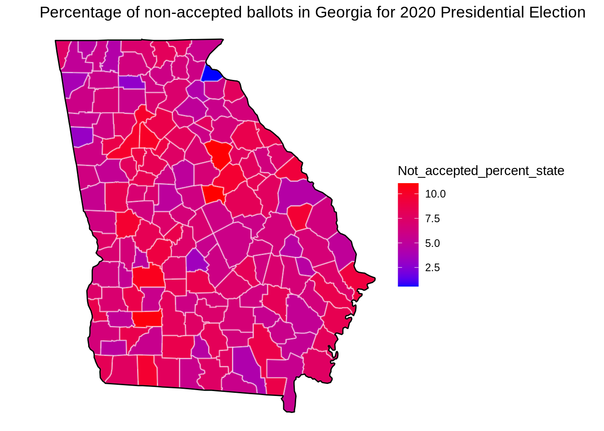
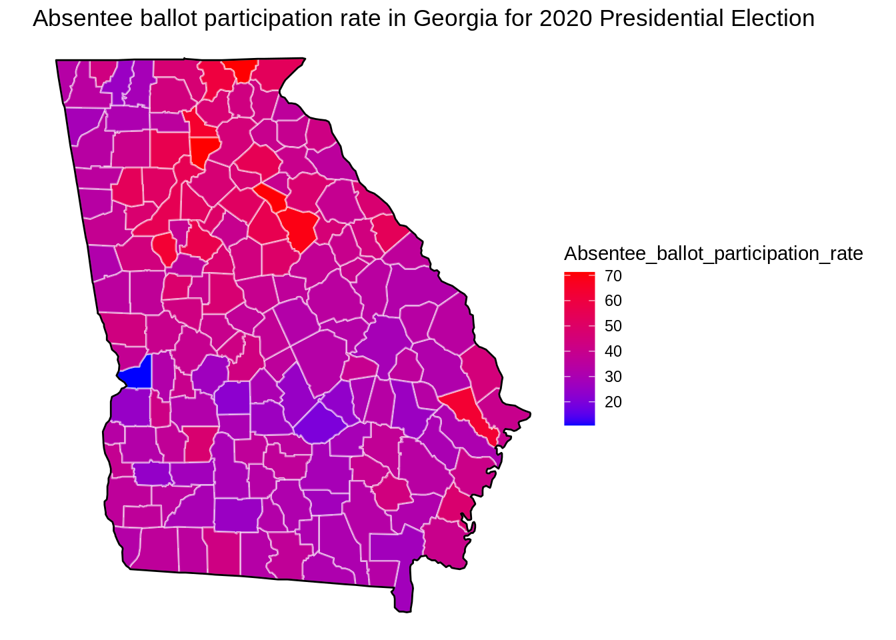

# Absentee ballot voting in 2020 presidental election 

Shengyuan Cao


## Background and Research Idea
The right to vote is one of the most important rights in today’s world. Elections provide individuals the ability to influence the politics that govern their lives, and everyone should have an equal opportunity to participate in the voting system. Without a standardized voting process, voting is unequal among individuals and people will start to lose trust in the political system. 

To help promote voting equality across the country, especially in Georgia, I want to investigate if there were any potential patterns related to unequal voting. Absentee ballot serve as an important way for voters who cannot physically vote at voting centers on election days. And it is more prevalent during coronavirus times. Therefore, it is evident that absentee ballots play a considerable role in America’s election process. Our main goal is to try and assess absentee ballot equality based on recent election data, which would have many useful applications, such as to provide useful guide on how absentee ballots will be utilized in future elections. 

The following research will provide insights into which Georgia counties reject absentee ballots, and why they were rejected in 2020 Presidential election. Data comes from open data source at https://elections.sos.ga.gov/Elections/voterabsenteefile.do

In this research, I explore reasons why some absentee ballots were rejected during 2020 Presidential election in Georgia. This topic is to my interest since voting through absentee ballot becomes the trend during pandemic times. And it is very important to protect voting rights and promote voting equlity through absentee ballot. First, I find top reasons for ballot rejection in each county to gain a general idea of rejection reasons, then I group all rejection reasons into 16 main categories using keyword pattern matching method to identify top rejection reasons across Georgia. Besides, I calculate non-accepted ballot rates and absentee ballot participation rate in each county and show these values on a Georgia map.


## Analyze ballot rejection data

Below are 2020 Presidential Absentee ballot data. First, we load the data and unzip it. 

```r
downloader::download("https://github.com/Isabellatop/5702CCdata/raw/main/statewide_small.csv.zip",
                     "statewide_small.csv.zip")
statewide_small <- read.csv(unz("statewide_small.csv.zip", "statewide_small.csv"), header = TRUE, sep = ",") 
```


Application_Status is "A" means that the absentee ballot application is "Accepted". Since we are interested in why some absentee ballots were rejected, we want the ballot status where it is "R","C" or "S", which means "Rejected", "Cancelled" or "Spoiled" respectively. The "Status_Reason" column shows why the ballot is not accepted. 


```r
CRS2020<-statewide_small %>% filter(Ballot_Status =="R"|Ballot_Status =="C"|Ballot_Status =="S")
head(CRS2020,15) # Show first 15 rows
```

```
##      X  County Application_Status Ballot_Status
## 1    2 APPLING                  A             C
## 2    3 APPLING                  A             C
## 3   10 APPLING                  A             C
## 4   13 APPLING                  A             C
## 5   14 APPLING                  A             C
## 6   23 APPLING                  A             C
## 7   94 APPLING                  A             C
## 8   96 APPLING                  A             C
## 9  171 APPLING                  A             C
## 10 174 APPLING                  A             C
## 11 180 APPLING                  A             C
## 12 216 APPLING                  A             C
## 13 228 APPLING                  A             C
## 14 242 APPLING                  A             C
## 15 244 APPLING                  A             C
##                                  Status_Reason
## 1  mailed ballot surrendered to vote in-person
## 2          voter turned in ballot at the polls
## 3  mailed ballot surrendered to vote in-person
## 4                              voter requested
## 5  mailed ballot surrendered to vote in-person
## 6  mailed ballot surrendered to vote in-person
## 7          voter turned in ballot at the polls
## 8                       ballot was undelivered
## 9                              voter requested
## 10 mailed ballot surrendered to vote in-person
## 11                             voter requested
## 12                             voter requested
## 13 mailed ballot surrendered to vote in-person
## 14                      ballot was undelivered
## 15                      ballot was undelivered
```


We can get a sense of why ballots were rejected by finding the top one non-accepting reason for each county in Georgia. 


```r
Top_reason_for_each_county <- CRS2020 %>% group_by(County,Status_Reason) %>% summarise(Total_Number=n()) %>% top_n(1,Total_Number) 
Top_reason_for_each_county
```

```
## # A tibble: 159 × 3
## # Groups:   County [159]
##    County   Status_Reason                               Total_Number
##    <chr>    <chr>                                              <int>
##  1 APPLING  voter requested                                      258
##  2 ATKINSON mailed ballot surrendered to vote in-person          126
##  3 BACON    mailed ballot surrendered to vote in-person          184
##  4 BAKER    ballot was undelivered                                30
##  5 BALDWIN  voter requested                                     1062
##  6 BANKS    voter requested                                      199
##  7 BARROW   vip                                                 1788
##  8 BARTOW   mailed ballot surrendered to vote in-person         1049
##  9 BEN HILL voter requested                                      272
## 10 BERRIEN  mailed ballot surrendered to vote in-person          430
## # … with 149 more rows
```


There are 159 counties in Georgia State. I want to know whar are the most common rejection reason among all counties. We observed that vast majority counties have top rejecting reasons as "mailed ballot surrendered to vote in-person", "voter requested", "ballot was undelivered" and "ballot was undelivered", which is an interesting and critical observation. 


```r
Top_reason_for_each_county_new <- Top_reason_for_each_county %>% group_by(Status_Reason) %>% summarise(Total_Number=n()) %>% arrange(desc(Total_Number))
Top_reason_for_each_county_new
```

```
## # A tibble: 20 × 2
##    Status_Reason                                 Total_Number
##    <chr>                                                <int>
##  1 "mailed ballot surrendered to vote in-person"           67
##  2 "voter requested"                                       33
##  3 "voter turned in ballot at the polls"                   16
##  4 "ballot was undelivered"                                13
##  5 "voted in person"                                        9
##  6 "vio"                                                    4
##  7 "vip"                                                    3
##  8 "affidavit"                                              2
##  9 "administrative cancellation"                            1
## 10 "aff"                                                    1
## 11 "cancelled voted aip"                                    1
## 12 "early voted"                                            1
## 13 "lost it"                                                1
## 14 "signed affidavit"                                       1
## 15 "vip aff signed"                                         1
## 16 "voted aip"                                              1
## 17 "voted early"                                            1
## 18 "voted in office"                                        1
## 19 "voted in person/signed "                                1
## 20 "voted on bmd"                                           1
```

This plot gives us a general idea about ballot rejection reasons, which helps further detailed investigation.


```r
ggplot(Top_reason_for_each_county_new,aes(fct_reorder(Status_Reason,Total_Number),Total_Number))+ 
  geom_col() +
 coord_flip() + 
  xlab("Ballot rejection reason") + 
  ylab("Total count") +
  ggtitle("Distribution of top 1 ballot rejection reason in each of 159 \ncounties in Georgia")
```




## Categorize 16 main ballot rejection reasons

There are 5735 unqiue reasons out of all 343,887 observations as to why the ballot is not accepted. Since there are too many unique reasons and the reasons are messy, I will categorize the reasons for rejection by grouping them using key words to find out what are those non-accepting reasons and their distribution. 


```r
status_reason <- CRS2020$Status_Reason
(length(status_reason))
```

```
## [1] 343887
```

```r
(length(unique(status_reason)))
```

```
## [1] 5735
```


We want to find ballot rejection reason related to the category "vote early", which includes keywords early, pol(poll), person(in person), aip (means absentee in person), and vip (means voted in person). We use grep function for pattern matching and find there are 183,981 cases for errors about early voting. 

When looking at all the unique ballot rejection reason in this category as showed below, we observe many reasons actally meant the same thing even though they were worded differently. And many reasons had typos in them. It is very likely that reasons for rejecting ballots were not strictly standardized in Georgia, which is an area that could be improved in future absentee ballot voting.


```r
early_related <- c('early','pol','person','aip','vip')
(Total_early<- length(grep(paste(early_related,collapse="|"),status_reason)))
```

```
## [1] 183981
```


Similarly, we find how many ballots were rejected due to "Address related issues", which includes keywords add (address), county and location. We see that there were 2603 ballots rejected because of address related problems and unique address related reasons were listed below. 

```r
address_related <- c('add','county','location')

Total_address <- length(grep(paste(address_related,collapse="|"),status_reason)) 
Total_address
```

```
## [1] 2603
```

The third category is "Date related issues", which includes keywords dob, birth and date. In total there are 188 counts.

```r
date_related <- c('birth','dob','date')

Total_date <- length(grep(paste(date_related,collapse="|"),status_reason,value=TRUE)) 
Total_date 
```

```
## [1] 188
```


The fourth category is "Signature issue", which contains keyword "sign" (include signed and signature). There are 3612 many of them. 


```r
Total_sign <-length(grep(pattern = 'sign',status_reason)) 
Total_sign
```

```
## [1] 3612
```

The fifth category is "Dead issue", which contains keyword died, deceased and passed. There are 223 counts. 


```r
dead_related <- c('die','deceased','passed')

Total_dead <- length(grep(paste(dead_related,collapse="|"),status_reason,value=TRUE)) 
Total_dead 
```

```
## [1] 227
```

The sixth group is about "Delivery issue", which has keywords undeliver. We observe that there are 49,448 counts, which is a large component of rejected ballots. Most reasons are related to ballots were not delivered. 

```r
deliver_related <- c('undeliver')

unique(grep(paste(deliver_related,collapse="|"),status_reason,value=TRUE))
```

```
##  [1] "ballot was undelivered"                     
##  [2] "undelivered.  voted in person."             
##  [3] "ballot returned - undeliverable"            
##  [4] "returned as undeliverable"                  
##  [5] "returned undeliverable"                     
##  [6] "voter signed affidavit missing/undelivered "
##  [7] "undeliverable"                              
##  [8] "undeliverable - mailing to temp "           
##  [9] "undelivered"                                
## [10] "canc undeliverable - will fill out another "
## [11] "undeliverable - moc"                        
## [12] "ret'd undeliverable"                        
## [13] "ballot undelivered"                         
## [14] "undelivered- voting in person"              
## [15] "undelivered- vip"                           
## [16] "voted in person; ballot undelivered"        
## [17] "ballot undelivered/voted in "               
## [18] "ballot was undeliveredd"                    
## [19] "ret. undeliverable temp away"               
## [20] "ballot undelivered sent to wrong state "    
## [21] "ballot was undelivered. voted in "          
## [22] "ballot undelivered. voted in person"        
## [23] "ballot was undelivered.voted in "           
## [24] "ballot was undelivered from the "           
## [25] "original ballot was undelivered from "      
## [26] "ballot was undelivered and voter "          
## [27] "ballot was undelivered from "               
## [28] "ballot undelivered.voted in person"         
## [29] "ballot undelivered via email"               
## [30] "opt to vote in person ballot undelivered"   
## [31] "ballot was undelivered. voted at "          
## [32] "ballot undelivered voted in person"         
## [33] "application was undelivered"                
## [34] "returned usps undeliverable"                
## [35] "returned undeliverable, phone "             
## [36] "ballot returned undeliverable"              
## [37] "returned undelivered"                       
## [38] "return undeliverable"                       
## [39] "undelivered;re-issue per state"             
## [40] "9/18/20 ballot undelivered"                 
## [41] "ballot undelivered and vote in person"
```

```r
Total_deliver <- length(grep(paste(deliver_related,collapse="|"),status_reason,value=TRUE)) 
Total_deliver
```

```
## [1] 49448
```

The seventh group is about "Person lost ballot issue", which contain keyword lost,destroy (include destroyed). Most reasons are that ballots were lost or destroyed. There are 5722 many of those. 


```r
lost_related <- c('lost','destroy')
(Total_lost <- length(grep(paste(lost_related,collapse="|"),status_reason))) 
```

```
## [1] 5722
```

The eighth category is related to "Admin error", which has keywords admin(include administrative), office, vio (voted in office). We find there are as many as 16,562 counts, which is also a relatively large chunk of all rejected ballots. 


```r
admin_related <- c('admin','office','vio')
(Total_admin <- length(grep(paste(admin_related,collapse="|"),status_reason)))
```

```
## [1] 16562
```

The ninth category is about "Name error", which has keyword name. There are 16 in total. 


```r
(Total_name <- length(grep(pattern = 'name', status_reason))) 
```

```
## [1] 16
```

The 10th category is about "Reissued error". Keywords include reissue and re-issued. When looking at specific reasons, many of those are "spoiled - reissue" and "rejected ballot that has been re-issued". There are 2024 counts. 


```r
reissue_related <- c('reissue','re-issue')

(Total_reissue <- length(grep(paste(reissue_related,collapse="|"),status_reason))) 
```

```
## [1] 2024
```

The 11th category is about "Receiving error". Keywords are received/rcvd/late/deadline/after/arrived and there are 3863 of them. 


```r
receive_related <- c('received','rcvd','late','deadline','after','arrived','returned','envelope')

(Total_receive <- length(grep(paste(receive_related,collapse="|"),status_reason))) 
```

```
## [1] 3863
```
 
The 12th category is about "Voter request", which includes keyword request and cancel. There are 62,816 of them. Majority reason includes that voter requested to cancel ballot or requested to vote at the poll instead. 


```r
request_related <- c('request','cancel')

(Total_request <- length(grep(paste(request_related,collapse="|"),status_reason))) 
```

```
## [1] 62816
```

The 13th category is about "Affidavit issue", which includes keyword aff (includes affidavit). There are 6898 of them. 


```r
aff_related <- c('aff')

(Total_aff <- length(grep(paste(aff_related,collapse="|"),status_reason))) 
```

```
## [1] 6898
```

The 14th category is about "Multiple ballots/applications", which includes keyword multiple. There are 93 of them.


```r
(Total_multiple <- length(grep(pattern = 'multiple', status_reason))) 
```

```
## [1] 93
```

The 15th category is about "Insufficient/missing information", which has keywords insufficient, missing and there are 14 counts. 


```r
insufficient_information_related <- c('insufficient',' missing')

(Total_insufficient_information <- length(grep(paste(insufficient_information_related,collapse="|"),status_reason)))
```

```
## [1] 14
```

The 16th category is "Ineligible voter", which has keyword ineligible and has 16 counts. 


```r
unique(grep(pattern = 'ineligible',status_reason,value=TRUE))
```

```
## [1] "ineligible elector"
```

```r
(Total_ineligible <- length(grep(pattern = 'ineligible', status_reason)))
```

```
## [1] 16
```

Now we create a dataset with all the identified ballot rejection reasons with their counts to see what are the most promininet reasons that cause ballot to be rejected. 


```r
Reasons <- c('Early voting error','Address error','Date error','Signature error','Voter dead','Ballot undelivered error','Lost ballot','Administration error','Name error','Reissued error','Receiving error','Voter request to cancel ballot','Affidavit error','Multiple ballots error','Missing information','Ineligible voter')

value_counts <- c(Total_early,Total_address,Total_date,Total_sign,Total_dead,Total_deliver,Total_lost,Total_admin,Total_name,Total_reissue,Total_receive,Total_request,Total_aff,Total_multiple, Total_insufficient_information,Total_ineligible)

df <- data.frame(Reasons, value_counts)
df
```

```
##                           Reasons value_counts
## 1              Early voting error       183981
## 2                   Address error         2603
## 3                      Date error          188
## 4                 Signature error         3612
## 5                      Voter dead          227
## 6        Ballot undelivered error        49448
## 7                     Lost ballot         5722
## 8            Administration error        16562
## 9                      Name error           16
## 10                 Reissued error         2024
## 11                Receiving error         3863
## 12 Voter request to cancel ballot        62816
## 13                Affidavit error         6898
## 14         Multiple ballots error           93
## 15            Missing information           14
## 16               Ineligible voter           16
```


We observe that the top three reasons for a ballot to be rejected are related to errors about early voting, voter request to cancel ballot and ballot undelivered error. These three reasons count for the vast majority of all the identified reasons. 


```r
ggplot(df,aes(fct_reorder(Reasons,value_counts),value_counts))+ 
  geom_col() +
 coord_flip() + 
  xlab("Ballot rejection reason") + 
  ylab("Total count") +
  ggtitle("Absentee ballot rejection reason in Georgia")
```



Then, we want to find ballot non-accepted rate for each county in Georgia and make observations about which counties have the highest non-accepted rates. We calculate non-accepted rate by dividing the number of R,C,S (which ballot status is rejected, cancelled and spoiled ballots) by the total number of ballots with status R,C,S,A (A means accepted) for each county. We find that counties with the highest ballot non-accepting are Baldwin, Greene and Dougherty, which are all above 10%! 

We also compute the total absentee ballot number by adding all non-accepted ballot_status ballots (R,C,S,A) for each county.


```r
(Not_accepted_percent_state <- statewide_small %>% group_by(County) %>% summarise(Not_accepted_percent_state=100*sum(Ballot_Status =="R"|Ballot_Status =="C"|Ballot_Status =="S")/sum(Ballot_Status =="R"|Ballot_Status =="C"|Ballot_Status =="S"|Ballot_Status =="A" ), Total_absentee_number=sum(Ballot_Status =="R"|Ballot_Status =="C"|Ballot_Status =="S"|Ballot_Status =="A" ))) %>% arrange(desc(Not_accepted_percent_state))
```

```
## # A tibble: 159 × 3
##    County    Not_accepted_percent_state Total_absentee_number
##    <chr>                          <dbl>                 <int>
##  1 BALDWIN                        11.1                  16692
##  2 GREENE                         11.0                  11068
##  3 DOUGHERTY                      10.9                  26300
##  4 SUMTER                         10.4                  10603
##  5 DEKALB                         10.1                 359975
##  6 FULTON                          9.93                507773
##  7 TALBOT                          9.76                  2756
##  8 GRADY                           9.74                  8902
##  9 HANCOCK                         9.73                  3597
## 10 JENKINS                         9.64                  2843
## # … with 149 more rows
```

```r
Not_accepted_percent_state$County <- tolower(Not_accepted_percent_state$County)
Not_accepted_percent_state$County <- as.character(Not_accepted_percent_state$County)
```


## Show participation rate and ballot non-accepted rate on a Georgia map
 
Now import GA population data for each county and join it with our ballot data. We can compute the absentee ballot participation rate by dividing total absentee ballot number in each county by population in each county as a way to standardize data since we don't want to favor our analysis towards counties with high population. 

We find out overall, absentee ballot participation rate is high in 2020 presidental election in vast majority of counties in Georgia. This is not surprising given the pandemic was going on then and people preferred to vote through absentee ballot. The top three parcipation counties are Forsyth, Towns and Oconee, which were all above 70%. This again stress the importance of all kinds of ballot related issues and ways to solve them in order to improve the voting quality. 


Import population data in Georgia.

```r
GA_population <- read.csv("https://raw.githubusercontent.com/Isabellatop/5702CCdata/main/GAdat.csv")
GA_population$County <- tolower(GA_population$County)
```


Then, join GA county population data with county ballot data by the keyword "County" and compute absentee ballot participation rate. 

```r
population_and_satewide <- inner_join(GA_population, Not_accepted_percent_state, by="County")

population_and_satewide <- population_and_satewide %>% mutate(Absentee_ballot_participation_rate=100*Total_absentee_number/Population) %>%
  arrange(desc(Absentee_ballot_participation_rate))

head(population_and_satewide,15) 
```

```
##      County Population Not_accepted_percent_state Total_absentee_number
## 1   forsyth     175511                   7.047288                125041
## 2     towns      10471                   7.731544                  7450
## 3    oconee      32808                   5.917593                 23202
## 4    greene      15994                  10.995663                 11068
## 5    dawson      22330                   6.214335                 14370
## 6     bryan      30233                   7.339305                 19089
## 7   fayette     106567                   7.891644                 67223
## 8     union      21356                   7.948817                 12895
## 9     henry     203922                   8.279256                116037
## 10 cherokee     214346                   5.738003                120826
## 11   morgan      17868                   6.933360                 10024
## 12   fulton     920581                   9.929043                507773
## 13  jackson      60485                   5.043254                 33292
## 14 columbia     124053                   7.354239                 66873
## 15 paulding     142324                   6.174068                 76384
##    Absentee_ballot_participation_rate
## 1                            71.24397
## 2                            71.14889
## 3                            70.72056
## 4                            69.20095
## 5                            64.35289
## 6                            63.13962
## 7                            63.08050
## 8                            60.38116
## 9                            56.90264
## 10                           56.36961
## 11                           56.10029
## 12                           55.15788
## 13                           55.04175
## 14                           53.90680
## 15                           53.66909
```
 
We create a Georgia map with map_data function in maps package, which provides all the geographical information used to create a map.


```r
ga_df <- map_data("state") %>% filter(region == "georgia")

# ga_df is the base (only the STATE) of Georgia  
ga_base <- ggplot(data = ga_df, mapping = aes(x = long, y = lat, group = group)) + 
  coord_quickmap() + #coord_quickmap() automatic adjustment
  geom_polygon(color = "black", fill = "gray")

ga_base + theme_void() + 
  geom_polygon(data = ga_df, fill = NA, color = "white") + # inside, boarder color is white
  geom_polygon(color = "black", fill = NA) # outside boarder color 
```


```r
#  map_data("county") has state (column "region") and county (column "subregion")
county_df <- map_data("county") %>% filter(region == "georgia")

ga_base + theme_void() + # theme_void makes backgroud empty
  geom_polygon(data = county_df, fill = NA, color = "white") + # inside: boarder color is white
  geom_polygon(color = "black", fill = NA) # outside boarder color is black
```



```r
county_df$subregion <- replace(county_df$subregion, county_df$subregion=="de kalb", "dekalb")

state_df <- map_data("state") %>% filter(region == "georgia")


mapdat <- left_join(population_and_satewide,county_df, by = c("County"="subregion")) 

head(mapdat,15)
```

```
##     County Population Not_accepted_percent_state Total_absentee_number
## 1  forsyth     175511                   7.047288                125041
## 2  forsyth     175511                   7.047288                125041
## 3  forsyth     175511                   7.047288                125041
## 4  forsyth     175511                   7.047288                125041
## 5  forsyth     175511                   7.047288                125041
## 6  forsyth     175511                   7.047288                125041
## 7  forsyth     175511                   7.047288                125041
## 8  forsyth     175511                   7.047288                125041
## 9  forsyth     175511                   7.047288                125041
## 10 forsyth     175511                   7.047288                125041
## 11 forsyth     175511                   7.047288                125041
## 12 forsyth     175511                   7.047288                125041
## 13 forsyth     175511                   7.047288                125041
## 14 forsyth     175511                   7.047288                125041
## 15 forsyth     175511                   7.047288                125041
##    Absentee_ballot_participation_rate      long      lat group order  region
## 1                            71.24397 -84.25917 34.17693   415 16596 georgia
## 2                            71.24397 -84.27064 34.33163   415 16597 georgia
## 3                            71.24397 -83.97269 34.33163   415 16598 georgia
## 4                            71.24397 -83.96696 34.30298   415 16599 georgia
## 5                            71.24397 -83.96124 34.29725   415 16600 georgia
## 6                            71.24397 -83.94978 34.29725   415 16601 georgia
## 7                            71.24397 -83.94978 34.28579   415 16602 georgia
## 8                            71.24397 -83.95551 34.26860   415 16603 georgia
## 9                            71.24397 -83.96124 34.24569   415 16604 georgia
## 10                           71.24397 -83.98415 34.22850   415 16605 georgia
## 11                           71.24397 -84.07010 34.18839   415 16606 georgia
## 12                           71.24397 -84.08729 34.14828   415 16607 georgia
## 13                           71.24397 -84.10448 34.13110   415 16608 georgia
## 14                           71.24397 -84.11593 34.09672   415 16609 georgia
## 15                           71.24397 -84.11593 34.07380   415 16610 georgia
```


Now visualize ballots non_accepted_percent for each county on map. 


```r
p <-    ggplot(mapdat, aes(long, lat, group = group)) +
        geom_polygon(aes(fill = Not_accepted_percent_state, color="yellow"), # inside county
                     colour = alpha("white", 1/2))  +
        scale_fill_gradient(low="blue", high="red")+
        geom_polygon(data = state_df, colour = "black", fill = NA) + #outside is Georgia state data, not specific
        theme_void() +
        coord_fixed(1.2) 

print(p+ggtitle("Percentage of non-accepted ballots in Georgia for 2020 Presidential Election"))
```




Now visualize absentee ballot participation rate for each county on map, which is calcualted by summing up all ballots and divided by population county-wise. We can see that most counties have participation rates higher than 30 percent. 


```r
s <-    ggplot(mapdat, aes(long, lat, group = group)) + # Each group is a different code for each county
        geom_polygon(aes(fill = Absentee_ballot_participation_rate, color="brown"), 
                     colour = alpha("white", 1/2))  + # inside county's border is white
        scale_fill_gradient(low="blue", high="red")+ # fill-in color
        geom_polygon(data = state_df, colour = "black", fill = NA) + # outside state color
        theme_void() +
        coord_fixed(1.2) 
print(s+ggtitle("Absentee ballot participation rate in Georgia for 2020 Presidential Election"))
```


