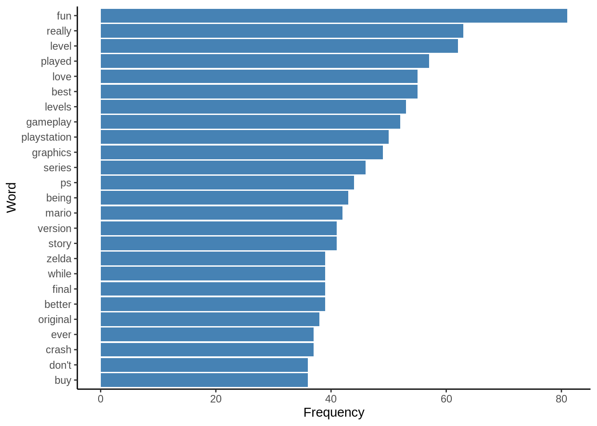
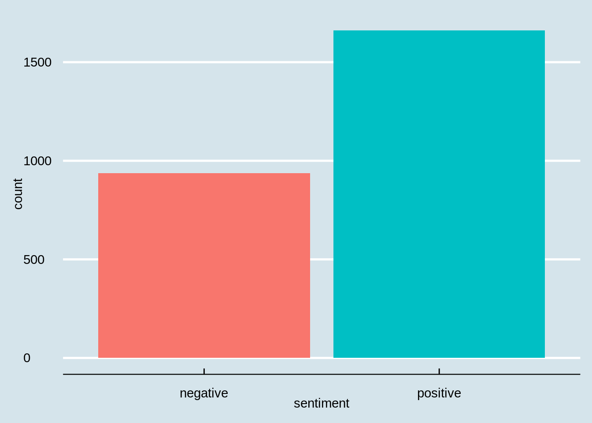
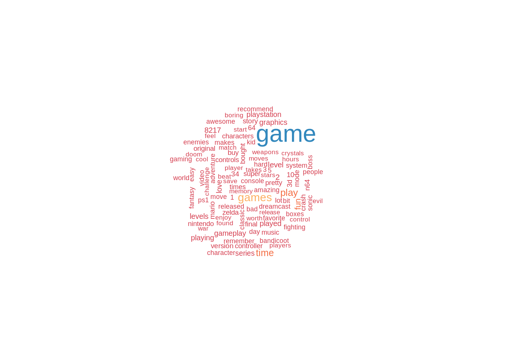
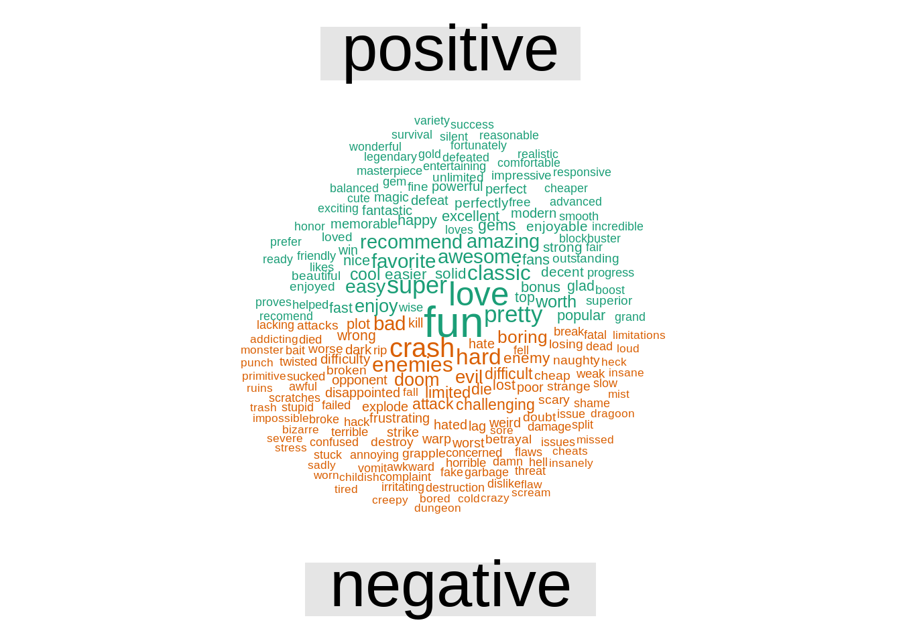

# Sentiment analysis and wordcloud

Yuao Zhao


```r
library(qdap)
library(tidyverse)
library(dplyr)
library(tidyr)
library(stringr)
library(tidytext)
library(ggplot2) 
library(ggthemes)
library(wordcloud)
```

Sentiment analysis is an important part of the emotion computing and wordcloud is a fancy way of text visualization. Combining the two, we can reveal and display people's attitude and perspectives through their comments or articles. This tutorial will go through the basic process of these two by analysing the video game comments dataset. 

About the Data
This dataset is based on a set of Amazon review of video games downloaded from Prof Julian McAuley’s website (http://jmcauley.ucsd.edu/data/amazon/). Since this dataset is very large, we only included data from Aug 2013 to July 2014 which gives us a year of data to work with.

The data we are going to use includes the following fields:  
* id: A unique identifier for each review  
* review: Text of review posted on Amazon  
* review_rating: Each review on Amazon is rated by others using a five-star scale (presumably based on helpfulness of review)  

## Read and explore the text


```r
videogame = read.csv('resources/sentiment_analysis_and_wordcloud/videogame_review.csv',stringsAsFactors = F)
head(videogame)
```

```
##   id
## 1  1
## 2  2
## 3  3
## 4  4
## 5  5
## 6  6
##                                                                                                                                                                                                                                                                                                                                                                                                                                                                                                                                                                                                                                                                                                                                                                                                                                                                                                                                                                                                                                                                                                                                                                                                                                                                                                                                                                                                                                                                                                                                                                                                                                                                                                                                                                                                                                                                                                                                                                                                                                                                                                                                                                                                                                                                                                                                                                                                                                                                                                                                                                                                                                                                                                                                                                                                                                                                                                                                                                                                                                                                                                                                                                                                                                                                                                                                                                                                                                                                                                                                                                                                                                                                                                                                                                                                                                                                                                                                                                                                                                                                                                                                                                                                                                                                                                                                                                                                                                                                                                                                                                                                                                                                                                                                                                                                                                                                                                                                                                                                                                                                                                                                                                                                                                                                                                                                                                                                                                                                                                                                                                                                                                                                                                     review
## 1                                                                                                                                                                                                                                                                                                                                                                                                                                                                                                                                                                                                                                                                                                                                                                                                                                                                                                                                                                                                                                                                                                                                                                                                                                                                                                                                                                                                                                                                                                                                                                                                                                                                                                                                                                                                                                                                                                                                                                                                                                                                                                                                                                                                                                                                                                                                                                                                                                                                                                                                                                                                                                                                                                                                                                                                                                                                                                                                                                                                                                                                                                                                                                                                                                                                                                                                                                                                                                                                                                                                                                                                                                                                                                                                                                                                                                                                                                                                                                                                                                                                                                                                                                                                                                                                                                                                                                                                                                                                                                                                                                                                                                                                                                                                                                                                                                                                                                                                                                                                                                                                                                                                                                                                                                                                                                                                                                                                               1st shipment received a book instead of the game.2nd shipment got a FAKE one. Game arrived with a wrong key inside on sealed box. I got in contact with codemasters and send them pictures of the DVD and the content. They said nothing they can do its a fake DVD.Returned it good bye.!
## 2                                                                                                                                                                                                                                                                                                                                                                                                                                                                                                                                                                                                                                                                                                                                                                                                                                                                                                                                                                                                                                                                                                                                                                                                                                                                                                                                                                                                                                                                                                                                                                                                                                                                                                                                                                                                                                                                                                                                                                                                                                                                                                                                                                                                                                                                                                                                                                                                                                                                                                                                                                                                                                                                                                                                                                                                                                                                                                                                                                                                                                                                                                                                                                                                                                                                                                                                                                                                                                                                                                                                                                                                                                                                                                                                                                                                                                                                                                                                                                                                                                                                                                                                                                                                                                                                                                                                                                                                                                                                                                                                                                                                                                                                                                                                                                                                                                                                                                                                                                                                                                                                                                                                                                                                                                                                                     I still haven't figured this one out. Did everything as instructed but the game never installed. Strange. Since I don't like to rate on something I couldn't get to work, I'll just say that I didn't like it because I couldn't get it to work :P For those that did manage to get it installed, I'm sure it's a great game. I had the first Dirt and it was a scream! Too bad this one bombed. Maybe a bad disc...
## 3                                                                                                                                                                                                                                                                                                                                                                                                                                                                                                                                                                                                                                                                                                                                                                                                                                                                                                                                                                                                                                                                                                                                                                                                                                                                                                                                                                                                                                                                                                                                                                                                                                                                                                                                                                                                                                                                                                                                                                                                                                                                                                                                                                                                                                                                                                                                                                                                                                                                                                                                                                                                                                                                                                                                                                                                                                                                                                                                                                                                                                                                                                                                                                                                                                                                                                                                                                                                                                                                                                                                                                                                                                                                                                                                                                                                                                                                                                                                                                                                                                                                                                                                                                                                                                                                                                                                                                                                                                                                                                                                                                                                                                                                                                                                                                                                                                                                                                                                                                                                                                                                                                                                                                                                                                                                                                                                                                                                                                                                                                                I bought this and the key didn't work.  It was a gift, and the recipient wasn't able to solve the problem.  It might have been a good game, but I never found out because the key failed.
## 4                                                                                                                                                                                                                                                                                                                                                                                                                                                                                                                                                                                                                                                                                                                                                                                                                                                                                                                                                                                                                                                                                                                                                                                                                                                                                                                                                                                                                                                                                                                                                                                                                                                                                                                                                                                                                                                                                                                                                                                                                                                                                                                                                                                                                                                                                                                                                                                                                                                                                                                                                                                                                                                                                                                                                                                                                                                                                                                                                                                                                                                                                                                                                                                                                                                                                                                                                                                                                                                                                                                                                                                                                                                                                                                                                                                                                                                                                                                                                                                                                                                                                                                                                                                                                                                                                                                                                                                                                                                                                                                                                                                                                                                                                                                                                                                                                                                                                                                                                                                                                                                                                                                                                                                                                                                                                                                                                                                                                                                                                                                                                                                                           I love it! Use it all the time. Really works perfectly with all games that you need a mic for.
## 5                                                                                                                                                                                                                                                                                                                                                                                                                                                                                                                                                                                                                                                                                                                                                                                                                                                                                                                                                                                                                                                                                                                                                                                                                                                                                                                                                                                                                                                                                                                                                                                                                                                                                                                                                                                                                                                                                                                                                                                                                                                                                                                                                                                                                                                                                                                                                                                                                                                                                                                                                                                                                                                                                                                                                                                                                                                                                                                                                                                                                                                                                                                                                                                                                                                                                                                                                                                                                                                                                                                                                                                                                                                                                                                                                                                                                                                                                                                                                                                                                                                                                                                                                                                                                                                                                                                                                                                                                                                                                                                                                                                                                                                                                                                                                                                                                                                                                                                                                                                                                                                                                                                                                                                                                                                                                                                                                                                                                                                                          my grandkids (and their parents) love playing with the microphone along with the guitar we got.this really is a lot of fun for everyone.  would totally recommend getting this if someone has an interest in music (singing)...
## 6 The greatest bait and switch betrayal of a fanbase in videogaming history and most hated game of all time.To begin I will provide Amazon's customer base the &#34;tale of the turd&#34; as I call it in relation to this abomination's &#34;quality&#34; or rather lackthereof:Gameplay: Utterly challengeless. A lobotomy patient, a two year old drooling baby in a feces filled diaper or even an individual with a severe case of down syndrome could easily complete this game in a single sitting with minimal effort. Just mash buttons or &#34;spam&#34; the controls as PC gamers would say and you'll eventually complete this atrocious slap in the face Disney level Aonuma dreck.Graphics: Hideous, vomit inducing, ridiculous, teletubbies-esque, bait and switch from what we were originally promised at Spaceworld 2000 (realistic style epic, cool and beautiful graphics with a decidedly Lord Of The Rings style flare) Also there are ugly and gaudy white lines that appear all throughout Wand Wacker indicating Nintendo was not able to polish this turd before release. Oh what a shame.Sound: The only redeemable inspiring thing about this Aonuma dud is the ocean music likely composed by Koji Kondo. The rest is detestable Saturday morning cartoon level kiddy drivel. Soccer moms and grandparents should approve. Real Zelda fans can only vomit at this level of disrespect Nintendo has stooped to in order to insult us.Theme: Near total rip off of Kevin Costner's Water World to such a great extent I fully believe Costner could probably win a lawsuit against Nintendo for royalties if he so desired. Needless to say this watery environment is not what true Zelda fans look forward to when we go to pick up a new Zelda game. No, what we're looking for is the green forests and fields of Hyrule proper, not some watery grave that sits atop it for reasons likely relating to Aonuma's child learning how to bathe for the first time and Aonuma getting inspired to make Zelda into a giant bathing simulator via Wand Wacker. I've said it before and I'll say it again Nintendo needs to fire Eiji Aonuma and his entire Zelda team and get normal people developing the Zelda series again for it to return to health.Commentary: The online game journalists also known as professional liars can attempt to re-write history all they like but The Legend Of Celda: Wand Wacker will go down as the most hated videogame of all time and the greatest betrayal of a fanbase in gaming history.This was Nintendo, Miyamoto and Eiji Aonuma's Vince Mcmahon esque &#34;Screw you!&#34; to the true Zelda fanbase and by true Zelda fanbase I'm not referring to the scumbag sycophants that populate online gaming message forums but the market in general who determines whether videogames become massive successes or massive failures and the true Zelda fans spoke loud and clear not once but twice.Two whole times on that Wand Wacker piece of dog excrement first with its original Gamecube release and second with its Wii U HD re-release that this is not the way that they envisioned the Legend Of Zelda series, this is not the way they wanted it to go and as a result Wand Wacker flopped mightily BOTH times as such a Benedict Arnold or Rosenbergs esque betrayal is destined to do.To rephrase a quote from Ridley Scott's Gladiator: &#34;Marcus Aurelius had a dream that was Zelda and this is not it, THIS IS NOT IT!&#34;We were lied to and led to believe that the epic, cool, badass, Spaceworld 2000 realistically presented Zelda would be what we would soon be getting on the Gamecube but then much later the bait and switch hideously deformed Celda Wand Wacker made its debut to boos and hisses worldwide and massive hate on the internet was poured it and Nintendo's way (before the damage control brainwashing took effect which has left a dishonest internet forum gaming community in its wake who pretends to love Wand Wacker in order to shill and run damage control for Nintendo while real Zelda fans have abandoned Nintendo due to its betrayal of them for the other consoles or PC gaming if they haven't simply upped and left gaming in disgusting over this nasty unnecessary debacle and betrayal of Zelda's true fans.Eiji Aonuma the hack no talent Jimmy Fallon Of Japan enabled by the out of touch Shigeru Miyamoto has been ruining the Zelda series since he took up its reigns to create the embarrassment known as Majora's Mask.Aonuma's first game &#34;Marvelous&#34; failed (MARVELOUSLY!) and he had no credentials at all to be given the Zelda series but insanely Nintendo gave it to him and ever since he's been driving Zelda along with it's sales figures into the ground making one boring puzzle filled bad NPC filled faux Zelda game after another.When the truth of the matter is Zelda is supposed to be an arcade action adventure sword and sorcery game with light RPG elements thrown in for good measure.Aonuma completely butchers this formula in favor of the boring garbage gameplay elements he prefers and the market lets him know what it thinks of his efforts by making sure his version of Zelda ends up in the bomba discount gaming bins where such low quality trash belongs.In anycase to re-iterate so as to set this very important point in stone once more:Wand Wacker offers up literally no gameplay challenge whatsoever and can be completed by a lobotomy patient (as is typical of Aonuma offerings).Conclusion: My rating of this turd is 1 star since I can't give it lower due to how Amazon's system is set up.
##   review_rating
## 1             1
## 2             2
## 3             1
## 4             5
## 5             5
## 6             1
```
### Explore Ratings of Reviews


```r
videogame %>%
  summarize(average_rating = mean(review_rating), median_rating = median(review_rating))
```

```
##   average_rating median_rating
## 1       4.423333             5
```

The median_rating is **5** and the average of the rating is **4.42**

### Distribution of Ratings


```r
ggplot(data=videogame,aes(x=review_rating))+
  geom_bar(fill='sienna')+
  theme_economist()
```


As we can see from the chart, few people gave the extreme low scores. 

### Explore the reviews

Regular expressions (regex) is a framework for teaching a computer how to recognize patterns of text. In order to count sentences, one needs to define what a sentence is. If we defined a sentence as “a set of characters or punctuation (comma, quote) or spaces that end with one or more period, question mark, exclamation mark or combination of them”, the following reqular expression would match the sentence: [A-Za-z,;’"\s]+[^.!?]*[.?!]


```r
# Characters across all reviews
videogame%>%
  summarize(mean_character = mean(nchar(review)), median_character = median(nchar(review)))
```

```
##   mean_character median_character
## 1         582.81            191.5
```

```r
# Words across all reviews
videogame%>%
  summarize(mean_words = mean(str_count(string = review,pattern = '\\S+')), median_words = median(str_count(string = review,pattern = '\\S+')))
```

```
##   mean_words median_words
## 1   106.7833           37
```

```r
# Sentences across all reviews
videogame%>%
 summarize(mean_sentences = mean(str_count(string = review,pattern = "[A-Za-z,;'\"\\s]+[^.!?]*[.?!]")), median_sentences = median(str_count(string = review,pattern = "[A-Za-z,;'\"\\s]+[^.!?]*[.?!]")))
```

```
##   mean_sentences median_sentences
## 1           5.84                3
```
On average, there are 583 characters, 106 words, 6 sentences across all reviews. 

### Most common words


```r
most_common_word = freq_terms(text.var=videogame$review,top=25,stopwords =
                                c(Top200Words,"game","games","playing","it's","i've","i'm","s","d"))
  
ggplot(most_common_word,aes(x = fct_reorder(WORD, FREQ, .desc=FALSE),y=FREQ))+
  geom_bar(stat = "identity",fill = "steelblue")+
  xlab("Word")+
  ylab("Frequency")+
  theme_classic()+
  coord_flip()
```



By examining the top 25 words, we can conclude that the most popular games are **Mario** and **Zelda**. Also most words are good-comment-word, such as fun, love, best.  

## Sentiment analysis

Let us classify the words to gain a better understanding of the reviews. For this, we will use the dplyr and tidytext packages. We will make use of the unnest_tokens function from tidytext to tokenize the reviews and the following dplyr functions to organize the data: select, group_by, ungroup and count. Later on, we will also use the tidyr package to reshape the data.

### Words in reviews

```r
videogame %>%
  select(id,review) %>%
  unnest_tokens(output = word,input=review) %>%
  group_by(id) %>%
  count() %>%
  head()
```

```
## # A tibble: 6 × 2
## # Groups:   id [6]
##      id     n
##   <int> <int>
## 1     1    54
## 2     2    80
## 3     3    37
## 4     4    20
## 5     5    37
## 6     6   949
```

### Word lexicons ---- Bing

There are a number of word lexicons that can be used to classify words as being positive or negative. The bing lexicon categorizes words as being positive and negative. 


```r
pos_neg = videogame%>%
            select(id,review)%>%
            unnest_tokens(output = word, input = review)%>%
            inner_join(get_sentiments('bing'))
head(pos_neg)
```

```
##   id    word sentiment
## 1  1    fake  negative
## 2  1   wrong  negative
## 3  1    fake  negative
## 4  1    good  positive
## 5  2 strange  negative
## 6  2    like  positive
```


```r
ggplot(pos_neg,aes(x=sentiment,fill=sentiment))+
  geom_bar()+
  guides(fill = F)+
  theme_economist()
```



The amount of *positive words* is almost as **twice** as the amount of *negative words*. 


```r
rating_sentiment = 
  videogame %>%
    select(id,review,review_rating)%>%
    unnest_tokens(output=word,input=review)%>%
    inner_join(get_sentiments('bing'))%>%
    group_by(review_rating,sentiment)%>%
    summarize(amount = n())%>%
    mutate(proportion = amount/sum(amount))

rating_sentiment %>%
  ggplot(aes(x=review_rating,y=proportion,fill=sentiment))+
  geom_col()+
  theme_economist()
```


The proportion of positive words increases as the review_rating growth. Ratings of 3 and 4 are barely the same in terms of the positive-negative structure of people's comments. 


### Word lexicons ---- nrc

A word may reflect more than just valence. The ‘nrc’ lexicon categorizes words by emotion. 

*Please note that the next two code chunks must be run interactively since they require the user to consent to the license agreement for using the nrc lexicon. See here for more detail: https://github.com/EmilHvitfeldt/textdata/issues/19*

Emotion in reviews

```r
videogame %>%
  select(id,review) %>%
  unnest_tokens(output = word, input = review) %>%
  inner_join(get_sentiments('nrc')) %>%
  group_by(sentiment) %>%
    count()
```
Let's visualize


```r
videogame %>%
  select(id,review)%>%
  unnest_tokens(output = word, input = review)%>%
  inner_join(get_sentiments('nrc'))%>%
  group_by(sentiment)%>%
    count()%>%
      ggplot(aes(x=reorder(sentiment,X = n),y=n,fill=sentiment))+
        geom_col()+
        guides(fill=F)+
        coord_flip()+
        theme_wsj()
```

## Wordcloud

Wordclouds sometime could offer little insight into the data, yet they tend to be very good at capturing interest of non-technical audiences.

### Simple Word Cloud Visualization

```r
wordcloudData1 = 
  videogame%>%
  select(id,review)%>%
  unnest_tokens(output=word,input=review)%>%
  anti_join(stop_words)%>%
  group_by(word)%>%
  summarize(freq = n())%>%
  arrange(desc(freq))%>%
  ungroup()%>%
  data.frame()

set.seed(617)
wordcloud(words = wordcloudData1$word,wordcloudData1$freq,scale=c(2,0.5),max.words = 100,colors=brewer.pal(9,"Spectral"))
```



### Comparison Word Cloud

```r
wordcloudData2 = 
  videogame%>%
  select(id,review)%>%
  unnest_tokens(output=word,input=review)%>%
  anti_join(stop_words)%>%
  inner_join(get_sentiments('bing'))%>%
  count(sentiment,word,sort=T)%>%
  spread(key=sentiment,value = n,fill=0)%>%
  data.frame()
rownames(wordcloudData2) = wordcloudData2[,'word']
wordcloudData2 = wordcloudData2[,c('positive','negative')]

set.seed(617)
comparison.cloud(term.matrix = wordcloudData2,scale = c(2,0.5),max.words = 200, rot.per=0)
```



Hope you can enjoy this tutorial and explore more on text mining.
