# Using SQL with R

Samir Char, Christodoulos Constantinides


```{r, include=FALSE}
knitr::opts_chunk$set(echo = TRUE)
knitr::opts_chunk$set(message = FALSE)
knitr::opts_chunk$set(warning = FALSE)
```
## Installing required packages
```{r Installing packages, eval=FALSE, echo=TRUE}
install.packages(c("dbplyr", "RMariaDB"))
```  
```{r Loading libraries}
library(RMariaDB) #Database Interface and 'MariaDB' Driver
```
## Creating a MySQL database in AWS
### Create a AWS account

If you already have an AWS account you can skip this part.

We need to create a AWS account and create a database. Don't worry, it will be completely free (actually, better than that because AWS gives us 50$ for free.) Enter https://aws.amazon.com/ and click on "Create AWS account", which should be on the top right corner.

There are five simple steps that you'll see when creating the account:  
1. Set up email, password, username  
2. Account type. Select "personal"  
3. Billing information. Don't worry, you won't be charged!  
4. Confirm identity. An sms or email will be sent to you to confirm identity  
5. Select your plan. Select the first option: "basic support - free"  

And you are set!

### Create Relational DataBase instance in AWS

Enter to https://console.aws.amazon.com/ and sign in with your account. Select "root user" if is not already selected. When logged in, you should see a search box in the top of the website like in the picture below (search box highlighted in red).


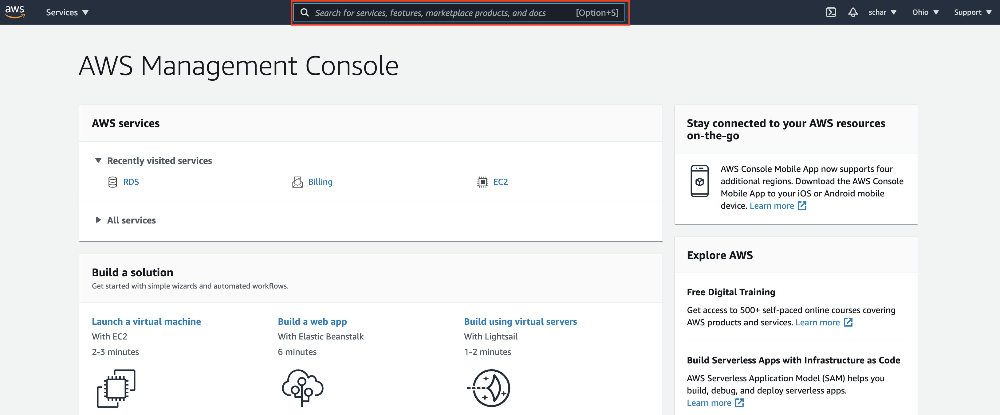

Type "rds" and select the first option as shown below:

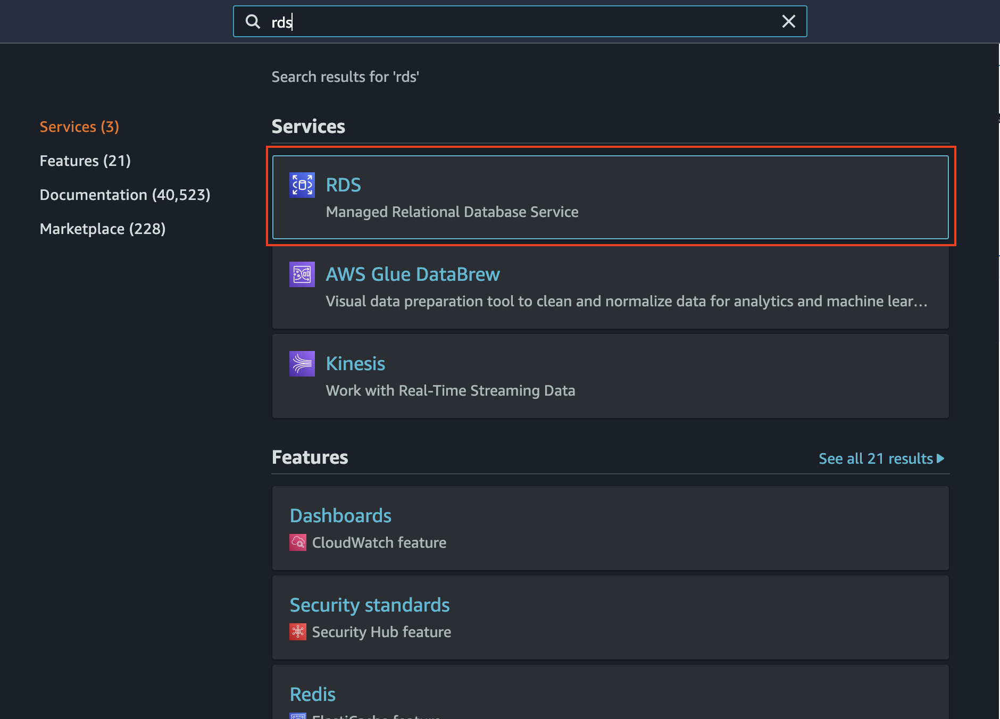

This should bring you to the main AWS Relational Database panel. Please click on the "Create database"  orange button at the top of the site.

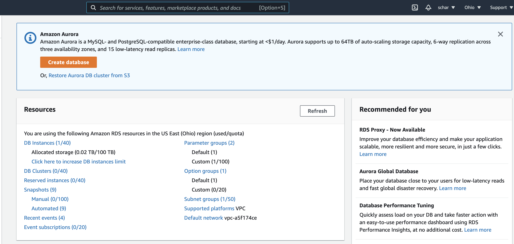
Now we need to configure the database. There are a lot of options here but we are only changing a few, so below I list the **changes** you need to make. This means that all other settings are left to default.

Set the database in the following way:

* **Engine Options**: MariaDB
* **Template:**: free Tier. This is important so you don't get any charge.
* **Settings**:
  * DB Instance identifier: the name you want for the database, call it tutorialDB
  * Credentials Settings: here you set a username and a password to access the database. I'm going to select user: admin and password: password. You can define the credentials however you want.
* **Connectivity**:
  * Public Access: yes
  * VPC Security Group: Create New 
  * New VPC security group name: tutorialVPC

Finally click on the orange button at the end that says "Create database". This takes a few minutes to create. You know the database is all set when the status of the database becomes "available". 

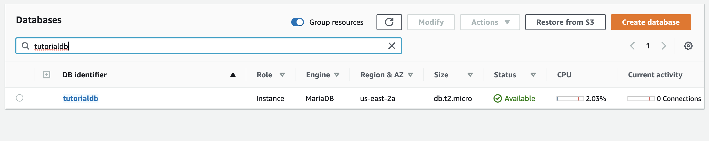

### Connect to the database

Click on the name of the database to see the connection information and copy the endpoint url and save it somewhere, you will need it later.

Then, go click on the VPC security groups link under the Security section.

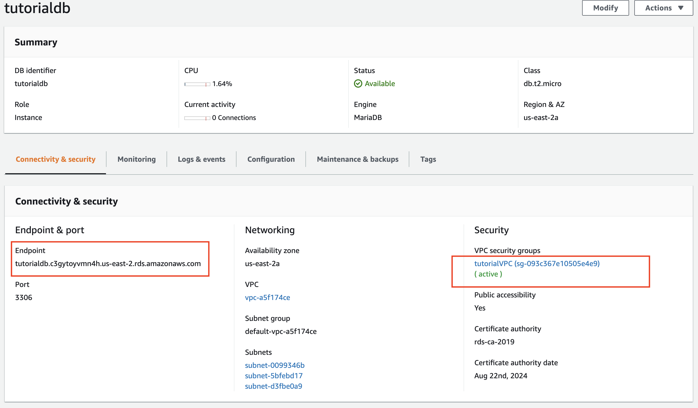
Then go all the way to the bottom of the page and click on edit inbound rules

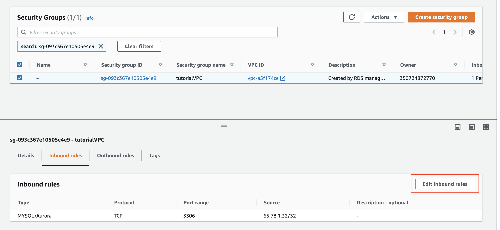

A new tab should open and then add the following rule:

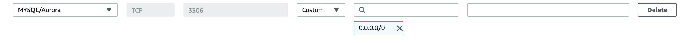

### Populate the database with data!

In this tutorial we are using Lahman's Baseball Database (LBDB), a famous database of baseball statistics, but you can use any database you like. To insert LBDB into our Amazon RDS, first we need to download the file "lahman-mysql-dump.sql" from the following github url: https://github.com/WebucatorTraining/lahman-baseball-mysql

After this, we need to run the script inside the database. There are many ways to do this, here we are doing it through the AWS CloudShell. Other ways include running the script through DataGrip or through other programming languages.

Open the terminal and upload the sql dump.

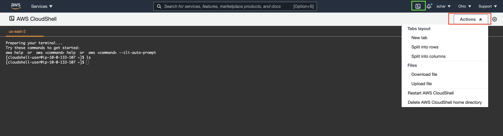

Complete the following command by entering your credentials (username, password and host) where the "< , >" symbols appear. Run the command in the AWS CloudShell to run the script:

```{bash eval=FALSE}
cat lahman-mysql-dump.sql | sed s/utf8mb4_0900_ai_ci/utf8mb4_general_ci/ | 
mysql --host=<DB ENDPOINT> --user=<USER> --password=<PASSWORD>
```

**Note**: The part sed s/utf8mb4_0900_ai_ci/utf8mb4_general_ci/ is probably not necessary if you are using another database. This is just for lahman's database because some particularities of this database.

If you want to check that your database is ready, try running the following code in the AWS CloudShell:

```{bash eval=FALSE}
mysql --host=<DB ENDPOINT> --user=<USER> --password=<PASSWORD> -e "show databases;"
```


You should see your database listed in the results like in the image below:


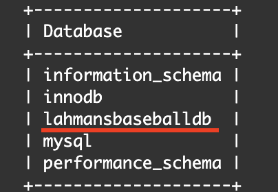

Congratulations! You have set up your AWS Relational Database Server.  
Now it's time to connect with R and perform some SQL queries.  

## Connecting With R  
### Setting up the connection


Replace the database credentials with yours for this chunk of code to work properly.

```{r installing packages, eval=FALSE}
connection <- dbConnect(RMariaDB::MariaDB(), 
                        user = <USER>,
                        password = <PASSWORD>,
                        dbname='lahmansbaseballdb', 
                        host= <DB ENDPOINT> )
``` 
Now connection is responsible for executing queries and other actions related to the database.   
We can view which tables are in the database  
```{r, eval=FALSE}
dbListTables(connection)
```
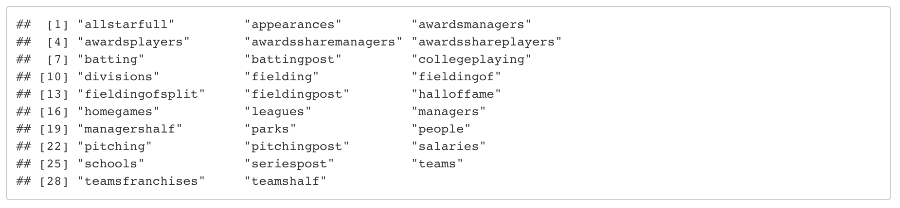

### Create - Read - Update - Delete operations
We can also perform CRUD operations  
  
#### Insert

```{r Insert, eval=FALSE}
query <- "INSERT INTO leagues(lgID, league, active) VALUES ('TT', 'Test League', 'N')"
res <- dbSendQuery(connection,query)
res
```  
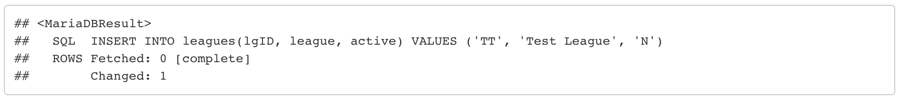

#### Update  
```{r Update, eval=FALSE}
query <- "UPDATE leagues SET active='Y' WHERE lgID='TT'"
res <- dbSendQuery(connection,query)
res
```
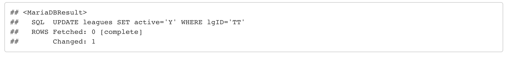

#### Delete  
```{r Delete, eval=FALSE}
query <- "DELETE FROM leagues WHERE lgID='TT'"
res <- dbSendQuery(connection,query)
res
```  
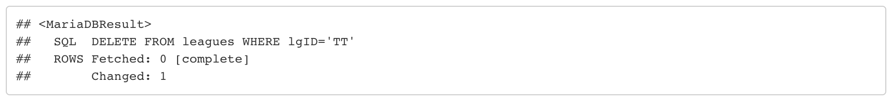

#### Select  
```{r Select, eval=FALSE}
query <- 'SELECT yearID, G_all FROM appearances WHERE playerID="willite01" ORDER BY yearID'
rs <- dbSendQuery(connection,query)
dbRows<-dbFetch(rs)
dbRows
```
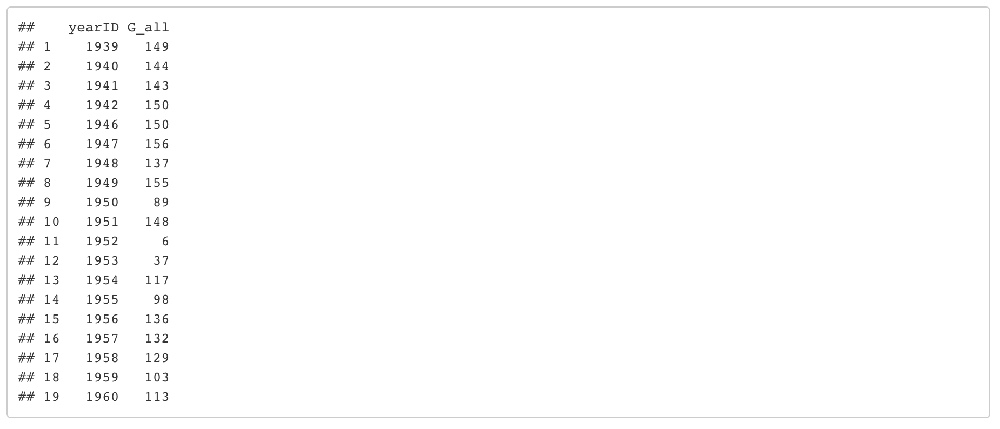

### Dataframe cleaning
Before visualizing our result we should do some cleaning like column type conversion.  
```{r Cleaning the resulting frame, eval=FALSE}
dbRows$yearID <- as.numeric(dbRows$yearID)
```

### Visualizing our Dataframe  
We are now ready to visualize our Dataframe.
```{r Visualizing our query, eval=FALSE}
library(tidyverse)
ggplot(dbRows, aes(yearID, G_all)) + 
  geom_line() + ggtitle("Games played by willite01 each year") +
  xlab("Year") + ylab("Games Played")
```
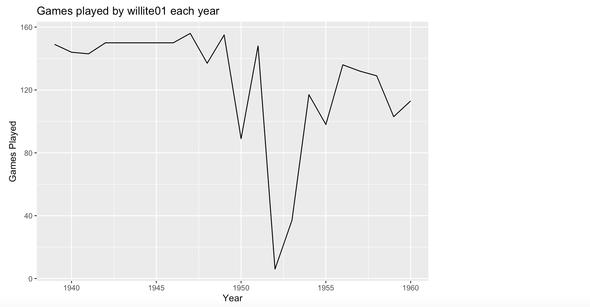

