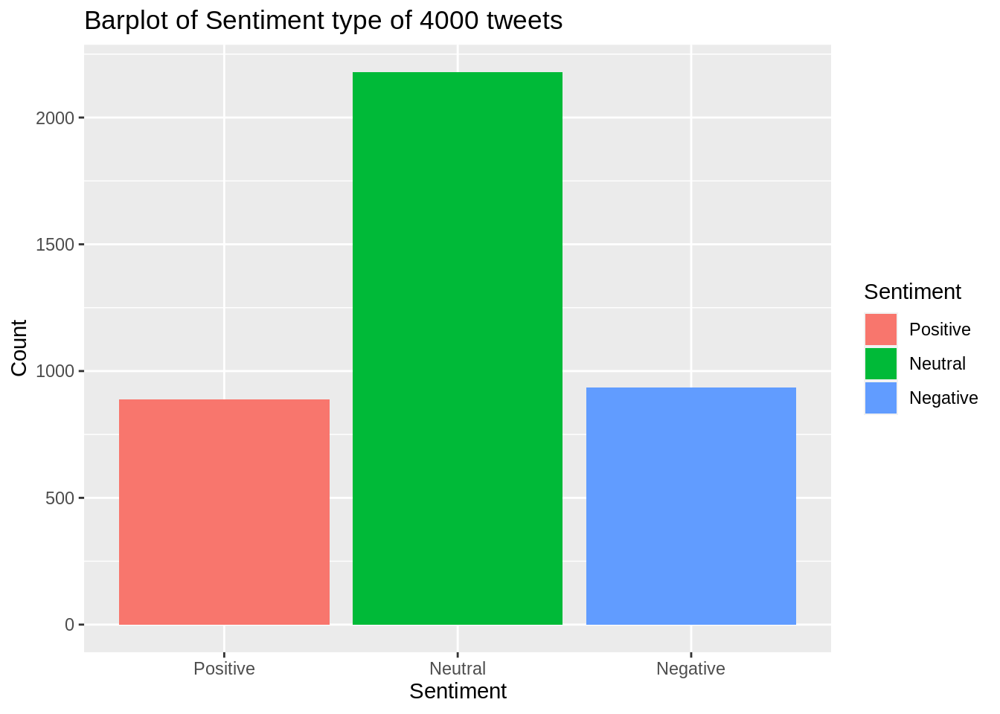
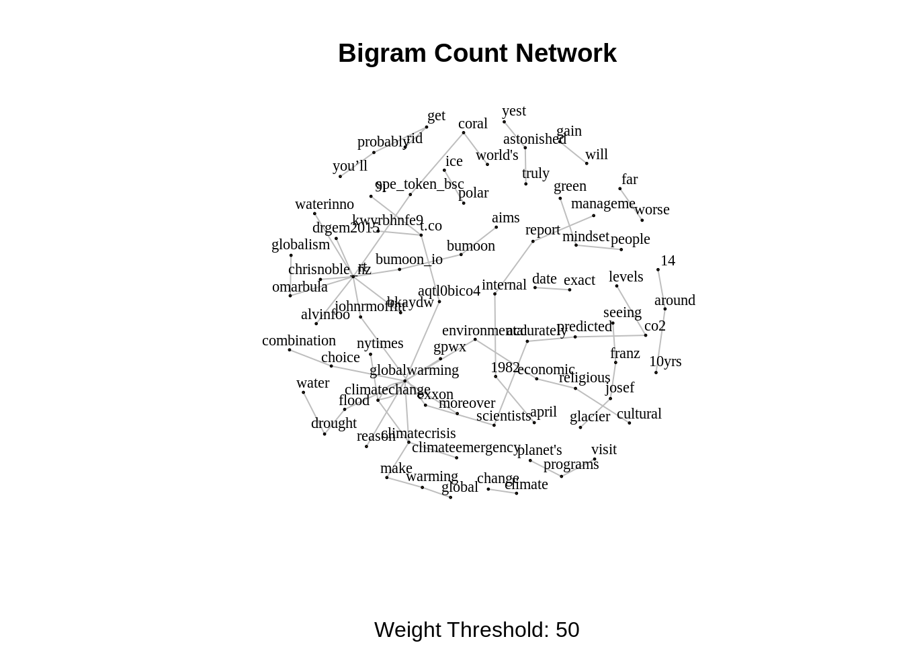
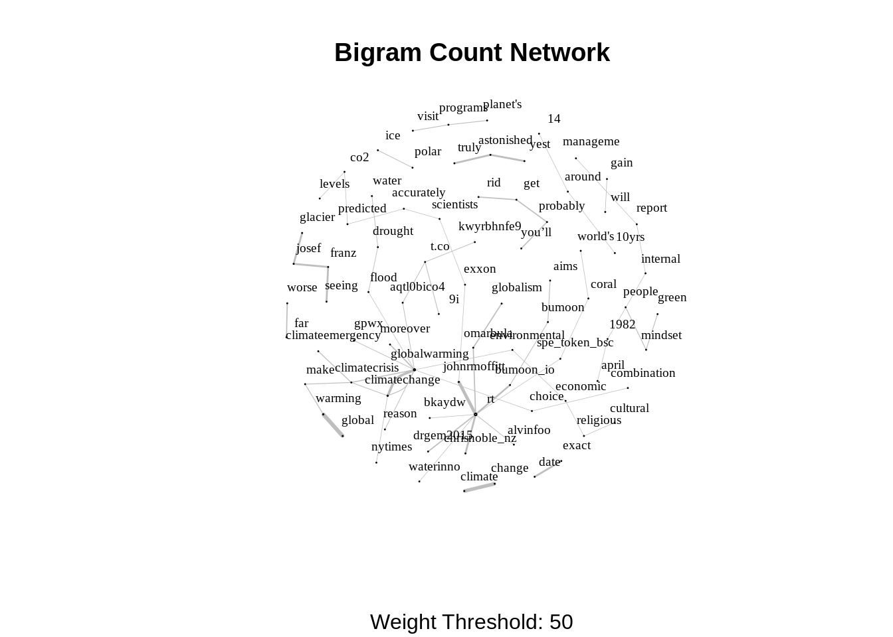

# Twitter sentiment analysis in R

Shivani Modi and Sriram Dommeti

## Loading all the required R libraries


```r
library(twitteR)
library(ROAuth)
library(hms)
library(lubridate) 
library(tidytext)
library(tm)
library(wordcloud)
library(igraph)
library(glue)
library(networkD3)
library(rtweet)
library(plyr)
library(stringr)
library(ggplot2)
library(ggeasy)
library(plotly)
library(dplyr)  
library(hms)
library(lubridate) 
library(magrittr)
library(tidyverse)
library(janeaustenr)
library(widyr)
```

## Sentiment Analysis

Sentiment analysis gives us insight into the things that automate mining of attitudes, opinions, views and emotions from text, speech, tweets and database sources. However, to fully explore the possibilities of this text analysis technique, we need data visualization tools to help organize the results. Visually representing the content of a text document is one of the most important tasks in the field of text mining. 

However, there are some gaps between visualizing unstructured (text) data and structured data. Many text visualizations do not represent the text directly, they represent an output of a language model. In this post, we will use tweets extracted using Twitter API, store tweets as text data, classify opinions in text into categories like positive, or negative or neutral, create a function to calculate the score of each type of opinion in the text and try to explore and visualize as much as we can, using R libraries. 

Tweets can be imported into R using Twitter API, then the text data has to be cleaned before analysis, for example removing emoticons, removing URLs, etc.

## Twitter authorization to extract tweets:

As a first step, we need to get authorized credentials from Twitter to use the API for extracting the tweets. Steps involve creating a Twitter developer account, creating an app and then we have necessary credentials. Reference for obtaining access tokens:

https://cran.r-project.org/web/packages/rtweet/vignettes/auth.html


```r
#Note: Replace below with your credentials following above reference
api_key <- "xxxxxxxxxxxxxxxxxxxxxxxxx"
api_secret <- "xxxxxxxxxxxxxxxxxxxxxxxxxxxxxxxxxxxxxxxxxxxxxxxxxx"
access_token <- "xxxxxxxxxxxxxxxxxxxxxxxxxxxxxxxxxxxxxxxxxxxxxxxxxx"
access_token_secret <- "xxxxxxxxxxxxxxxxxxxxxxxxxxxxxxxxxxxxxxxxxxxxx"
#Note: This will ask us permission for direct authentication, type '1' for yes:
setup_twitter_oauth(api_key,api_secret,access_token,access_token_secret)
```


```
## [1] "Using direct authentication"
```

## Extracting Global Warming tweets:


```r
# extracting 4000 tweets related to global warming topic
tweets <- searchTwitter("#globalwarming", n=4000, lang="en")
n.tweet <- length(tweets)

# convert tweets to a data frame
tweets.df <- twListToDF(tweets)

tweets.txt <- sapply(tweets, function(t)t$getText())
# Ignore graphical Parameters to avoid input errors
tweets.txt <- str_replace_all(tweets.txt,"[^[:graph:]]", " ")

## pre-processing text:
clean.text = function(x)
{
  # convert to lower case
  x = tolower(x)
  # remove rt
  x = gsub("rt", "", x)
  # remove at
  x = gsub("@\\w+", "", x)
  # remove punctuation
  x = gsub("[[:punct:]]", "", x)
  # remove numbers
  x = gsub("[[:digit:]]", "", x)
  # remove links http
  x = gsub("http\\w+", "", x)
  # remove tabs
  x = gsub("[ |\t]{2,}", "", x)
  # remove blank spaces at the beginning
  x = gsub("^ ", "", x)
  # remove blank spaces at the end
  x = gsub(" $", "", x)
  # some other cleaning text
  x = gsub('https://','',x)
  x = gsub('http://','',x)
  x = gsub('[^[:graph:]]', ' ',x)
  x = gsub('[[:punct:]]', '', x)
  x = gsub('[[:cntrl:]]', '', x)
  x = gsub('\\d+', '', x)
  x = str_replace_all(x,"[^[:graph:]]", " ")
  return(x)
}

cleanText <- clean.text(tweets.txt)
# remove empty results (if any)
idx <- which(cleanText == " ")
cleanText <- cleanText[cleanText != " "]
```

## Frequency of Tweets


```r
tweets.df %<>% 
  mutate(
    created = created %>% 
      # Remove zeros.
      str_remove_all(pattern = '\\+0000') %>%
      # Parse date.
      parse_date_time(orders = '%y-%m-%d %H%M%S')
  )

tweets.df %<>% 
  mutate(Created_At_Round = created%>% round(units = 'hours') %>% as.POSIXct())

tweets.df %>% pull(created) %>% min()
```

```
## [1] "2021-08-24 23:58:46 UTC"
```

```r
tweets.df %>% pull(created) %>% max()
```

```
## [1] "2021-08-28 11:48:33 UTC"
```

```r
plt <- tweets.df %>% 
  dplyr::count(Created_At_Round) %>% 
  ggplot(mapping = aes(x = Created_At_Round, y = n)) +
  theme_light() +
  geom_line() +
  xlab(label = 'Date') +
  ylab(label = NULL) +
  ggtitle(label = 'Number of Tweets per Hour')

plt %>% ggplotly()
```

```{=html}
<div id="htmlwidget-0d6d6f6ad6e5dd88bf07" style="width:672px;height:480px;" class="plotly html-widget"></div>
<script type="application/json" data-for="htmlwidget-0d6d6f6ad6e5dd88bf07">{"x":{"data":[{"x":[1629849600,1629853200,1629856800,1629860400,1629864000,1629867600,1629871200,1629874800,1629878400,1629882000,1629885600,1629889200,1629892800,1629896400,1629900000,1629903600,1629907200,1629910800,1629914400,1629918000,1629921600,1629925200,1629928800,1629932400,1629936000,1629939600,1629943200,1629946800,1629950400,1629954000,1629957600,1629961200,1629964800,1629968400,1629972000,1629975600,1629979200,1629982800,1629986400,1629990000,1629993600,1629997200,1630000800,1630004400,1630008000,1630011600,1630015200,1630018800,1630022400,1630026000,1630029600,1630033200,1630036800,1630040400,1630044000,1630047600,1630051200,1630054800,1630058400,1630062000,1630065600,1630069200,1630072800,1630076400,1630080000,1630083600,1630087200,1630090800,1630094400,1630098000,1630101600,1630105200,1630108800,1630112400,1630116000,1630119600,1630123200,1630126800,1630130400,1630134000,1630137600,1630141200,1630144800,1630148400,1630152000],"y":[15,34,34,30,35,38,110,135,29,37,42,88,66,57,94,95,69,37,55,75,55,82,33,27,18,31,18,15,32,44,36,33,63,55,70,51,39,63,75,61,56,75,62,39,69,75,28,29,12,22,24,24,15,33,35,25,46,77,34,53,60,77,58,61,76,34,72,76,70,75,57,37,9,15,16,27,23,21,31,45,49,27,17,38,20],"text":["Created_At_Round: 2021-08-25 00:00:00<br />n:  15","Created_At_Round: 2021-08-25 01:00:00<br />n:  34","Created_At_Round: 2021-08-25 02:00:00<br />n:  34","Created_At_Round: 2021-08-25 03:00:00<br />n:  30","Created_At_Round: 2021-08-25 04:00:00<br />n:  35","Created_At_Round: 2021-08-25 05:00:00<br />n:  38","Created_At_Round: 2021-08-25 06:00:00<br />n: 110","Created_At_Round: 2021-08-25 07:00:00<br />n: 135","Created_At_Round: 2021-08-25 08:00:00<br />n:  29","Created_At_Round: 2021-08-25 09:00:00<br />n:  37","Created_At_Round: 2021-08-25 10:00:00<br />n:  42","Created_At_Round: 2021-08-25 11:00:00<br />n:  88","Created_At_Round: 2021-08-25 12:00:00<br />n:  66","Created_At_Round: 2021-08-25 13:00:00<br />n:  57","Created_At_Round: 2021-08-25 14:00:00<br />n:  94","Created_At_Round: 2021-08-25 15:00:00<br />n:  95","Created_At_Round: 2021-08-25 16:00:00<br />n:  69","Created_At_Round: 2021-08-25 17:00:00<br />n:  37","Created_At_Round: 2021-08-25 18:00:00<br />n:  55","Created_At_Round: 2021-08-25 19:00:00<br />n:  75","Created_At_Round: 2021-08-25 20:00:00<br />n:  55","Created_At_Round: 2021-08-25 21:00:00<br />n:  82","Created_At_Round: 2021-08-25 22:00:00<br />n:  33","Created_At_Round: 2021-08-25 23:00:00<br />n:  27","Created_At_Round: 2021-08-26 00:00:00<br />n:  18","Created_At_Round: 2021-08-26 01:00:00<br />n:  31","Created_At_Round: 2021-08-26 02:00:00<br />n:  18","Created_At_Round: 2021-08-26 03:00:00<br />n:  15","Created_At_Round: 2021-08-26 04:00:00<br />n:  32","Created_At_Round: 2021-08-26 05:00:00<br />n:  44","Created_At_Round: 2021-08-26 06:00:00<br />n:  36","Created_At_Round: 2021-08-26 07:00:00<br />n:  33","Created_At_Round: 2021-08-26 08:00:00<br />n:  63","Created_At_Round: 2021-08-26 09:00:00<br />n:  55","Created_At_Round: 2021-08-26 10:00:00<br />n:  70","Created_At_Round: 2021-08-26 11:00:00<br />n:  51","Created_At_Round: 2021-08-26 12:00:00<br />n:  39","Created_At_Round: 2021-08-26 13:00:00<br />n:  63","Created_At_Round: 2021-08-26 14:00:00<br />n:  75","Created_At_Round: 2021-08-26 15:00:00<br />n:  61","Created_At_Round: 2021-08-26 16:00:00<br />n:  56","Created_At_Round: 2021-08-26 17:00:00<br />n:  75","Created_At_Round: 2021-08-26 18:00:00<br />n:  62","Created_At_Round: 2021-08-26 19:00:00<br />n:  39","Created_At_Round: 2021-08-26 20:00:00<br />n:  69","Created_At_Round: 2021-08-26 21:00:00<br />n:  75","Created_At_Round: 2021-08-26 22:00:00<br />n:  28","Created_At_Round: 2021-08-26 23:00:00<br />n:  29","Created_At_Round: 2021-08-27 00:00:00<br />n:  12","Created_At_Round: 2021-08-27 01:00:00<br />n:  22","Created_At_Round: 2021-08-27 02:00:00<br />n:  24","Created_At_Round: 2021-08-27 03:00:00<br />n:  24","Created_At_Round: 2021-08-27 04:00:00<br />n:  15","Created_At_Round: 2021-08-27 05:00:00<br />n:  33","Created_At_Round: 2021-08-27 06:00:00<br />n:  35","Created_At_Round: 2021-08-27 07:00:00<br />n:  25","Created_At_Round: 2021-08-27 08:00:00<br />n:  46","Created_At_Round: 2021-08-27 09:00:00<br />n:  77","Created_At_Round: 2021-08-27 10:00:00<br />n:  34","Created_At_Round: 2021-08-27 11:00:00<br />n:  53","Created_At_Round: 2021-08-27 12:00:00<br />n:  60","Created_At_Round: 2021-08-27 13:00:00<br />n:  77","Created_At_Round: 2021-08-27 14:00:00<br />n:  58","Created_At_Round: 2021-08-27 15:00:00<br />n:  61","Created_At_Round: 2021-08-27 16:00:00<br />n:  76","Created_At_Round: 2021-08-27 17:00:00<br />n:  34","Created_At_Round: 2021-08-27 18:00:00<br />n:  72","Created_At_Round: 2021-08-27 19:00:00<br />n:  76","Created_At_Round: 2021-08-27 20:00:00<br />n:  70","Created_At_Round: 2021-08-27 21:00:00<br />n:  75","Created_At_Round: 2021-08-27 22:00:00<br />n:  57","Created_At_Round: 2021-08-27 23:00:00<br />n:  37","Created_At_Round: 2021-08-28 00:00:00<br />n:   9","Created_At_Round: 2021-08-28 01:00:00<br />n:  15","Created_At_Round: 2021-08-28 02:00:00<br />n:  16","Created_At_Round: 2021-08-28 03:00:00<br />n:  27","Created_At_Round: 2021-08-28 04:00:00<br />n:  23","Created_At_Round: 2021-08-28 05:00:00<br />n:  21","Created_At_Round: 2021-08-28 06:00:00<br />n:  31","Created_At_Round: 2021-08-28 07:00:00<br />n:  45","Created_At_Round: 2021-08-28 08:00:00<br />n:  49","Created_At_Round: 2021-08-28 09:00:00<br />n:  27","Created_At_Round: 2021-08-28 10:00:00<br />n:  17","Created_At_Round: 2021-08-28 11:00:00<br />n:  38","Created_At_Round: 2021-08-28 12:00:00<br />n:  20"],"type":"scatter","mode":"lines","line":{"width":1.88976377952756,"color":"rgba(0,0,0,1)","dash":"solid"},"hoveron":"points","showlegend":false,"xaxis":"x","yaxis":"y","hoverinfo":"text","frame":null}],"layout":{"margin":{"t":43.7625570776256,"r":7.30593607305936,"b":40.1826484018265,"l":28.4931506849315},"plot_bgcolor":"rgba(255,255,255,1)","paper_bgcolor":"rgba(255,255,255,1)","font":{"color":"rgba(0,0,0,1)","family":"","size":14.6118721461187},"title":{"text":"Number of Tweets per Hour","font":{"color":"rgba(0,0,0,1)","family":"","size":17.5342465753425},"x":0,"xref":"paper"},"xaxis":{"domain":[0,1],"automargin":true,"type":"linear","autorange":false,"range":[1629834480,1630167120],"tickmode":"array","ticktext":["Aug 25","Aug 26","Aug 27","Aug 28"],"tickvals":[1629849600,1629936000,1630022400,1630108800],"categoryorder":"array","categoryarray":["Aug 25","Aug 26","Aug 27","Aug 28"],"nticks":null,"ticks":"outside","tickcolor":"rgba(179,179,179,1)","ticklen":3.65296803652968,"tickwidth":0.33208800332088,"showticklabels":true,"tickfont":{"color":"rgba(77,77,77,1)","family":"","size":11.689497716895},"tickangle":-0,"showline":false,"linecolor":null,"linewidth":0,"showgrid":true,"gridcolor":"rgba(222,222,222,1)","gridwidth":0.33208800332088,"zeroline":false,"anchor":"y","title":{"text":"Date","font":{"color":"rgba(0,0,0,1)","family":"","size":14.6118721461187}},"hoverformat":".2f"},"yaxis":{"domain":[0,1],"automargin":true,"type":"linear","autorange":false,"range":[2.7,141.3],"tickmode":"array","ticktext":["50","100"],"tickvals":[50,100],"categoryorder":"array","categoryarray":["50","100"],"nticks":null,"ticks":"outside","tickcolor":"rgba(179,179,179,1)","ticklen":3.65296803652968,"tickwidth":0.33208800332088,"showticklabels":true,"tickfont":{"color":"rgba(77,77,77,1)","family":"","size":11.689497716895},"tickangle":-0,"showline":false,"linecolor":null,"linewidth":0,"showgrid":true,"gridcolor":"rgba(222,222,222,1)","gridwidth":0.33208800332088,"zeroline":false,"anchor":"x","title":{"text":"","font":{"color":"rgba(0,0,0,1)","family":"","size":14.6118721461187}},"hoverformat":".2f"},"shapes":[{"type":"rect","fillcolor":"transparent","line":{"color":"rgba(179,179,179,1)","width":0.66417600664176,"linetype":"solid"},"yref":"paper","xref":"paper","x0":0,"x1":1,"y0":0,"y1":1}],"showlegend":false,"legend":{"bgcolor":"rgba(255,255,255,1)","bordercolor":"transparent","borderwidth":1.88976377952756,"font":{"color":"rgba(0,0,0,1)","family":"","size":11.689497716895}},"hovermode":"closest","barmode":"relative"},"config":{"doubleClick":"reset","showSendToCloud":false},"source":"A","attrs":{"11a94429075b2":{"x":{},"y":{},"type":"scatter"}},"cur_data":"11a94429075b2","visdat":{"11a94429075b2":["function (y) ","x"]},"highlight":{"on":"plotly_click","persistent":false,"dynamic":false,"selectize":false,"opacityDim":0.2,"selected":{"opacity":1},"debounce":0},"shinyEvents":["plotly_hover","plotly_click","plotly_selected","plotly_relayout","plotly_brushed","plotly_brushing","plotly_clickannotation","plotly_doubleclick","plotly_deselect","plotly_afterplot","plotly_sunburstclick"],"base_url":"https://plot.ly"},"evals":[],"jsHooks":[]}</script>
```

## Estimating Sentiment Score

There are many resources describing methods to estimate sentiment. For the purpose of this tutorial, we will use a very simple algorithm which assigns sentiment score of the text by simply counting the number of occurrences of "positive" and "negative" words in a tweet.

Hu & Liu have published an "Opinion Lexicon" that categorizes approximately 6,800 words as positive or negative, which can be downloaded from this link:

http://www.cs.uic.edu/~liub/FBS/sentiment-analysis.html

### Loading sentiment word lists:


```r
positive = scan('resources/twitter_sentiment_analysis/positive-words.txt', what = 'character', comment.char = ';')
negative = scan('resources/twitter_sentiment_analysis/negative-words.txt', what = 'character', comment.char = ';')
# add your list of words below as you wish if missing in above read lists
pos.words = c(positive,'upgrade','Congrats','prizes','prize','thanks','thnx',
              'Grt','gr8','plz','trending','recovering','brainstorm','leader')
neg.words = c(negative,'wtf','wait','waiting','epicfail','Fight','fighting',
              'arrest','no','not')
```

### Sentiment scoring function:


```r
score.sentiment = function(sentences, pos.words, neg.words, .progress='none')
{
  require(plyr)
  require(stringr)
  
  # we are giving vector of sentences as input. 
  # plyr will handle a list or a vector as an "l" for us
  # we want a simple array of scores back, so we use "l" + "a" + "ply" = laply:
  scores = laply(sentences, function(sentence, pos.words, neg.words) {
    
    # clean up sentences with R's regex-driven global substitute, gsub() function:
    sentence = gsub('https://','',sentence)
    sentence = gsub('http://','',sentence)
    sentence = gsub('[^[:graph:]]', ' ',sentence)
    sentence = gsub('[[:punct:]]', '', sentence)
    sentence = gsub('[[:cntrl:]]', '', sentence)
    sentence = gsub('\\d+', '', sentence)
    sentence = str_replace_all(sentence,"[^[:graph:]]", " ")
    # and convert to lower case:
    sentence = tolower(sentence)
    
    # split into words. str_split is in the stringr package
    word.list = str_split(sentence, '\\s+')
    # sometimes a list() is one level of hierarchy too much
    words = unlist(word.list)
    
    # compare our words to the dictionaries of positive & negative terms
    pos.matches = match(words, pos.words)
    neg.matches = match(words, neg.words)
    
    # match() returns the position of the matched term or NA
    # we just want a TRUE/FALSE:
    pos.matches = !is.na(pos.matches)
    neg.matches = !is.na(neg.matches)
    
    # TRUE/FALSE will be treated as 1/0 by sum():
    score = sum(pos.matches) - sum(neg.matches)
    
    return(score)
  }, pos.words, neg.words, .progress=.progress )
  
  scores.df = data.frame(score=scores, text=sentences)
  return(scores.df)
}
```

### Calculating the sentiment score:


```r
analysis <- score.sentiment(cleanText, pos.words, neg.words)
# sentiment score frequency table
table(analysis$score)
```

```
## 
##   -5   -4   -3   -2   -1    0    1    2    3    4 
##    1   16   44  208  832 2091  648  129   28    3
```

## Histogram of sentiment scores:


```r
analysis %>%
  ggplot(aes(x=score)) + 
  geom_histogram(binwidth = 1, fill = "lightblue")+ 
  ylab("Frequency") + 
  xlab("sentiment score") +
  ggtitle("Distribution of Sentiment scores of the tweets") +
  ggeasy::easy_center_title()
```


***Analysis:*** From the Histogram of Sentiment scores, we can see that around half of the tweets have sentiment score as zero i.e. Neutral and overall as expected, the distribution depicts negative sentiment in the tweets related to global warming, since it is a major issue of concern.

## Barplot of sentiment type:


```r
neutral <- length(which(analysis$score == 0))
positive <- length(which(analysis$score > 0))
negative <- length(which(analysis$score < 0))
Sentiment <- c("Positive","Neutral","Negative")
Count <- c(positive,neutral,negative)
output <- data.frame(Sentiment,Count)
output$Sentiment<-factor(output$Sentiment,levels=Sentiment)
ggplot(output, aes(x=Sentiment,y=Count))+
  geom_bar(stat = "identity", aes(fill = Sentiment))+
  ggtitle("Barplot of Sentiment type of 4000 tweets")
```



***Analysis:*** It is also clear from this barplot of sentiment type that around half of the tweets have sentiment score as zero i.e. Neutral and there are more negative sentiment tweets than that of positive sentiment. This barplot helps us to identify overall opinion of the people about global warming.

## Wordcloud:


```r
text_corpus <- Corpus(VectorSource(cleanText))
text_corpus <- tm_map(text_corpus, content_transformer(tolower))
text_corpus <- tm_map(text_corpus, function(x)removeWords(x,stopwords("english")))
text_corpus <- tm_map(text_corpus, removeWords, c("global","globalwarming"))
tdm <- TermDocumentMatrix(text_corpus)
tdm <- as.matrix(tdm)
tdm <- sort(rowSums(tdm), decreasing = TRUE)
tdm <- data.frame(word = names(tdm), freq = tdm)
set.seed(123)
wordcloud(text_corpus, min.freq = 1, max.words = 100, scale = c(2.2,1),
          colors=brewer.pal(8, "Dark2"), random.color = T, random.order = F)
```


***Analysis:*** Wordcloud helps us to visually understand the important terms frequently used in the tweets related to global warming, here for example, "climate change", "environmental", "temperature", "emissions", etc.

## Word Frequency plot:


```r
ggplot(tdm[1:20,], aes(x=reorder(word, freq), y=freq)) + 
  geom_bar(stat="identity") +
  xlab("Terms") + 
  ylab("Count") + 
  coord_flip() +
  theme(axis.text=element_text(size=7)) +
  ggtitle('Most common word frequency plot') +
  ggeasy::easy_center_title()
```


***Analysis:*** we can infer that the most frequently used terms in the tweets related to global warming are, "climate", "climatechange", "since", "biggest", "hoax", etc.

## Network Analysis

We are using a weighted network (graph) to describe how to encode and visualize text data. In this section we are counting pairwise relative occurrence of words.

### Bigram analysis and Network definition

Bigram counts pairwise occurrences of words which appear together in the text.


```r
#bigram
bi.gram.words <- tweets.df %>% 
  unnest_tokens(
    input = text, 
    output = bigram, 
    token = 'ngrams', 
    n = 2
  ) %>% 
  filter(! is.na(bigram))

bi.gram.words %>% 
  select(bigram) %>% 
  head(10)
```

```
##              bigram
## 1  melting glaciers
## 2      glaciers due
## 3            due to
## 4         to global
## 5    global warming
## 6        warming is
## 7       is slightly
## 8  slightly warping
## 9     warping earth
## 10        earth amp
```

```r
extra.stop.words <- c('https')
stopwords.df <- tibble(
  word = c(stopwords(kind = 'es'),
           stopwords(kind = 'en'),
           extra.stop.words)
)
```

Next, we filter for stop words and remove white spaces.


```r
bi.gram.words %<>% 
  separate(col = bigram, into = c('word1', 'word2'), sep = ' ') %>% 
  filter(! word1 %in% stopwords.df$word) %>% 
  filter(! word2 %in% stopwords.df$word) %>% 
  filter(! is.na(word1)) %>% 
  filter(! is.na(word2)) 
```

Finally, we group and count by bigram.


```r
bi.gram.count <- bi.gram.words %>% 
  dplyr::count(word1, word2, sort = TRUE) %>% 
  dplyr::rename(weight = n)

bi.gram.count %>% head()
```

```
##           word1         word2 weight
## 1       climate        change    255
## 2            ms   engineering    204
## 3   engineering       student    197
## 4 globalwarming climatechange    186
## 5        global       warming    179
## 6          rcms  nustresearch    179
```

Let us plot the distribution of the weightvalues:


```r
bi.gram.count %>% 
  ggplot(mapping = aes(x = weight)) +
  theme_light() +
  geom_histogram() +
  labs(title = "Bigram Weight Distribution")
```


Note that it is very skewed, for visualization purposes it might be a good idea to perform a transformation, eg log transform:


```r
bi.gram.count %>% 
  mutate(weight = log(weight + 1)) %>% 
  ggplot(mapping = aes(x = weight)) +
  theme_light() +
  geom_histogram() +
  labs(title = "Bigram log-Weight Distribution")
```


In order to define weighted network from a bigram count we used the following structure.

* Each word is going to represent a node.
* Two words are going to be connected if they appear as a bigram.
* The weight of an edge is the number of times the bigram appears in the corpus.

### Network visualization


```r
threshold <- 50

# For visualization purposes we scale by a global factor. 
ScaleWeight <- function(x, lambda) {
  x / lambda
}

network <-  bi.gram.count %>%
  filter(weight > threshold) %>%
  mutate(weight = ScaleWeight(x = weight, lambda = 2E3)) %>% 
  graph_from_data_frame(directed = FALSE)

plot(
  network, 
  vertex.size = 1,
  vertex.label.color = 'black', 
  vertex.label.cex = 0.7, 
  vertex.label.dist = 1,
  edge.color = 'gray', 
  main = 'Bigram Count Network', 
  sub = glue('Weight Threshold: {threshold}'), 
  alpha = 50
)
```



We can even improvise the representation by setting the sizes of the nodes and the edges by the degree and weight respectively.


```r
V(network)$degree <- strength(graph = network)

# Compute the weight shares.
E(network)$width <- E(network)$weight/max(E(network)$weight)

plot(
  network, 
  vertex.color = 'lightblue',
  # Scale node size by degree.
  vertex.size = 2*V(network)$degree,
  vertex.label.color = 'black', 
  vertex.label.cex = 0.6, 
  vertex.label.dist = 1.6,
  edge.color = 'gray', 
  # Set edge width proportional to the weight relative value.
  edge.width = 3*E(network)$width ,
  main = 'Bigram Count Network', 
  sub = glue('Weight Threshold: {threshold}'), 
  alpha = 50
)
```



We can go a step further and make our visualization more dynamic using the networkD3 library.


```r
threshold <- 50

network <-  bi.gram.count %>%
  filter(weight > threshold) %>%
  graph_from_data_frame(directed = FALSE)

# Store the degree.
V(network)$degree <- strength(graph = network)
# Compute the weight shares.
E(network)$width <- E(network)$weight/max(E(network)$weight)

# Create networkD3 object.
network.D3 <- igraph_to_networkD3(g = network)
# Define node size.
network.D3$nodes %<>% mutate(Degree = (1E-2)*V(network)$degree)
# Define color group
network.D3$nodes %<>% mutate(Group = 1)
# Define edges width. 
network.D3$links$Width <- 10*E(network)$width

forceNetwork(
  Links = network.D3$links, 
  Nodes = network.D3$nodes, 
  Source = 'source', 
  Target = 'target',
  NodeID = 'name',
  Group = 'Group', 
  opacity = 0.9,
  Value = 'Width',
  Nodesize = 'Degree', 
  # We input a JavaScript function.
  linkWidth = JS("function(d) { return Math.sqrt(d.value); }"), 
  fontSize = 12,
  zoom = TRUE, 
  opacityNoHover = 1
)
```

```{=html}
<div id="htmlwidget-4bcca7da8cb5759484a4" style="width:672px;height:480px;" class="forceNetwork html-widget"></div>
<script type="application/json" data-for="htmlwidget-4bcca7da8cb5759484a4">{"x":{"links":{"source":[48,7,4,7,7,53,49,24,0,42,3,3,8,48,25,9,0,11,54,57,7,7,22,7,23,1,8,20,20,31,31,3,20,10,47,3,29,23,3,20,3,49,45,47,42,7,7,7,12,15,13,4,43,33,13,15,16,12,5,7,22,44,21,30,8,8,35,27,26,55,39,2,5,37,0,43,33,38,4,40,31,30,11,4],"target":[55,60,34,34,75,83,50,66,58,76,8,8,70,81,67,10,72,62,62,86,61,84,36,36,65,2,41,41,41,41,41,41,29,25,51,30,30,26,21,21,45,82,79,80,52,52,85,68,14,63,16,37,77,71,17,17,18,18,59,69,64,78,31,31,31,31,73,28,28,56,56,6,6,38,46,46,39,39,39,74,32,32,19,40],"value":[10,8,7.72549019607843,7.29411764705882,7.01960784313725,7.01960784313725,6.54901960784314,6,5.56862745098039,5.13725490196078,5.09803921568627,4.74509803921569,4.50980392156863,3.96078431372549,3.96078431372549,3.96078431372549,3.96078431372549,3.96078431372549,3.96078431372549,3.96078431372549,3.96078431372549,3.96078431372549,3.76470588235294,3.56862745098039,3.45098039215686,3.45098039215686,3.45098039215686,3.45098039215686,3.45098039215686,3.45098039215686,3.45098039215686,3.41176470588235,3.37254901960784,3.25490196078431,3.17647058823529,3.09803921568627,3.09803921568627,3.05882352941176,3.01960784313725,2.98039215686275,2.86274509803922,2.82352941176471,2.82352941176471,2.82352941176471,2.82352941176471,2.82352941176471,2.82352941176471,2.82352941176471,2.82352941176471,2.82352941176471,2.82352941176471,2.82352941176471,2.82352941176471,2.82352941176471,2.74509803921569,2.70588235294118,2.66666666666667,2.62745098039216,2.62745098039216,2.43137254901961,2.35294117647059,2.31372549019608,2.31372549019608,2.31372549019608,2.31372549019608,2.31372549019608,2.31372549019608,2.27450980392157,2.27450980392157,2.27450980392157,2.27450980392157,2.27450980392157,2.27450980392157,2.27450980392157,2.27450980392157,2.23529411764706,2.19607843137255,2.19607843137255,2.15686274509804,2.11764705882353,2.03921568627451,2,2,2],"colour":["#666","#666","#666","#666","#666","#666","#666","#666","#666","#666","#666","#666","#666","#666","#666","#666","#666","#666","#666","#666","#666","#666","#666","#666","#666","#666","#666","#666","#666","#666","#666","#666","#666","#666","#666","#666","#666","#666","#666","#666","#666","#666","#666","#666","#666","#666","#666","#666","#666","#666","#666","#666","#666","#666","#666","#666","#666","#666","#666","#666","#666","#666","#666","#666","#666","#666","#666","#666","#666","#666","#666","#666","#666","#666","#666","#666","#666","#666","#666","#666","#666","#666","#666","#666"]},"nodes":{"name":["climate","ms","engineering","globalwarming","global","rcms","student","rt","climatechange","innovate","cost","every","fox","george","josh","ketan","klein","monbiot","naomi","us","renewableenergy","greenwashing","6","94","electric","free","gives","possible","savings","facetheclimateemergency","fridaysforfuture","renewables","uprootthesystem","anomalies","anttilip","daily","eleonorawhelan","land","surface","temperature","warming","extinctionrebellion","many","become","direct","incl","system","amp","approx","average","c","frequency","ipbes","stop","strike","1975","since","water","change","nustresearch","anonoccu1","earthmanat","day","joshi","percents","emissions","cars","cooler","jonawidow","olivergreene80","climatecrisis","looking","crisis","resolution","trend","beatawakefield","changes","larger","relation","increases","intensity","climatedata","increase","brainwashing","ecostarreward","johnrmoffitt","drought"],"group":[1,1,1,1,1,1,1,1,1,1,1,1,1,1,1,1,1,1,1,1,1,1,1,1,1,1,1,1,1,1,1,1,1,1,1,1,1,1,1,1,1,1,1,1,1,1,1,1,1,1,1,1,1,1,1,1,1,1,1,1,1,1,1,1,1,1,1,1,1,1,1,1,1,1,1,1,1,1,1,1,1,1,1,1,1,1,1],"nodesize":[3.86,2.04,4.01,6.16,3.96,3.46,3.64,8.41,6.6,1.3,2.45,2.02,2.02,2.02,1.01,2.02,2.02,2.02,2.02,1.01,3.03,2.55,1.6,1.76,0.88,2.03,1.76,0.88,1.76,1.69,2.98,5.35,1.48,1.44,1.44,0.72,1.44,1.44,1.44,2.73,2.51,3.94,1.2,1.18,0.59,1.18,1.18,1.16,1.09,1.16,0.58,0.58,1.16,0.58,0.56,1.02,1.07,0.51,2.55,1.79,1.53,1.42,1.57,1.01,0.88,0.88,0.88,0.88,0.87,0.81,0.77,0.72,0.72,0.72,0.72,0.69,0.62,0.59,0.59,0.59,0.58,0.58,0.58,0.58,0.55,0.52,0.51]},"options":{"NodeID":"name","Group":"Group","colourScale":"d3.scaleOrdinal(d3.schemeCategory20);","fontSize":12,"fontFamily":"serif","clickTextSize":30,"linkDistance":50,"linkWidth":"function(d) { return Math.sqrt(d.value); }","charge":-30,"opacity":0.9,"zoom":true,"legend":false,"arrows":false,"nodesize":true,"radiusCalculation":" Math.sqrt(d.nodesize)+6","bounded":false,"opacityNoHover":1,"clickAction":null}},"evals":[],"jsHooks":[]}</script>
```

In this blog, we explored how to extract data and insights from Twitter. We presented how to clean text data and perform sentiment analysis. Secondly, we saw how pairwise word counts give information about the relations of the input text. Lastly, we studied how to use networks to represent bigram count measures.

## References:

Bing Liu, Minqing Hu and Junsheng Cheng. "Opinion Observer: Analyzing 
       and Comparing Opinions on the Web." Proceedings of the 14th 
       International World Wide Web conference (WWW-2005), May 10-14, 
       2005, Chiba, Japan.
