# Intro to Tableau with R

Daniel Schmidle and Pranav Gopal

{width=50%} <br>

<!-- Intro -->
<p>
With an increasing number of job listings requesting experience with Tableau for Data Scientist, Analyst and ML Engineer positions, it is becoming increasingly likely that we might find ourselves needing this tool as part of our repertoire. Since 2003, Tableau has been helping people see and understand data to create actionable insights from their analysis. And without a doubt, Tableau has easy and extensive data visualization capabilities. <br>
However, as we travel through the Tableau-verse in wonderment of all the beautiful graphs and charts, we still might feel as if something is missing: the computational, data manipulating, statistical power of R we have grown to love. Fortunately, through the Tableau Desktop and the Tableau Server we can still harness the power of R to create incredible data visualizations and analysis.
</p>
<p> Thus, here is how to start utilizing R in Tableau: </p>


<!-- Setup Directions -->
<h3> Setup</h3>
<p>First, you will need R installed on your device (https://www.r-project.org/ ) and Tableau Desktop through the Tableau homepage (free for students: https://www.tableau.com/academic/students) <br>

In order to have Tableau to connect to R, the Rserve package must be installed and implemented in the RGui or RStudio Console:  </p>

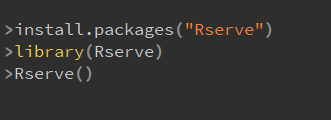 <br>

<p>Tableau will now be able to find and connect to R through a socket server. <br>
Now, on the Tableau Desktop go to <b>Help &#8594; Settings and Performance &#8594; Manage Analytics Extension Connection.. </b> </p><br>

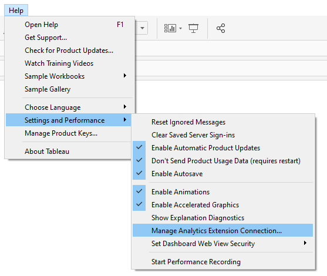 <br>

<p>Set  the extension <b>Rserve</b>, and  set the <b>Server: Localhost</b> and <b>Port: 6311</b> </p>

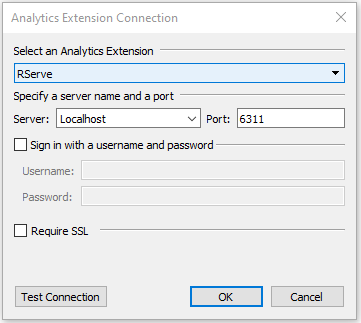 <br>

<p> You can check the connection by the <b>Test Connection</b></p>
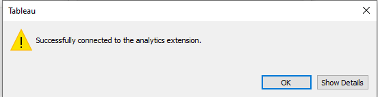 <br>

<p>And now you are all set up to use R in Tableau. So, let’s do one easy example to show how to use R functions in the Tableau Desktop.</p> <br>


<!-- First Example Here -->

<h3> Creating Your First R Function </h3>
<p>
To begin using the computational power of R we must first understand how Tableau implements R. <br>
Here, the common Tableau built-in <b>Sample - Superstore</b> is used for the base dataset in the example. <br>
Start, by creating a new calculated field (one easy way is to right click the Data panel on the left hand side and choose <b>Create Calculated Field</b>)
</p>

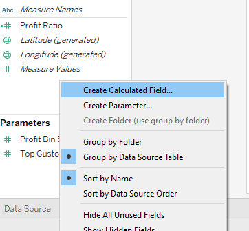 <br>

<p>
Now, here is where the R magic happens:  
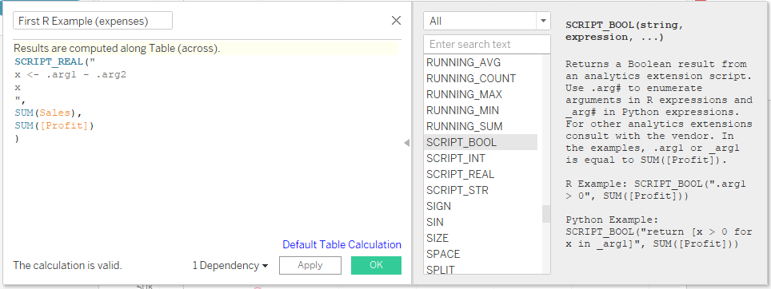 <br>

Inside the Calculated Field window, we can start by renaming our field, here we name it “First R Example (expenses)” <br>

Next, inside the function field we need to declare to Tableau what data type we want the R function to return. The types are <b>SCRIPT_BOOL , SCRIPT_INT , SCRIPT_REAL , SCRIPT_STR </b>. The functions list window on the right will allow you to select the data types / Tableau functions and provide further details for each: 
 <br>

In the above example SCRIPT_REAL is chosen since we want floating point numbers to be returned. <br>

Next, Inside the SCRIPT_REAL(“ <b> #Your R function goes here”</b>,...)  with each argument that you want to pass in being represented by <b>.arg1 , .arg2 ,... , argN </b> for N arguments. In this example the variable x is calculating the difference of .arg1 and .arg2 <br>

Next, the final part of the function SCRIPT_REAL(“ Your R function goes here”, <b> specified data arguments for (.arg1, .arg2, etc) go here </b>). In this example <b>SUM(Sales)</b> is being passed to <b>.arg1</b> and <b>SUM([Profit])</b> is being passed to <b>.arg2</b> so that <b>x = SUM(Sales) - SUM([Profit])</b><br>

<b>Attention!</b> Tableau will only allow aggregate data to be passed to the SCRIPT function, and thus R function. Therefore, the arguments must be of the form SUM() or AVG() etc. and not in vector format. This limits the normal R functionality however, the limitations become more versatile as aggregate manipulation occurs in Tableau. <br>

So, to finish off our first example we can now use the R output to visualize Sales on the First R Example (calculated expenses) by dragging the <b>calculated expenses</b> to the <b>columns</b> section, <b>sales</b> to the <b>Rows</b>, and <b>Sub-Category</b> to the <b>Color</b> sections: 
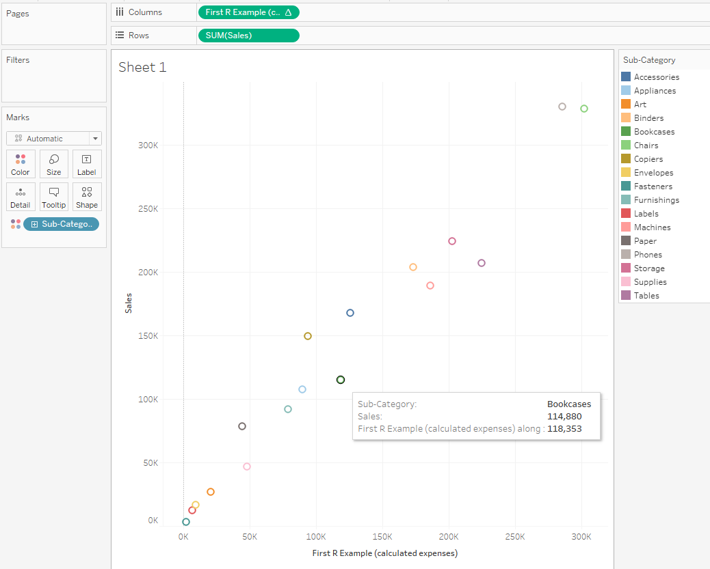 <br>

And now we have used R to create a graph in Tableau! Now, this simple calculation can be done in Tableau easily and the call to R is not needed in this case but, let’s take a look at another example where the power R really starts to show. 
</p><br>


<!-- Second Example -->
<h3>Example 2 (getting some more use out of R) </h3>

<p>To get a little deeper with an R function let us create a linear model for predictions. Still using the <b>Sample - Superstore</b> data from the previous example, we create a new calculated field:<br>

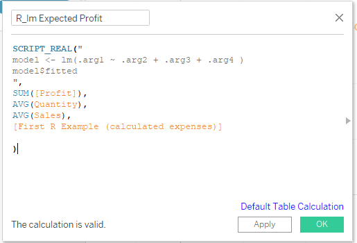 <br>

Here, we are using the lm() function from R to create a linear model of <b>SUM([Profit])</b> on <b>AVG(Quantity)</b>, <b>AVG(Sales)</b>, and from our first example <b>[First R Example (calculated expenses)]</b>. This linear model will estimate an expected profit for a category we choose. So, plotting Profit on Expected Profit with aggregated color by Sub-Category creates a nice visualization of the expected vs real outcomes from the model. To note here, a scatter plot was chosen to represent the model outcomes, but the possibilities of other plot types are just a click away in tableau. 

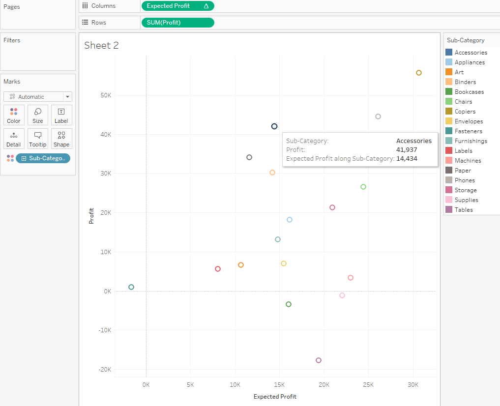 <br>

From this example we can start to see the possibilities of R computation within Tableau. <br>

<!-- Work Around-->
Being able to utilize R in Tableau creates a more dynamic analytical environment however, Tableau’s use of R as a calculated field is limited in many ways. First, as noted above, the SCRIPT Function in Tableau can only take aggregate input, such as the SUM or AVG, and will not accept a vector for computation. So, when using R inside Tableau think more point calculations than Monte Carlo simulations. There is however a way around these limitations that uses R to calculate what you want first, then utilize the newly formed dataset to create a more dynamic integration in Tableau. 
</p><br>
 


<!-- Third Example Here--> 
<h3>Example 3 (The R Tableau Tango)</h3>
<p>

A great example of how easy Tableau is to create dynamic, visually stunning graphs is no better demonstrated than with geospatial data. Tableau can create amazing, interactive visualizations for any region with just a couple clicks of the mouse and the right data. <br>

For this example we used a Covid-19 dataset taken from the JHU CSSE COVID-19 Data as well as The New York Times. https://data.world/covid-19-data-resource-hub/covid-19-case-counts <br>

Tableau easily creates an interactive time series visualizing the growth of positive cases by country. Using the Tableau generated <b>latitude</b> and <b>longitude</b> creates the geospatial map, selecting <b>Report Date</b> on the <b>Pages tab</b> creates the time series for cases per day, and adding the <b>SUM(People Positive Cases Count)</b> and the <b>Country Alpha 3 Code</b> to the <b>Marks options</b> creates the visualization for case growth. Another benefit of Tableau is the ease of formatting: changing color patterns, background colors, and plot styles which can be seen in the plot below. </p>

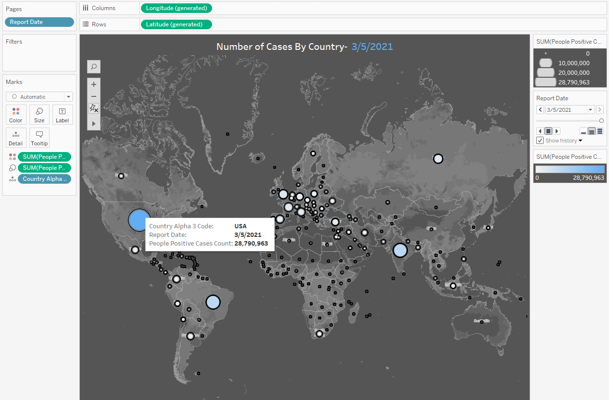 <br>

<p>But, say we wanted to do a point estimate for the Death Rate parameter of Covid-19 by region. And let's say we wanted to use bootstrapping from the daily reported data. This sort of computation is where R shines. So, since this type of simulation would not be possible from the Tableau Desktop, using R separately and feeding the result back to Tableau would create the perfect team for all your statistical needs. So, lets begin: <br>

Using the  <b>‘Covid-19 Activity.csv’</b> data in Rmarkdown, the first pre-processing step is to calculate the Death Rate per day for each country. We then eliminated all data that had a Death Rate of NaN or Infinity using the <b> tidyverse and dplyr R packages</b>. Looping through every country in the dataframe, we used the  <b>base R replicate and sample functions</b> to bootstrap the Death Rate data for each country, taking 100 samples over 1000 repetitions and calculating the mean point estimated Death Rate per country. Writing this calculated pre-processed dataset back to Tableau and plotting the new data in conjunction with the geospatial plot produces the image below: </p>


```{r eval = FALSE, echo=TRUE}
library(tidyverse)
library(dplyr)

covid <- read.csv("data/COVID-19 Activity.csv")
covid_clean <- select(covid, 1, 4, 10, 13)
covid_clean$Death_Rate <- covid_clean$PEOPLE_DEATH_COUNT/covid_clean$PEOPLE_POSITIVE_CASES_COUNT
covid_clean <- do.call(data.frame, lapply(covid_clean, function(x) replace(x, is.infinite(x), NA)))
covid_clean <- covid_clean  %>% drop_na("Death_Rate")

countries <- unique(covid_clean$COUNTRY_SHORT_NAME)

Est_Death_Rate <- rep(NA,length(countries))
death_tbl <- data.frame(countries, Est_Death_Rate)

for (c in countries){
country <- covid_clean[covid_clean$COUNTRY_SHORT_NAME == c,]
c_death <- replicate(1000, mean(sample(country$Death_Rate, 100, replace = TRUE)))
death_tbl$Est_Death_Rate[death_tbl$countries == c] <- mean(c_death)
}
```

```{r}
#write.csv(death_tbl,"data/death_tbl.csv")
```

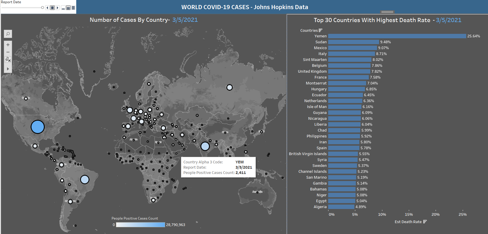 <br>

<!--  Closing  --> 

<p>
It is clear from the above examples that Tableau is extremely user-friendly in data visualization. It allows users to create beautiful and colorful plots with no coding knowledge at all. Through it’s drag and drop environment, users can easily change color palettes, filter plots by certain variables, and resize plots instead of having to write time-consuming R code to achieve the same result. However, Tableau’s limited ability for data manipulation makes it much better suited for simple calculations and plotting data that is already pre-processed. <br><br>
Example 2 showcased the ability to use R within Tableau for more advanced capabilities such as linear regression and other machine learning models. Additionally, Example 3 dealt with statistical analysis of bootstrapping Covid-19 data to calculate a point estimated Death Rate per country. This is where combining the packages available in R to pre-process the data, and then passing it back to Tableau creates a powerhouse for statistical analysis and data visualization.
All three of these examples showcase the capabilities of using Tableau and R together. Combining the analytical ability of R packages with the drag and drop data visualization of Tableau will make you a better data scientist, and hopefully will help you land the job of your dreams!
</p><br><br>


<h4>Sources</h4>
https://www.tableau.com/learn/whitepapers/using-r-and-tableau <br>
https://www.youtube.com/watch?v=E092x4a9_Y4 
<br><br>


